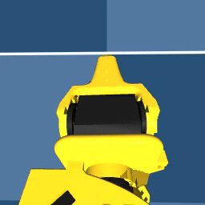
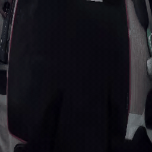
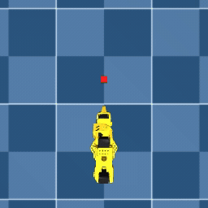
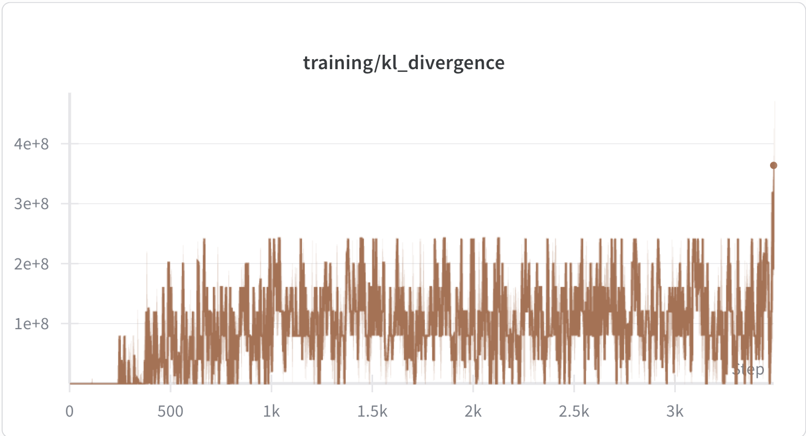
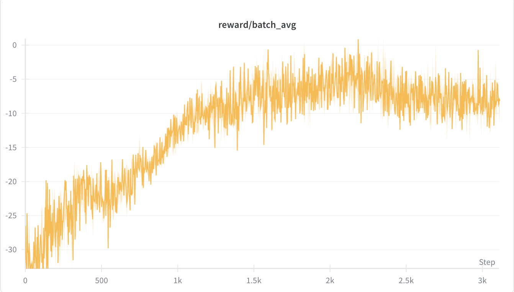
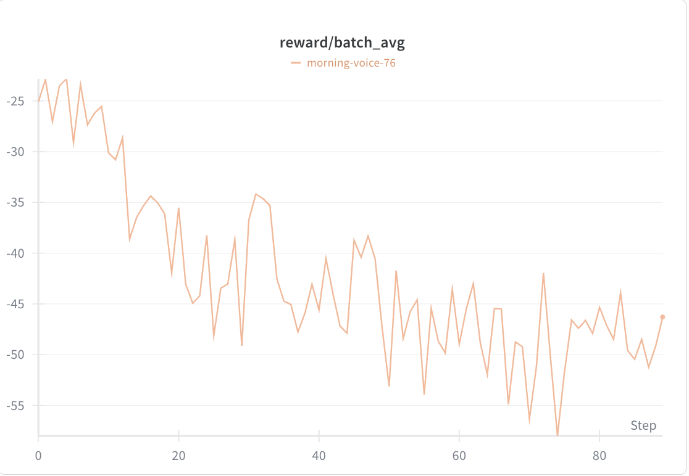
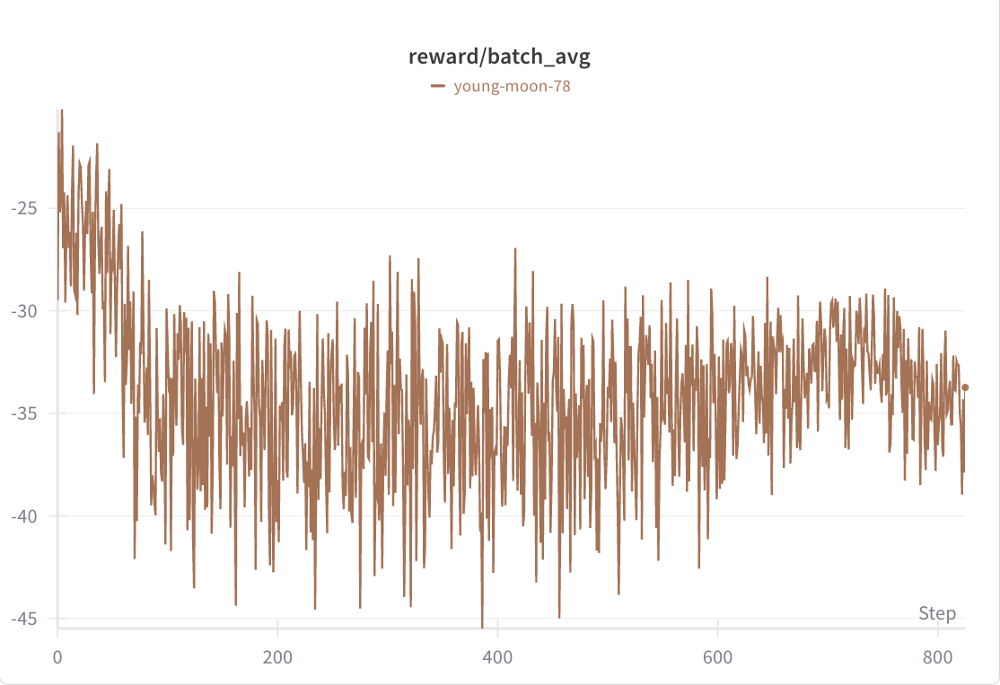
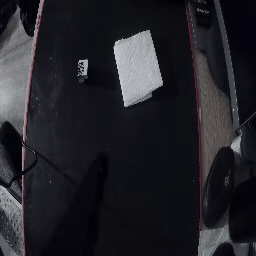

# Research Case Study: ReinFlow-Style RL Fine-Tuning of SmolVLA for SO-ARM-101 Manipulation

I built this project as an end-to-end research stack for adapting a pretrained vision-language-action policy to a new robotic manipulation task in simulation and on real hardware. The core challenge was not just "getting a robot to move," but making a deterministic flow-matching VLA behave like an RL-trainable policy, then debugging the optimization, coordinate-system, and reward-design failures that appeared along the way.

The strongest signal in this repo is my research process: paper-to-system translation, first-principles debugging, scaling-law reasoning, and disciplined iteration across model internals, simulation, and physical data collection.

Why this matters: if frontier robot learning is going to be practical, pretrained VLAs need to be adapted to new tasks and embodiments without requiring a perfect supervised dataset every time.

**Local demo assets**

<table>
  <tr>
    <td align="center"><strong>Sim top camera</strong></td>
    <td align="center"><strong>Sim wrist camera</strong></td>
    <td align="center"><strong>Physical wrist camera</strong></td>
  </tr>
  <tr>
    <td></td>
    <td></td>
    <td></td>
  </tr>
</table>

## Executive Summary

| Item | Details |
| --- | --- |
| Problem | Adapt a pretrained flow-matching VLA to a new manipulation task with reinforcement learning and real-world deployment support |
| Models | SmolVLA (450M) as the main research target; Pi0 (3.3B) supported as an extension path |
| Method | ReinFlow-style on-policy RL with a learnable noise network, actor-critic / PPO training, and manipulation-specific reward shaping |
| Environment | SO-ARM-101 in MuJoCo with three camera views, vectorized rollouts, and subprocess-based parallel rendering |
| Real-world data | 100 physical episodes / 41,631 frames from a wrist-camera dataset |
| Sim demonstration data | 50 randomized-block episodes + 50 fixed-block episodes |
| Experiment scale | 129 local `wandb` run summaries tracked in this repo |
| Strongest supported later PPO summary | `reward/batch_avg = -8.49` at 21,650 episodes, with `contact_rate = 12.8%`, `sustained_contact_rate = 6.9%`, and `grasp_rate = 2.6%` |
| Main limitation | The system clearly improved shaped behavior and contact/grasp emergence, but did not yet reach robust task completion |

**Status:** this repo documents meaningful progress toward approach, contact, sustained contact, and occasional grasp behavior, but it does **not** claim solved pick-and-place performance.

Evidence trail:
- Physical dataset metadata: [`imitation-learning/datasets/so101_pickplace_v1/meta/info.json`](imitation-learning/datasets/so101_pickplace_v1/meta/info.json)
- Sim dataset metadata: [`simulation_code/datasets/so101_pickplace/meta/info.json`](simulation_code/datasets/so101_pickplace/meta/info.json), [`simulation_code/datasets/so101_pickplace_fixed/meta/info.json`](simulation_code/datasets/so101_pickplace_fixed/meta/info.json)
- Strongest later PPO summary: [`run-20260108_035325-6ilsbq76`](simulation_code/wandb/run-20260108_035325-6ilsbq76/files/wandb-summary.json)

## Why This Project Is Technically Challenging

- **Flow-matching VLAs are awkward RL targets.** SmolVLA generates actions through iterative denoising, which is naturally deterministic; policy-gradient methods need a probabilistic policy and stable log-probability computation.
- **SmolVLA's chunked action space changes optimization behavior.** A 50-step action chunk with 6 DoF creates a 300-dimensional action output, which materially changes log-probability scale, KL behavior, and noise tuning compared with the ReinFlow paper settings.
- **Simulation, calibration, and pretrained-model coordinates do not line up by default.** MuJoCo state, LeRobot calibration, and SmolVLA normalization statistics live in different frames; if these are misaligned, the pretrained policy sees "alien" inputs.
- **Manipulation learning is bottlenecked by reward design and experiment throughput.** A sparse lift objective was not enough; I had to instrument alignment, contact, sustained contact, and grasp behavior while also building faster rollout infrastructure to run enough experiments.

[TODO: add image - architecture diagram showing SmolVLA, ReinFlow wrapper, MuJoCo environment, reward loop, and physical-arm / dataset loop]

**Local simulation media**

<table>
  <tr>
    <td align="center"><strong>Top camera</strong></td>
    <td align="center"><strong>Wrist camera</strong></td>
    <td align="center"><strong>Fixed-block top camera</strong></td>
  </tr>
  <tr>
    <td></td>
    <td></td>
    <td></td>
  </tr>
</table>

[TODO: add image - a curated 3-view simulation observation grid. There are checked-in assets for `camera1` and `camera2`, but no checked-in still or video asset for `camera3`]

## What I Built

### ReinFlow-style VLA training stack

I implemented a training pipeline around SmolVLA that turns a pretrained flow-matching policy into something trainable with on-policy RL. This includes:
- a ReinFlow wrapper around SmolVLA with a learnable noise network and actor-critic support
- exact denoising-trajectory log-probability computation for on-policy updates
- PPO-style training with KL monitoring, clip-fraction tracking, warmup, and checkpointing
- a Pi0 extension path for the same research interface

Primary code:
- [`simulation_code/train_reinflow.py`](simulation_code/train_reinflow.py)
- [`simulation_code/reinflow_smolvla.py`](simulation_code/reinflow_smolvla.py)
- [`smolvla_modifications/lerobot-src-lerobot-policies-smolvla-modeling_smolvla.py`](smolvla_modifications/lerobot-src-lerobot-policies-smolvla-modeling_smolvla.py)

### MuJoCo simulation and experiment throughput

I built a MuJoCo manipulation environment around the SO-ARM-101 robot with three camera views and both single-process and parallelized rollout paths. The repo includes:
- a Gymnasium-compatible environment
- vectorized batched observations for GPU-friendly inference
- subprocess-based parallel rendering for faster experimentation on larger hardware

Primary code:
- [`simulation_code/so101_gym_env.py`](simulation_code/so101_gym_env.py)
- [`simulation_code/vectorized_env.py`](simulation_code/vectorized_env.py)
- [`simulation_code/subproc_vectorized_env.py`](simulation_code/subproc_vectorized_env.py)

### Reward instrumentation and logging

I added reward components and diagnostics that expose the actual behavior being learned, not just a single scalar return. The project logs:
- distance-driven shaped reward
- height alignment
- contact rate
- sustained contact rate
- grasp rate
- PPO diagnostics such as KL divergence, clip fraction, ratio drift, and gradient norms

Primary reference:
- [`hyperparameter_notes.md`](hyperparameter_notes.md)

### Physical-arm dataset collection

I built a single-arm data collection path for the physical SO-101 that does not require a full leader-follower setup. The resulting dataset includes 100 episodes and 41,631 frames from a wrist-mounted camera.

Primary code and data:
- [`imitation-learning/record_single_arm.py`](imitation-learning/record_single_arm.py)
- [`imitation-learning/datasets/so101_pickplace_v1/meta/info.json`](imitation-learning/datasets/so101_pickplace_v1/meta/info.json)

### Physical-arm inference path

I also added a path for running SmolVLA on a physical SO-101 arm using a wrist camera, dataset statistics, and processor construction compatible with the training artifacts.

Primary code:
- [`imitation-learning/run_smolvla_physical_arm.py`](imitation-learning/run_smolvla_physical_arm.py)

### Pi0 support as an extension path

I extended the codebase to support Pi0 as a second VLA backend, including adapter code, quantization utilities, and ReinFlow-compatible training hooks. This matters less as a finished result and more as evidence that I designed the stack around reusable model abstractions rather than a single hard-coded policy.

Primary code:
- [`simulation_code/pi0_adapter.py`](simulation_code/pi0_adapter.py)
- [`simulation_code/pi0_quantization.py`](simulation_code/pi0_quantization.py)

Taken together, this is end-to-end research infrastructure: model adaptation, training, instrumentation, simulation, throughput engineering, dataset tooling, and a physical deployment path.

## Core Research Investigations

This section is the real center of the project. The point of the repo is not only that I "trained something," but that I identified and resolved several non-obvious failure modes that sit at the boundary of ML theory, model internals, and robotics systems.

### 1. KL Explosion / Dropout Nondeterminism

**Problem.** In parallel PPO training, KL divergence exploded to hundreds of millions immediately after critic warmup, before any optimizer step had happened.

**Hypothesis / reasoning.** If the policy weights had not changed yet, then old and new log-probabilities should have matched. The only way for KL to blow up before updates was for policy evaluation itself to be nondeterministic.

**What I checked.**
- traced the PPO KL approximation and log-probability code path
- noticed the explosion happened on epoch 1 before any weight update
- systematically searched for sources of randomness
- identified dropout inside the wrapped SmolVLA submodules as the culprit

**Fix.** I overrode the wrapper's `train()` behavior so the critic can stay in training mode while the base SmolVLA policy is forced to remain in eval mode during PPO updates.

**Impact.** This fixed a class of silent RL failures that would otherwise look like "bad hyperparameters." It turned an impossible optimization regime into one where sane-KL PPO runs were possible again. For example, later PPO summaries reached `training/kl_divergence = 0.0458` with meaningful behavior metrics instead of immediate catastrophic KL blowups.

Evidence trail:
- Full investigation: [`notes/kl-divergence-bug-fix.md`](notes/kl-divergence-bug-fix.md)
- Wrapper implementation: [`simulation_code/reinflow_smolvla.py`](simulation_code/reinflow_smolvla.py)
- Example later stable-KL run: [`run-20260108_035117-6ilsbq76`](simulation_code/wandb/run-20260108_035117-6ilsbq76/files/wandb-summary.json)

<table>
  <tr>
    <td align="center"><strong>KL explosion failure case</strong></td>
  </tr>
  <tr>
    <td></td>
  </tr>
</table>

Failure-case graph source: W&B run ID `plbfqt25` (local snapshot `run-20260102_015143-plbfqt25`, commit `93a93367e3da15115dbcb3913be93163e37f8f88`).

### 2. Sigma Scaling for 300-Dimensional Chunked Actions

**Problem.** Hyperparameters inspired by the ReinFlow paper behaved badly when applied directly to SmolVLA, because SmolVLA predicts 50-action chunks over 6 joints, creating a much larger action space than the paper settings.

**Hypothesis / reasoning.** The variance of log-probability differences does not stay constant when action dimensionality changes. Unscaled sigma values were making the log-probability regime numerically pathological.

**What I checked.**
- inspected `wandb` logs showing positive log-probabilities and 100% PPO clipping
- derived how log-probability variance changes with total action dimensionality
- compared paper-scale settings with SmolVLA's `D = 300` action output

**Fix.** I scaled the noise bounds upward from paper-like values to a SmolVLA-appropriate regime, updating `sigma_min` to `0.25` and `sigma_max` to `0.50`.

**Impact.** This converted what initially looked like ordinary instability into a concrete scaling-law issue. It gave me a defensible rule for transferring ReinFlow-style tuning into a new regime rather than treating tuning as trial-and-error. Later PPO summaries show negative `logprob/per_dimension` values instead of the broken positive regime documented in the debugging note.

Evidence trail:
- Full investigation: [`notes/sigma-scaling-bug-fix.md`](notes/sigma-scaling-bug-fix.md)
- Hyperparameter reference: [`hyperparameter_notes.md`](hyperparameter_notes.md)
- Training config: [`simulation_code/train_reinflow.py`](simulation_code/train_reinflow.py)
- Example later summary with negative per-dimension log-probability: [`run-20260108_035117-6ilsbq76`](simulation_code/wandb/run-20260108_035117-6ilsbq76/files/wandb-summary.json)

[TODO: add graph - logprob/per_dimension and PPO clip fraction in the broken sigma regime vs the scaled regime. Candidate W&B runs: `plbfqt25` for the broken regime and `6ilsbq76` for the later scaled / improved regime]

### 3. MuJoCo <-> SmolVLA Coordinate-Frame Mismatch

**Problem.** SmolVLA normalization statistics implied joint means that were impossible under the MuJoCo joint limits. That meant the model and simulation were speaking different coordinate languages.

**Hypothesis / reasoning.** SmolVLA appeared to expect absolute servo coordinates, while MuJoCo and LeRobot calibration were centered around a calibrated zero pose.

**What I checked.**
- compared SmolVLA means with MuJoCo joint limits
- inspected LeRobot calibration files and homing offsets
- used the reset pose as an alignment check across systems

**Fix.** I corrected the `MUJOCO_TO_PHYSICAL_OFFSET` mapping so MuJoCo states are translated into the physical frame the model expects before normalization.

**Impact.** This removed a systematic bias that was pushing the policy far away from the pretrained data manifold even at reset. In the note, the old setup put `shoulder_lift` roughly `-2.29` standard deviations away from expectation at the reset pose; the corrected offsets align the reset pose close to zero in normalized space.

Evidence trail:
- Full investigation: [`notes/smolvla-coordinate-fix.md`](notes/smolvla-coordinate-fix.md)
- Normalization utilities: [`simulation_code/so101_mujoco_utils.py`](simulation_code/so101_mujoco_utils.py)

[TODO: add image - coordinate-frame diagram showing MuJoCo zero, calibrated robot zero, and SmolVLA absolute servo frame]

### 4. Reward Shaping: From Approach -> Contact -> Hold -> Grasp -> Lift

**Problem.** A sparse "lift the block" objective was not enough to produce useful learning signals for a chunked-action manipulation policy.

**Hypothesis / reasoning.** The task needed a staged reward curriculum encoded directly into the objective: approach the block, align above it, make contact, maintain contact, grasp, then lift.

**What I checked.**
- failure modes in long runs that improved motion without improving task structure
- whether KL/ratio metrics that looked healthier actually corresponded to better behavior
- contact, sustained-contact, and grasp metrics after reward changes

**Fix.** I incrementally added:
- contact reward on January 7, 2026
- height-alignment, grasp, sustained-contact, and lift bonuses on January 8, 2026

**Impact.** Later PPO summaries show measurable emergence of contact and small but nonzero grasp behavior. In the strongest later PPO summary in this repo, contact rate reached `12.8%`, sustained-contact rate `6.9%`, and grasp rate `2.6%`, even though the overall task remained unsolved.

Evidence trail:
- Reward formulation and changelog: [`hyperparameter_notes.md`](hyperparameter_notes.md)
- Strongest later PPO summary: [`run-20260108_035325-6ilsbq76`](simulation_code/wandb/run-20260108_035325-6ilsbq76/files/wandb-summary.json)

[TODO: add graph - reward components, contact rate, sustained-contact rate, and grasp rate over training. Best W&B source is run ID `6ilsbq76`; use the local snapshots `run-20260108_035117-6ilsbq76` and `run-20260108_035325-6ilsbq76` as the evidence trail]

## Experimental Arc

The repo records a progression from naive baselines to better-instrumented PPO training. The main pattern is that I kept revising the method when the evidence said my earlier interpretation was wrong.

| Date / phase | What changed | Why it mattered |
| --- | --- | --- |
| December 2025 | Built the MuJoCo environment, simulation datasets, and early RL baselines including a Gaussian-wrapper `ReinFlow-lite` approach | Established the infrastructure, but also surfaced that a simpler wrapper was not enough |
| Late December 2025 | Shifted toward a fuller ReinFlow-style training stack with actor-critic / PPO machinery | Moved from a lightweight baseline toward a more serious RL formulation |
| January 2, 2026 | Diagnosed KL explosion as dropout nondeterminism, not just "bad tuning" | Converted an impossible PPO regime into a debuggable one |
| January 5, 2026 | Derived sigma scaling for SmolVLA's 300-dimensional action chunks | Replaced paper-copying with dimension-aware reasoning |
| January 7, 2026 | Increased `policy_lr` after 17k episodes showed no reward improvement; added contact reward shaping | Responded to stagnation with both optimization and objective changes |
| January 8, 2026 | Added height-alignment, grasp, sustained-contact, and lift bonuses | Made the reward structure reflect the real subskills needed for grasping |
| January 8, 2026 | Tried more aggressive PPO settings, then reverted them when evidence showed collapse at ~4.5k episodes | Showed willingness to undo "promising" changes when the actual training behavior regressed |
| January 8, 2026 | Reverted `recompute_old_log_probs` after a 900-episode test had healthier metrics but worse rewards and no grasps | Prioritized behavioral evidence over cosmetically better diagnostics |

The most important research judgment in this project is that I did not treat a cleaner metric dashboard as success. I repeatedly changed direction when the model's actual behavior, long-run stability, or grounded reasoning contradicted the simpler story.

Evidence trail:
- Early baseline: [`simulation_code/old-training-scripts/train_reinflow_lite-DIDNTWORK.py`](simulation_code/old-training-scripts/train_reinflow_lite-DIDNTWORK.py)
- Changelog and reversions: [`hyperparameter_notes.md`](hyperparameter_notes.md)

[TODO: add image - experiment timeline graphic or a milestone table screenshot]

## Results

I want to be precise here: this project shows real learning progress and meaningful technical problem-solving, but not a solved manipulation benchmark.

### What Improved

Later PPO runs in this repo show a consistent move from "mostly alignment / approach behavior" toward actual contact, sustained contact, and small but nonzero grasp emergence.

<table>
  <tr>
    <td align="center"><strong>`6ilsbq76`</strong></td>
    <td align="center"><strong>`3pa9oaax`</strong></td>
    <td align="center"><strong>`syi4c1rb`</strong></td>
  </tr>
  <tr>
    <td></td>
    <td></td>
    <td></td>
  </tr>
</table>

These three reward curves show the later-stage comparison I reference throughout the README: `6ilsbq76` as the strongest overall research run in this repo, `3pa9oaax` as a worse-behavior comparison after the `recompute_old_log_probs` change, and `syi4c1rb` as a conservative post-revert run.

| Run summary | Episodes | Key supported metrics | Interpretation |
| --- | ---: | --- | --- |
| [`run-20260108_155532-3pa9oaax`](simulation_code/wandb/run-20260108_155532-3pa9oaax/files/wandb-summary.json) | 900 | `reward/batch_avg = -46.29`, `height_align_rate = 43.2%`, `grasp_rate = 0` | The policy had learned a fair amount of geometric alignment, but essentially no real manipulation behavior yet |
| [`run-20260108_035117-6ilsbq76`](simulation_code/wandb/run-20260108_035117-6ilsbq76/files/wandb-summary.json) | 1,640 | `reward/batch_avg = -11.44`, `contact_rate = 9.2%`, `sustained_contact_rate = 3.7%`, `grasp_rate = 0.8%`, `KL = 0.0458` | A much stronger regime: significantly better shaped reward, contact emergence, and a sane KL range |
| [`run-20260108_035325-6ilsbq76`](simulation_code/wandb/run-20260108_035325-6ilsbq76/files/wandb-summary.json) | 21,650 | `reward/batch_avg = -8.49`, `contact_rate = 12.8%`, `sustained_contact_rate = 6.9%`, `grasp_rate = 2.6%` | The strongest supported later summary in this repo for shaped-behavior progress |

What I take from these results:
- the policy learned more than random exploration
- reward shaping produced measurable behavioral progression
- the debugging and normalization fixes mattered enough to make later-stage improvement visible

### What Remains Unsolved

- I do **not** have evidence in this repo for robust lift success or stable end-to-end pick-and-place completion.
- The strongest later PPO summary also remained unstable, with `training/clip_fraction = 1.0` and `training/kl_divergence = 6.84`, which is not a "solved training regime."
- The results are strongest as a research story about behavior emergence and debugging of hard failure modes, not as a final benchmark claim.
- I still need a more standardized evaluation protocol for lift success, grasp persistence, and policy reliability across seeds / positions.

[TODO: add graph - selected `wandb` curves for contact rate, grasp rate, KL divergence in the stable regime, and clip fraction. Reward curves are already embedded above. Recommended W&B run IDs: `6ilsbq76` (best overall story), `3pa9oaax` (healthier metrics but much worse behavior after `recompute_old_log_probs`), and `syi4c1rb` (post-revert conservative run)]

## Real-World Data and Deployment

This project is not simulation-only.

I built a physical data collection and inference path around the SO-101:
- a single-arm recording pipeline that outputs LeRobot-compatible datasets without requiring a full leader-follower teleop stack
- a wrist-camera dataset with **100 episodes and 41,631 frames**
- a physical-arm SmolVLA inference script that uses dataset statistics and processor construction for deployment

Why this matters: a lot of robotics ML repos stop at simulation. This repo includes a real data collection story and a path toward physical deployment, which is where many research ideas actually break.

Evidence trail:
- Recorder: [`imitation-learning/record_single_arm.py`](imitation-learning/record_single_arm.py)
- Physical inference: [`imitation-learning/run_smolvla_physical_arm.py`](imitation-learning/run_smolvla_physical_arm.py)
- Dataset metadata: [`imitation-learning/datasets/so101_pickplace_v1/meta/info.json`](imitation-learning/datasets/so101_pickplace_v1/meta/info.json)

**Local physical-media assets**

<table>
  <tr>
    <td align="center"><strong>Physical clip A</strong></td>
    <td align="center"><strong>Physical clip B</strong></td>
  </tr>
  <tr>
    <td></td>
    <td></td>
  </tr>
</table>

**Existing hardware image**

<table>
  <tr>
    <td align="center"><strong>Mount view</strong></td>
    <td align="center"><strong>Mount / placement image</strong></td>
  </tr>
  <tr>
    <td></td>
    <td></td>
  </tr>
</table>

I do not have a full checked-in photo of the assembled physical setup, but I do have the local mount and camera-placement images above.

## What This Project Demonstrates About My Research Skills

- **Paper-to-system translation.** I took ideas from ReinFlow and SmolVLA and converted them into a working research stack around a new robot, simulator, and task.
- **First-principles debugging.** The strongest debugging wins in this repo came from tracing impossible metrics back to model semantics, not from random tuning.
- **Scaling-law reasoning.** I derived why paper hyperparameters failed in SmolVLA's higher-dimensional action regime and adjusted the method accordingly.
- **Experiment design and instrumentation.** I logged the right intermediate behaviors and diagnostics so I could reason about what was actually being learned.
- **Bridging model internals, simulation, and hardware.** The project spans model modification, RL training, MuJoCo environment design, physical data collection, and deployment tooling.

## Repo Guide

If you only look at a few parts of this repo, I would start here:

- **Training stack:** [`simulation_code/train_reinflow.py`](simulation_code/train_reinflow.py), [`simulation_code/reinflow_smolvla.py`](simulation_code/reinflow_smolvla.py)
- **Hyperparameter and experiment record:** [`hyperparameter_notes.md`](hyperparameter_notes.md)
- **Three highest-signal debugging notes:** [`notes/kl-divergence-bug-fix.md`](notes/kl-divergence-bug-fix.md), [`notes/sigma-scaling-bug-fix.md`](notes/sigma-scaling-bug-fix.md), [`notes/smolvla-coordinate-fix.md`](notes/smolvla-coordinate-fix.md)
- **Physical data collection:** [`imitation-learning/record_single_arm.py`](imitation-learning/record_single_arm.py), [`imitation-learning/datasets/so101_pickplace_v1/meta/info.json`](imitation-learning/datasets/so101_pickplace_v1/meta/info.json)
- **Physical inference path:** [`imitation-learning/run_smolvla_physical_arm.py`](imitation-learning/run_smolvla_physical_arm.py)

## Next Steps

If I continued this project, the next experiments I would prioritize are:

1. **Retrain with the corrected coordinate offsets as the clean baseline.** The coordinate-frame fix removes a systematic handicap and should be treated as the starting point for new comparison runs.
2. **Introduce a curriculum or staged task decomposition.** Start with reaching / alignment, then contact, then grasp, then lift, rather than forcing the entire task through one reward landscape from the beginning.
3. **Build a stronger evaluation protocol.** Track lift success, grasp persistence, recovery behavior, and robustness across randomized block positions and multiple seeds.
4. **Run targeted ablations instead of broad tuning.** Compare reward components, trainable-parameter subsets, denoising-step counts, and rollout lengths with a fixed evaluation protocol.
5. **Improve long-run PPO stability.** The best later run in this repo still had high clip fraction and KL drift; that needs to be treated as a first-class research problem.
6. **Curate the visual evidence.** A public-facing version of this repo should include selected rollout videos, wrist-camera clips, and `wandb` graphs that directly show the progression documented above.

## Setup / Running the Code

Open for setup and usage notes

This top-level README is intentionally optimized for the research story.

For environment setup, simulation commands, teleoperation, VLA inference, and training entry points, see:
- [`simulation_code/README.md`](simulation_code/README.md)

## Note on Evidence

I wrote this README to be audit-friendly. The claims above are grounded in:
- the debugging notes in [`notes/`](notes/)
- the hyperparameter and experiment record in [`hyperparameter_notes.md`](hyperparameter_notes.md)
- dataset metadata in [`imitation-learning/datasets/`](imitation-learning/datasets/) and [`simulation_code/datasets/`](simulation_code/datasets/)
- local training summaries in [`simulation_code/wandb/`](simulation_code/wandb/)
