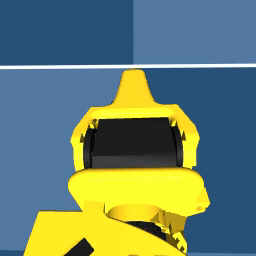
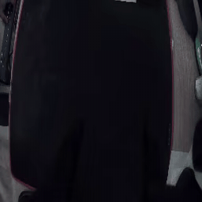
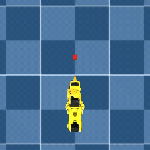
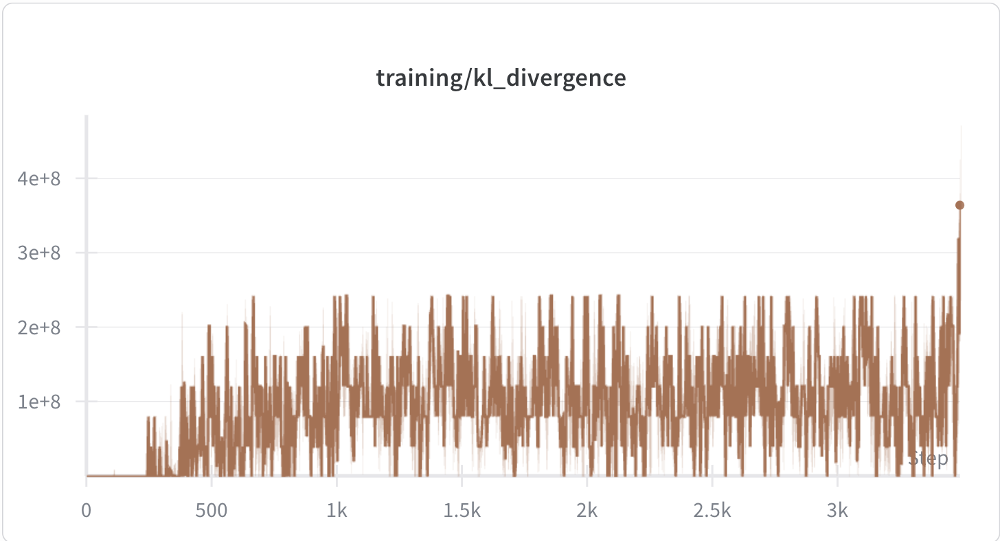
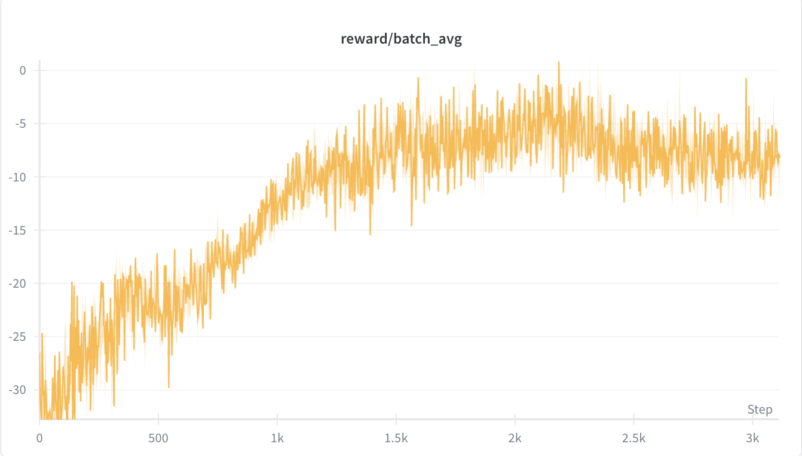
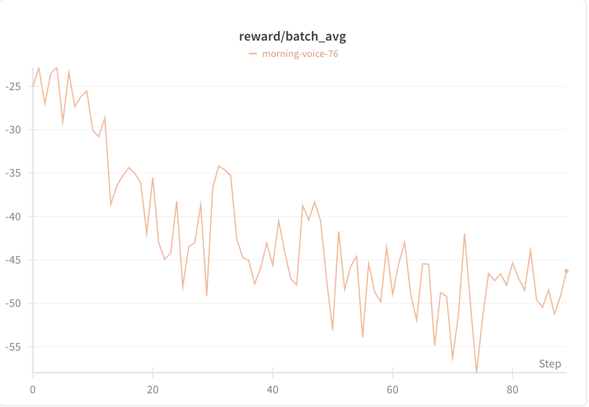
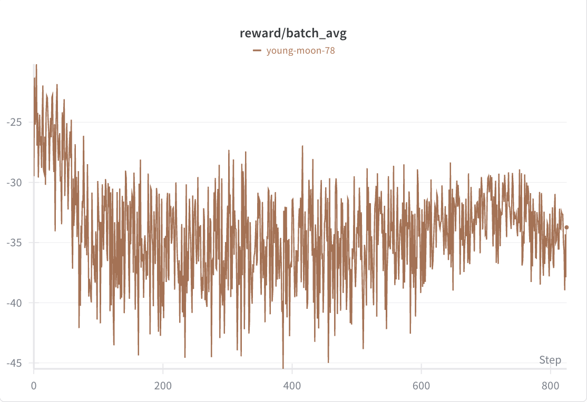
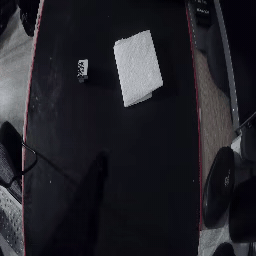

# Research Case Study: ReinFlow-Style RL Fine-Tuning of SmolVLA for SO-ARM-101 Manipulation

I built this project as an end-to-end research stack for adapting a pretrained vision-language-action policy to a new robotic manipulation task in simulation and on real hardware. The core challenge was not just "getting a robot to move," but making a deterministic flow-matching VLA behave like an RL-trainable policy, then debugging the optimization, coordinate-system, and reward-design failures that appeared along the way.

The strongest signal in this repo is my research process: paper-to-system translation, first-principles debugging, scaling-law reasoning, and disciplined iteration across model internals, simulation, and physical data collection.

Why this matters: if frontier robot learning is going to be practical, pretrained VLAs need to be adapted to new tasks and embodiments without requiring a perfect supervised dataset every time.

**Local demo assets**

<table>
  <tr>
    <td align="center"><strong>Sim top camera</strong></td>
    <td align="center"><strong>Sim wrist camera</strong></td>
    <td align="center"><strong>Physical wrist camera</strong></td>
  </tr>
  <tr>
    <td></td>
    <td></td>
    <td></td>
  </tr>
</table>

## Executive Summary

| Item | Details |
| --- | --- |
| Problem | Adapt a pretrained flow-matching VLA to a new manipulation task with reinforcement learning and real-world deployment support |
| Models | SmolVLA (450M) as the main research target; Pi0 (3.3B) supported as an extension path |
| Method | ReinFlow-style on-policy RL with a learnable noise network, actor-critic / PPO training, and manipulation-specific reward shaping |
| Environment | SO-ARM-101 in MuJoCo with three camera views, vectorized rollouts, and subprocess-based parallel rendering |
| Real-world data | 100 physical episodes / 41,631 frames from a wrist-camera dataset |
| Sim demonstration data | 50 randomized-block episodes + 50 fixed-block episodes |
| Experiment scale | 129 local `wandb` run summaries tracked in this repo |
| Strongest supported later PPO summary | `reward/batch_avg = -8.49` at 21,650 episodes, with `contact_rate = 12.8%`, `sustained_contact_rate = 6.9%`, and `grasp_rate = 2.6%` |
| Active rebuild status | The horizon-alignment tranche completed (2026-08-06, `horizon_gates/704b7a9574e559db`, `horizon_not_resolved`): the 480-action hold-tail teacher **eliminated past-horizon violations in all three seeds** (and physically proved the tail safe), but seeds land 9/9/12 of 15 — the remaining gripper envelope-grazing is **in-distribution over-squeeze** (22/35 findings in `set_down`, 6 in `traverse`: the teacher commands the gripper at its floor bound ~0.0005 for grip force, and imitation overshoot dives to −0.002…−0.02, below the floor). The gripper-clamp gate (`clamp_gates/f63104b1f82cadfc`, eval-only) then delivered the **first 15/15 zero-safety Stage A passes** (seeds 101 and 202); seed 303 retains exactly its three pre-identified release-speed delta frames (`clamp_not_resolved` under the strict all-seeds rule). Per pre-registration the **vision rung now begins**, carrying the validated gripper clamp |
| Vision + randomization (exploratory lane, 2026-08-06) | Vision v0 validated the pixels pipeline end to end (frames-sidecar capture, minibatched conv training, live-frame closed-loop eval) with deliberately-bad results (0–3/15; black-image ablation shows partial pixel use). The scenario-randomization engine then produced the project's **first held-out generalization measurement**: state+clamp trained on 25 full-episode-screened random cube poses scores **18/30 on a held-out suite from a different generator seed** — perfectly bimodal (6 scenarios 3/3 with zero safety frames, 4 scenarios 0/3 deterministic; the two nearest-y poses fail). Vision on the same data: 0/30. Notes: `notes/vision-rung-notebook.md`; evals under `randomized_v1/randomized_explorations/{fd18a476910d7732,6ecb2a418dfe405e}` |
| Data-scaling curve (exploratory lane, 2026-08-07) | Overnight sweep over training-set size (50/100/200/400 full-episode-screened episodes, frozen held-out benchmark of 30 rollouts): **state+clamp reaches 30/30 with zero safety frames at 400 episodes** — the first perfect held-out generalization score — after plateauing at 27/30 through 50–200 (data coverage, no recipe change). Vision at fixed 20k steps is non-monotone (6/14/9/18 of 30); a compute probe (same n200 data, 60k steps) isolates the confound: **24/30** — vision was compute-starved, so training steps must scale with data. Undertrained vision is also unsafe vision (642 safety frames at n400/20k vs 9 at matched epochs). Capture publish for >RAM frames sidecars now streams (`write_immutable_file`). Results: `notes/vision-rung-notebook.md`, `artifacts/so_arm101_v2/randomized_scaling/SWEEP_LOG.txt` |
| Physical smoke path (prepped) | `tools/replay_physical_trajectory.py` replays a sim capture on the SO101Follower with every command double-gated by `evaluate_physical_command` (offline full-trajectory + per-step pre-send; dry-run default, `--enable-motion` + confirmation for motion). Runbook: `notes/physical-smoke-runbook.md`. Bench execution pending (arm not attached) |
| Vision at matched compute (exploratory lane, 2026-08-08) | Vision on the n400 capture at epoch-matched compute (120k steps), 3 seeds on the frozen held-out benchmark: **24/30, 30/30, 24/30 — seed 202 is the first perfect held-out score from the deployable-inputs policy** (wrist pixels + proprioception + clock; no privileged state), and seeds 101/202 have zero safety frames. Mid-sweep infra: deterministic prefetching for >RAM frames sidecars (bitwise-identical training pinned by test incl. checkpoint sha; measured 3.2× on the 38 GB n400 sidecar). Runs charted in wandb project `so-arm101-v2-scaling` |
| Main limitation | Generalization numbers are exploratory-lane (no pre-registered gate yet): state+clamp 30/30 and vision+clamp 24-30/30 held-out are sim-only, conditioned on teacher-solvable poses, with visible seed spread on vision; physical transfer is unproven |

**Status:** a learned policy now completes the full pick-and-place task
autonomously in simulation: the promoted H=90 chunked clone (privileged
state + progress inputs, noise-augmented feasibility training) passes the
deterministic nominal MuJoCo gate 3/3 with zero safety frames
(`saturation_gates/46de62c4f6d1b78f`, under the pinned mujoco 3.9.0
environment; the earlier identical decision `1a78ec8affead704` ran under a
shadowed mujoco 3.11.0 and is quarantined — see
`notes/parallel-execution-infrastructure.md`). Scope of that claim is
deliberate and narrow: one nominal scenario, privileged simulator state (not
vision), in simulation. Broader-scenario robustness, vision inputs, and
physical deployment remain unproven and gated. All simulation evidence now
runs with `PYTHONNOUSERSITE=1` so the env's mujoco 3.9.0 pin wins; the
`so-arm101-v2-sim` CLI refuses any other version. Every environment switch
the lane reads — the required ones, the numerics regime override, the vision
prefetch controls, and experiment tracking — is catalogued in
`notes/environment-switches.md`.

## Legacy RL Stack Status

The current training stack is materially more stable than the January 2026 PPO regime documented elsewhere in this repo.

- PPO old/new log-prob evaluation is now forced through a deterministic microbatched path, with pre-update self-consistency checks before the first optimizer step.
- PPO early-stop is interpreted using `training/post_update_kl`, not the old pre-step KL approximation.
- SmolVLA RL now defaults to the stable actor subset `rl_stable_heads`, which trains `action_in_proj`, `action_out_proj`, `action_time_mlp_in`, `action_time_mlp_out`, and `noise_mlp`, while leaving `state_proj` frozen.
- Critic warmup actor sampling runs under `torch.no_grad()`, and critic features are detached by default so value learning does not move shared actor conditioning.
- On the current 14.6 GB single-GPU setup, `--parallel-envs 5` is the practical headless SmolVLA ceiling.

Within the legacy RL lane, the bottleneck moved from catastrophic PPO
instability to reward topology and behavior discovery. That lane is preserved
as research history; it is not the active next step of the diagnostics-first
rebuild.

## Current Diagnostics-First Rebuild Status

### August 2026 update: the simulator itself was the blocker

A privileged-controller "preflight" for the v2 rebuild lane (an oracle controller
with ground-truth state that must prove the task is solvable before any learning
is trusted) uncovered that **a strict opposing-face grasp of the 25 mm cube was
physically impossible in every simulator configuration this repo had ever used**:
MuJoCo collides mesh geoms by convex hull, and the one-piece jaw meshes' hulls
filled the jaw mouth, so no policy could ever have learned the grasp the reward
was asking for. This retroactively explains the corner-pinch-only behavior across
all RL campaigns. Full chain of evidence:
[`notes/privileged-controller-preflight-findings.md`](notes/privileged-controller-preflight-findings.md).

In response, the v2 simulation lane was migrated to the community-validated
MuJoCo Menagerie `trs_so_arm100` model (decomposed jaw collision meshes plus
fingertip pad primitives - the standard fix), with a numerically derived and
test-guarded joint-convention conversion, an FK-transplanted wrist camera, and
migrated task/suite contracts. On the new model the strict grasp detector fired
for the first time in the repo's history (269 consecutive frames at 56.5 N in a
wedge test). The privileged-controller preflight now **passes end-to-end**
(`environment_proven: true`, 15/15 deterministic strict-grasp pickups with
zero safety violations) - the first proven-solvable simulator this project has
had. The scene and controller also now match the physical dataset's full
episode structure: a 2 in napkin place target is present in every camera view,
and the privileged controller carries the cube to it and sets it down after
the certified pickup. Migration record: [`notes/menagerie-model-migration.md`](notes/menagerie-model-migration.md).
The full behavior now also has a separate v3 contract and passes its own 15/15
privileged preflight. The first supervised-distillation rung exposed an
unnecessarily abrupt five-action retreat. Lengthening that retreat to 26
actions removed it as the worst imitation error, preserved deterministic 15/15
v3 oracle success with zero safety violations, and reduced the phase clone's
MSE by about 46% and maximum ACT error by about 57%. The retrained clone still
missed the predefined near-exact offline gate (`2.328e-05` MSE and `0.01959`
maximum error versus `1e-6` and `0.01`), so feedback-state, learned closed-loop,
vision, ACT, and RL stages were deliberately not run. A diagnostic late 10x
learning-rate reduction also failed to clear the gate. This gated result is
recorded in
[`notes/karpathy-style-rebuild-plan.md`](notes/karpathy-style-rebuild-plan.md).
The subsequent controlled capacity gate proved that the 128-wide trainer can
memorize a fixed 32-row stage-spanning subset (`9.946e-7` MSE, `0.004401`
maximum ACT error), and a full-trajectory parity replay exactly reproduced the
prior 128-wide result. Changing only hidden width to 256 improved the full
450-row result to `4.330e-6` MSE and `0.009032` maximum error with zero safety
violations. Because MSE still missed the `1e-6` gate by 4.33x, that checkpoint
was not closed-loop eligible.
The authoritative capacity artifacts are the fixed-32 report
[`2215e6361027023e`](artifacts/so_arm101_v2/oracle_distillation/models/phase_state/2215e6361027023e/report.json),
the exact width-128/full parity replay
[`5b9ff38c61eb8673`](artifacts/so_arm101_v2/oracle_distillation/models/phase_state/5b9ff38c61eb8673/report.json),
and the fixed-rate width-256/full failure
[`6fc677db0c3ae755`](artifacts/so_arm101_v2/oracle_distillation/models/phase_state/6fc677db0c3ae755/report.json).
A residual-first optimizer tranche then found the smallest new failing rung at
64 rows
([`05ac242f8c404ebe`](artifacts/so_arm101_v2/oracle_distillation/models/phase_state/05ac242f8c404ebe/report.json)).
The predefined staged learning-rate schedule reproduced the fixed 10,000-step
prefix exactly, passed that rung, and passed the unchanged full-450 gate at
step 28,718 (`9.99972e-7` MSE, `0.007196` maximum error, zero safety
violations):
[`d5f96d397bd9b915`](artifacts/so_arm101_v2/oracle_distillation/models/phase_state/d5f96d397bd9b915/report.json).
Its one authorized nominal MuJoCo evaluation was deterministic and had zero
safety interventions, but all three repeats timed out with incomplete pickup
and only `0.159 mm` maximum cube-height gain:
[`943cf536710e3d84`](artifacts/so_arm101_v2/oracle_distillation/clone_evaluations/943cf536710e3d84/policies/fixed_pick_place_v3.nominal/evaluation.json).
The follow-up diagnostics resolved that branch. The cube paths are identical
until shared first contact at action 194, where they first split; the clone had
already accumulated small joint error, including more than `0.01` ACT by action
74. Inferring all clone commands on the stored teacher states and replaying that
fixed sequence succeeds end-to-end with zero safety events. Therefore the
offline tolerance is task-sufficient on the demonstrated path and autonomous
failure is caused by feedback compounding/covariate shift, not a bad fixed
action sequence. Immutable diagnostics:
[`first_divergence_v1`](artifacts/so_arm101_v2/oracle_distillation/diagnostics/first_divergence_v1/report.json)
and
[`fixed_action_replay_v1`](artifacts/so_arm101_v2/oracle_distillation/diagnostics/fixed_action_replay_v1/report.json).

The authorized recovery experiment then added exactly eight physical,
oracle-labeled rows spanning approach, first contact, seating, closure, lift,
transport, placement, and release. Every state was reproduced exactly twice;
its label passed the safety layer unchanged; and its complete oracle suffix
succeeded without a safety event. With architecture, 10-input feature set,
optimizer, schedule, normalization, nominal 450 rows, and safety path fixed,
the 458-row model passed offline at step 24,691 (`9.99977e-7` MSE,
`0.005620` max error). It nevertheless failed deterministically on all 15
standard rollouts. Nominal repeats produced 291 clipped frames and 13 unsafe
contact frames each. Exact anchor handoffs also regressed from `3/8` success
for the old clone to `1/8` for the augmented clone. Evidence:
[`recovery data`](artifacts/so_arm101_v2/quarantine_mujoco_3_11_0/oracle_distillation/recovery/0570ec8c0d37002f/manifest.json),
[`augmented model`](artifacts/so_arm101_v2/oracle_distillation/models/phase_state/c3ca76dc2c0fa42d/report.json),
[`standard evaluation`](artifacts/so_arm101_v2/quarantine_mujoco_3_11_0/oracle_distillation/clone_evaluations/e67ba4433d3aa98c/policies/fixed_pick_place_v3/evaluation.json), and
[`anchor evaluation`](artifacts/so_arm101_v2/quarantine_mujoco_3_11_0/oracle_distillation/recovery_evaluations/4e5e4f1252d582ae/report.json).

Established conclusion: eight isolated, equal-weight recovery anchors do not
produce safe feedback recovery and can warp off-table interpolation despite an
excellent finite-table fit. The completed recovery-row loss-weight ablation
then reused the same rows at weights `0.10`, `0.25`, and `0.50`. Weight `0.10`
passed offline at step 26,846 but failed nominal MuJoCo `0/3`; weight `0.25`
missed the nominal MSE gate at 30,000 steps; and weight `0.50` passed offline at
step 26,052 but failed nominal MuJoCo `0/3`. Both physical failures introduced
clipping/limiting regressions, so no candidate reached the five-start or
anchor-handoff gates. The strict static scan is telemetry only because the
known weight-0 control also fails it; nominal MuJoCo `3/3` is the first
physically meaningful safety gate. Evidence: [immutable ablation summary](artifacts/so_arm101_v2/quarantine_mujoco_3_11_0/oracle_distillation/recovery_weight_ablations/187b171bdf0fd39e/report.json).
The subsequent bounded observability gate changed only the input schema while
holding the 450+8 rows, equal recovery weight, width 256, seed, optimizer,
schedule, targets, and safety path fixed. Dynamics, dynamics plus causal
contact, and dynamics plus contact plus two-frame history all passed the
unchanged offline gate, but each failed nominal MuJoCo `0/3`. Their repeated
nominal safety counts were respectively `385` clipped / `5` limited / `1`
unsafe, `85` clipped / `0` limited / `0` unsafe, and `74` clipped / `25`
limited / `0` unsafe frames. The terminal status is therefore
`closed_loop_not_resolved`: richer privileged observability alone is not a
sufficient fix, and the predefined next step is complete oracle correction
trajectories rather than another tiny-policy feature or hyperparameter pass.
At all eight anchors, contact flags and the preceding pre-action history were
identical to the same-phase nominal values; dynamics separated the perturbed
states but still did not produce safe feedback. Evidence:
[detailed observability report](notes/bounded-observability-gate.md) and
[immutable decision](artifacts/so_arm101_v2/quarantine_mujoco_3_11_0/oracle_distillation/observability_gates/3cdb2c3d2c467a5b/report.json).
The pre-registered DAgger correction tranche then executed the observability
gate's next action. Timeline-compressed corrections proved physically
infeasible at every site — the nominal oracle itself certifies its grasp only
at action 364 against the immutable 450-action pickup deadline, and the jaw
squeeze consolidates over ~160 actions of physics that cannot be sped up —
so, with an explicit design amendment, corrections were captured as
nominal-speed privileged replans validated as fresh sub-episodes under the
unchanged v3 contract, with deployment-clock progress labels saturating at
1.0. All 11 predefined sites (the eight anchor phases plus the documented
divergence onsets 31/74/194) yielded bitwise-repeatable, contract-certified
438-action corrections with zero safety events:
[correction dataset](artifacts/so_arm101_v2/quarantine_mujoco_3_11_0/oracle_distillation/corrections/7feed472071fd725/manifest.json)
(4,818 rows). The single authorized retrain — architecture, width 256, seed,
optimizer, schedule, normalization, and thresholds all unchanged; only rows
450 → 5,268 — terminated **`blocked_offline`** at a nominal-only floor of
`1.106e-4` MSE and `0.192` maximum ACT error against the unchanged `1e-6` /
`0.01` gates, with the worst error at nominal row 31, wrist_flex — the first
correction site, where policy-induced states nearly alias nominal features
with different labels. Per the gate's pre-registered stop policy no
closed-loop evaluation ran and no gate, capacity, or optimizer compensation
was applied. Evidence:
[immutable gate decision](artifacts/so_arm101_v2/quarantine_mujoco_3_11_0/oracle_distillation/correction_gates/faf13e95b8caa2e8/report.json),
[training report](artifacts/so_arm101_v2/oracle_distillation/models/phase_state/9e1bb18f724aa989/report.json), and
[notes/dagger-correction-gate.md](notes/dagger-correction-gate.md).
The tiny-model lane was then closed by a pre-registered promotion
([notes/chunked-promotion-proposal.md](notes/chunked-promotion-proposal.md)):
the near-exact offline memorization gate is retired as proven non-predictive,
and promotion is decided by deterministic nominal MuJoCo 3/3 with zero safety
frames. Two experiments ran under that proposal on 2026-08-03. A
non-promoting diagnostic probe of the blocked correction checkpoint returned
`behavior_moved`: 18.5 mm of lift (116x baseline) with new
`cube_supported`/`lift_10mm` milestones, but heavy safety regression
([probe report](artifacts/so_arm101_v2/quarantine_mujoco_3_11_0/oracle_distillation/correction_probes/63e2717b530a2cf0/report.json)).
An ascending chunk-horizon ladder (H = 10/30/90, nominal data only) returned
`closed_loop_not_resolved` — yet its H=90 candidate achieved the repository's
**first learned strict bilateral grasp** and a 60.7 mm lift through every
lift milestone before failing on `safety_invalidation` from command
saturation
([gate report](artifacts/so_arm101_v2/quarantine_mujoco_3_11_0/oracle_distillation/chunked_gates/591f0686e94d27fd/report.json)).
Task behavior now responds strongly to both correction data and action
chunking; saturated commands are the binding constraint for the next
pre-registered proposal.
The older small-model decision was also regenerated against the passing
simulator: it now reports `environment_proven: true` but remains
`blocked_offline` (0 reach/contact/success and a 91.5% clip-or-limit frame rate),
replacing the stale environment-blocked diagnosis without overwriting it.
The legacy stack and all results below are unchanged and remain interpretable
in their original context.

Evidence trail:
- Physical dataset metadata: [`imitation-learning/datasets/so101_pickplace_v1/meta/info.json`](imitation-learning/datasets/so101_pickplace_v1/meta/info.json)
- Sim dataset metadata: [`simulation_code/datasets/so101_pickplace/meta/info.json`](simulation_code/datasets/so101_pickplace/meta/info.json), [`simulation_code/datasets/so101_pickplace_fixed/meta/info.json`](simulation_code/datasets/so101_pickplace_fixed/meta/info.json)
- Strongest later PPO summary: [`run-20260108_035325-6ilsbq76`](simulation_code/wandb/run-20260108_035325-6ilsbq76/files/wandb-summary.json)

## Why This Project Is Technically Challenging

- **Flow-matching VLAs are awkward RL targets.** SmolVLA generates actions through iterative denoising, which is naturally deterministic; policy-gradient methods need a probabilistic policy and stable log-probability computation.
- **SmolVLA's chunked action space changes optimization behavior.** A 50-step action chunk with 6 DoF creates a 300-dimensional action output, which materially changes log-probability scale, KL behavior, and noise tuning compared with the ReinFlow paper settings.
- **Simulation, calibration, and pretrained-model coordinates do not line up by default.** MuJoCo state, LeRobot calibration, and SmolVLA normalization statistics live in different frames; if these are misaligned, the pretrained policy sees "alien" inputs.
- **Manipulation learning is bottlenecked by reward design and experiment throughput.** A sparse lift objective was not enough; I had to instrument alignment, contact, sustained contact, and grasp behavior while also building faster rollout infrastructure to run enough experiments.

[TODO: add image - architecture diagram showing SmolVLA, ReinFlow wrapper, MuJoCo environment, reward loop, and physical-arm / dataset loop]

**Local simulation media**

<table>
  <tr>
    <td align="center"><strong>Top camera</strong></td>
    <td align="center"><strong>Wrist camera</strong></td>
    <td align="center"><strong>Fixed-block top camera</strong></td>
  </tr>
  <tr>
    <td></td>
    <td></td>
    <td></td>
  </tr>
</table>

[TODO: add image - a curated 3-view simulation observation grid. There are checked-in assets for `camera1` and `camera2`, but no checked-in still or video asset for `camera3`]

## What I Built

### ReinFlow-style VLA training stack

I implemented a training pipeline around SmolVLA that turns a pretrained flow-matching policy into something trainable with on-policy RL. This includes:
- a ReinFlow wrapper around SmolVLA with a learnable noise network and actor-critic support
- exact denoising-trajectory log-probability computation for on-policy updates
- PPO-style training with KL monitoring, clip-fraction tracking, warmup, and checkpointing
- a Pi0 extension path for the same research interface

Primary code:
- [`simulation_code/train_reinflow.py`](simulation_code/train_reinflow.py)
- [`simulation_code/reinflow_smolvla.py`](simulation_code/reinflow_smolvla.py)
- [`smolvla_modifications/lerobot-src-lerobot-policies-smolvla-modeling_smolvla.py`](smolvla_modifications/lerobot-src-lerobot-policies-smolvla-modeling_smolvla.py)

### MuJoCo simulation and experiment throughput

I built a MuJoCo manipulation environment around the SO-ARM-101 robot with three camera views and both single-process and parallelized rollout paths. The repo includes:
- a Gymnasium-compatible environment
- vectorized batched observations for GPU-friendly inference
- subprocess-based parallel rendering for faster experimentation on larger hardware

Primary code:
- [`simulation_code/so101_gym_env.py`](simulation_code/so101_gym_env.py)
- [`simulation_code/vectorized_env.py`](simulation_code/vectorized_env.py)
- [`simulation_code/subproc_vectorized_env.py`](simulation_code/subproc_vectorized_env.py)

### Reward instrumentation and logging

I added reward components and diagnostics that expose the actual pickup subskills being learned, not just a single scalar return. The current reward is staged around:
- a scaled distance penalty rather than raw `-distance`
- horizontal and vertical approach progress before contact
- a static approach-closeness term plus a widened gated alignment reward
- a dense near-contact bridge for the last few millimeters before first touch
- contact entry and contact persistence
- bilateral grasp and grasp persistence
- lift progress above the block's initial height plus a completion bonus
- penalties for real hover stalls, losing sustained contact or grasp, and uncontrolled block displacement

This second April 2026 reward pass was specifically intended to recover approach/contact learning after the first anti-hover redesign over-corrected and made the pre-contact shaping too weak.

The project now logs behavior metrics that reflect those phases:
- `reward/contact_entry_rate`
- `reward/grasp_persistence_rate`
- `reward/lift_progress_mean`
- `reward/hover_stall_rate`
- `reward/block_displacement_mean`
- `reward/approach_reward_mean`
- `reward/alignment_reward_mean`
- `reward/near_contact_rate`
- `reward/contact_after_alignment_rate`
- `reward/horizontal_progress_mean`
- `reward/vertical_approach_mean`
- contact/grasp loss metrics, logged as `reward/contact_loss_count*` and `reward/grasp_loss_count*`
- slip metrics, logged as `reward/slip_count` in sequential runs and `reward/slip_count_total` / `reward/slip_count_avg` in parallel runs
- PPO diagnostics such as `debug/pre_update_kl`, `training/post_update_kl`, `training/post_update_ratio_max`, `training/post_update_clip_fraction`, and `reward/ema20`

Primary reference:
- [`hyperparameter_notes.md`](hyperparameter_notes.md)

### Physical-arm dataset collection

I built a single-arm data collection path for the physical SO-101 that does not require a full leader-follower setup. The resulting dataset includes 100 episodes and 41,631 frames from the camera adapter mounted to the rotating gripper. These existing real-arm recordings already use the same mount side and camera orientation now represented in simulation.

Primary code and data:
- [`imitation-learning/record_single_arm.py`](imitation-learning/record_single_arm.py)
- [`imitation-learning/datasets/so101_pickplace_v1/meta/info.json`](imitation-learning/datasets/so101_pickplace_v1/meta/info.json)

### Physical-arm inference path

I also added a path for running SmolVLA on a physical SO-101 arm using a wrist camera, dataset statistics, and processor construction compatible with the training artifacts.

Primary code:
- [`imitation-learning/run_smolvla_physical_arm.py`](imitation-learning/run_smolvla_physical_arm.py)

### Pi0 support as an extension path

I extended the codebase to support Pi0 as a second VLA backend, including adapter code, quantization utilities, and ReinFlow-compatible training hooks. This matters less as a finished result and more as evidence that I designed the stack around reusable model abstractions rather than a single hard-coded policy.

Primary code:
- [`simulation_code/pi0_adapter.py`](simulation_code/pi0_adapter.py)
- [`simulation_code/pi0_quantization.py`](simulation_code/pi0_quantization.py)

Taken together, this is end-to-end research infrastructure: model adaptation, training, instrumentation, simulation, throughput engineering, dataset tooling, and a physical deployment path.

## Core Research Investigations

This section is the real center of the project. The point of the repo is not only that I "trained something," but that I identified and resolved several non-obvious failure modes that sit at the boundary of ML theory, model internals, and robotics systems.

### 1. KL Explosion / Dropout Nondeterminism

**Problem.** In parallel PPO training, KL divergence exploded to hundreds of millions immediately after critic warmup, before any optimizer step had happened.

**Hypothesis / reasoning.** If the policy weights had not changed yet, then old and new log-probabilities should have matched. The only way for KL to blow up before updates was for policy evaluation itself to be nondeterministic.

**What I checked.**
- traced the PPO KL approximation and log-probability code path
- noticed the explosion happened on epoch 1 before any weight update
- systematically searched for sources of randomness
- identified dropout inside the wrapped SmolVLA submodules as the culprit

**Fix.** I overrode the wrapper's `train()` behavior so the critic can stay in training mode while the base SmolVLA policy is forced to remain in eval mode during PPO updates.

**Impact.** This fixed a class of silent RL failures that would otherwise look like "bad hyperparameters." It turned an impossible optimization regime into one where sane-KL PPO runs were possible again. For example, later PPO summaries reached `training/kl_divergence = 0.0458` with meaningful behavior metrics instead of immediate catastrophic KL blowups.

Evidence trail:
- Full investigation: [`notes/kl-divergence-bug-fix.md`](notes/kl-divergence-bug-fix.md)
- Wrapper implementation: [`simulation_code/reinflow_smolvla.py`](simulation_code/reinflow_smolvla.py)
- Example later stable-KL run: [`run-20260108_035117-6ilsbq76`](simulation_code/wandb/run-20260108_035117-6ilsbq76/files/wandb-summary.json)

<table>
  <tr>
    <td align="center"><strong>KL explosion failure case</strong></td>
  </tr>
  <tr>
    <td></td>
  </tr>
</table>

Failure-case graph source: W&B run ID `plbfqt25` (local snapshot `run-20260102_015143-plbfqt25`, commit `93a93367e3da15115dbcb3913be93163e37f8f88`).

### 2. Sigma Scaling for 300-Dimensional Chunked Actions

**Problem.** Hyperparameters inspired by the ReinFlow paper behaved badly when applied directly to SmolVLA, because SmolVLA predicts 50-action chunks over 6 joints, creating a much larger action space than the paper settings.

**Hypothesis / reasoning.** The variance of log-probability differences does not stay constant when action dimensionality changes. Unscaled sigma values were making the log-probability regime numerically pathological.

**What I checked.**
- inspected `wandb` logs showing positive log-probabilities and 100% PPO clipping
- derived how log-probability variance changes with total action dimensionality
- compared paper-scale settings with SmolVLA's `D = 300` action output

**Fix.** I scaled the noise bounds upward from paper-like values to a SmolVLA-appropriate regime, updating `sigma_min` to `0.25` and `sigma_max` to `0.50`.

**Impact.** This converted what initially looked like ordinary instability into a concrete scaling-law issue. It gave me a defensible rule for transferring ReinFlow-style tuning into a new regime rather than treating tuning as trial-and-error. Later PPO summaries show negative `logprob/per_dimension` values instead of the broken positive regime documented in the debugging note.

Evidence trail:
- Full investigation: [`notes/sigma-scaling-bug-fix.md`](notes/sigma-scaling-bug-fix.md)
- Hyperparameter reference: [`hyperparameter_notes.md`](hyperparameter_notes.md)
- Training config: [`simulation_code/train_reinflow.py`](simulation_code/train_reinflow.py)
- Example later summary with negative per-dimension log-probability: [`run-20260108_035117-6ilsbq76`](simulation_code/wandb/run-20260108_035117-6ilsbq76/files/wandb-summary.json)

[TODO: add graph - logprob/per_dimension and PPO clip fraction in the broken sigma regime vs the scaled regime. Candidate W&B runs: `plbfqt25` for the broken regime and `6ilsbq76` for the later scaled / improved regime]

### 3. MuJoCo <-> SmolVLA Coordinate-Frame Mismatch

**Problem.** SmolVLA normalization statistics implied joint means that were impossible under the MuJoCo joint limits. That meant the model and simulation were speaking different coordinate languages.

**Hypothesis / reasoning.** SmolVLA appeared to expect absolute servo coordinates, while MuJoCo and LeRobot calibration were centered around a calibrated zero pose.

**What I checked.**
- compared SmolVLA means with MuJoCo joint limits
- inspected LeRobot calibration files and homing offsets
- used the reset pose as an alignment check across systems

**Fix.** I corrected the `MUJOCO_TO_PHYSICAL_OFFSET` mapping so MuJoCo states are translated into the physical frame the model expects before normalization.

**Impact.** This removed a systematic bias that was pushing the policy far away from the pretrained data manifold even at reset. In the note, the old setup put `shoulder_lift` roughly `-2.29` standard deviations away from expectation at the reset pose; the corrected offsets align the reset pose close to zero in normalized space.

Evidence trail:
- Full investigation: [`notes/smolvla-coordinate-fix.md`](notes/smolvla-coordinate-fix.md)
- Normalization utilities: [`simulation_code/so101_mujoco_utils.py`](simulation_code/so101_mujoco_utils.py)

[TODO: add image - coordinate-frame diagram showing MuJoCo zero, calibrated robot zero, and SmolVLA absolute servo frame]

### 4. Reward Shaping: From Approach -> Contact -> Hold -> Grasp -> Lift

**Problem.** A sparse "lift the block" objective was not enough to produce useful learning signals for a chunked-action manipulation policy.

**Hypothesis / reasoning.** The task needed a staged reward curriculum encoded directly into the objective: approach the block, align above it, make contact, maintain contact, grasp, then lift. Later analysis also showed that naive alignment shaping could create a stable "hover above the block" local optimum.

**What I checked.**
- failure modes in long runs that improved motion without improving task structure
- whether KL/ratio metrics that looked healthier actually corresponded to better behavior
- contact, sustained-contact, and grasp metrics after reward changes

**Initial fix.** I incrementally added:
- contact reward on January 7, 2026
- height-alignment, grasp, sustained-contact, and lift bonuses on January 8, 2026

**April 2026 redesign.** After PPO stability was fixed, W&B showed that the policy was reliably aligning above the block but still almost never making contact or grasping. I first rewrote the reward into a phase-aware pickup objective:
- dense pre-contact approach shaping
- gated alignment reward that only pays while moving into a likely grasp state
- one-time contact-entry bonus plus contact persistence reward
- stronger bilateral grasp bonus plus grasp persistence reward
- dense lift-progress reward above the block's initial height plus a completion bonus
- penalties for hover stalls, slips, and knocking the block away without lifting it

**Second April 2026 pass.** That first redesign fixed the hover-above-block local optimum, but later W&B runs showed that it also reduced alignment and approach shaping too much. The current reward is therefore a hybrid version that restores explicit pre-contact progress signals while paying much more for the touch-to-grasp transition:
- `horizontal_progress_scale = 0.08`
- `vertical_approach_scale = 0.04`
- `approach_closeness_scale = 0.015`
- `alignment_reward_cap = 0.025`
- `near_contact_bonus = 0.08`
- `contact_entry_bonus = 0.30`
- `contact_persistence_reward = 0.09`
- `bilateral_grasp_bonus = 0.50`
- `grasp_persistence_reward = 0.15`
- `lift_bonus = 0.35`
- `block_displacement_penalty_scale = 0.12`

The behavioral logic also changed:
- the grasp corridor is now `0.006 < height_above < 0.06`
- `near_contact` contributes to `alignment_ready_steps`
- `contact_after_alignment` can trigger from either accumulated alignment-ready state or previous-step near-contact
- the aligned/close contact add-on is now `+0.08`
- static closeness shaping only pays while the arm is still making approach progress, and it is cut in half inside the alignment/near-contact corridor

**Impact.** The reward is now designed to turn "good geometry" into contact, grasp, and lift behavior without paying enough for passive hovering to become a local optimum again. The repo's current training guidance therefore uses behavior metrics like `reward/near_contact_rate`, `reward/contact_after_alignment_rate`, `reward/grasp_persistence_rate`, and `reward/lift_progress_mean` to judge whether the policy is actually learning pickup structure.

**Current training defaults.** SmolVLA PPO now keeps the smaller actor schedule from the April stabilization pass, but the LR floor ends at `1e-7` instead of `3e-8`. Reset behavior is fixed-pose by default, `--curriculum-fixed-block` moves the block to an easier canonical curriculum pose, and `--randomize-block-reset` enables randomized block resets for broader robustness testing.

**Next run ladder.**
- Run 1 reward-only: keep the default fixed block pose and judge the run with `reward/contact_after_alignment_rate`, `reward/contact_entry_rate`, `reward/contact_rate`, `reward/grasp_rate`, `reward/grasp_persistence_rate`, `reward/sustained_contact_rate`, `reward/lift_progress_mean`, `reward/block_displacement_mean`, and `reward/ema20`.
- Run 2 curriculum: use `--curriculum-fixed-block` with the same reward settings to test whether grasp and lift emerge once reset variance is reduced.
- Run 3 fallback: if Runs 1-2 improve contact but not grasp, keep the better run and add a grasp-specific escalation rather than retuning PPO first.

Evidence trail:
- Reward formulation and changelog: [`hyperparameter_notes.md`](hyperparameter_notes.md)
- Reward redesign rationale: [`notes/reward-redesign-contact-grasp-lift.md`](notes/reward-redesign-contact-grasp-lift.md)
- Strongest later PPO summary: [`run-20260108_035325-6ilsbq76`](simulation_code/wandb/run-20260108_035325-6ilsbq76/files/wandb-summary.json)

[TODO: add graph - reward components, contact rate, sustained-contact rate, and grasp rate over training. Best W&B source is run ID `6ilsbq76`; use the local snapshots `run-20260108_035117-6ilsbq76` and `run-20260108_035325-6ilsbq76` as the evidence trail]

### 5. Parallel GAE / Trajectory-Identity Bug

**Problem.** In parallel training, the trainer flattened chunk samples across environments and then built bootstrap targets with a global one-step shift. That let one environment's chunk bootstrap from another environment's next value.

**Hypothesis / reasoning.** PPO/GAE was implicitly assuming the flattened batch was one valid trajectory. But in parallel rollout collection, each environment is its own trajectory, and chunk-level credit assignment must stay inside that environment.

**Fix.** I refactored the parallel rollout path so data stays env-major through value inference and GAE. Values, next values, returns, and advantages are now computed per environment, with a valid mask for early termination and flattening only after per-env targets are complete.

**Impact.** This restored the intended RL semantics for parallel chunked PPO. The critic and policy are no longer trained on cross-environment futures, and the trainer now carries explicit assertions that guard against this class of bug reappearing.

Evidence trail:
- Full investigation: [`notes/parallel-gae-trajectory-identity-fix.md`](notes/parallel-gae-trajectory-identity-fix.md)
- Parallel trainer implementation: [`simulation_code/train_reinflow.py`](simulation_code/train_reinflow.py)

### 6. ReinFlow Inference / Sampler Consistency Bug

**Problem.** The training code optimized the ReinFlow wrapper's stochastic denoising sampler, but the old inference script evaluated plain base-model `select_action()` instead of the trained ReinFlow policy object.

**Hypothesis / reasoning.** In RL, the policy is weights plus the sampling procedure. If inference does not use the same sampler PPO trained, then evaluation is not measuring the trained policy at all.

**Fix.** I made `run_reinflow_inference.py` a strict ReinFlow evaluation path: it now requires a checkpoint, auto-detects model type from checkpoint metadata, loads the ReinFlow wrapper through the wrapper loaders, builds wrapper-correct observations, routes action selection through `rl_policy.select_action(...)`, and restores SmolVLA sigma bounds from checkpoint metadata when available.

**Impact.** This makes ReinFlow evaluation behaviorally coherent. The inference script now measures the actual policy PPO trained instead of a nearby but different base-model sampling path.

Evidence trail:
- Full investigation: [`notes/reinflow-inference-sampler-fix.md`](notes/reinflow-inference-sampler-fix.md)
- ReinFlow inference path: [`simulation_code/run_reinflow_inference.py`](simulation_code/run_reinflow_inference.py)
- SmolVLA checkpoint save/load path: [`simulation_code/reinflow_smolvla.py`](simulation_code/reinflow_smolvla.py)

## Experimental Arc

The repo records a progression from naive baselines to better-instrumented PPO training. The main pattern is that I kept revising the method when the evidence said my earlier interpretation was wrong.

| Date / phase | What changed | Why it mattered |
| --- | --- | --- |
| December 2025 | Built the MuJoCo environment, simulation datasets, and early RL baselines including a Gaussian-wrapper `ReinFlow-lite` approach | Established the infrastructure, but also surfaced that a simpler wrapper was not enough |
| Late December 2025 | Shifted toward a fuller ReinFlow-style training stack with actor-critic / PPO machinery | Moved from a lightweight baseline toward a more serious RL formulation |
| January 2, 2026 | Diagnosed KL explosion as dropout nondeterminism, not just "bad tuning" | Converted an impossible PPO regime into a debuggable one |
| January 5, 2026 | Derived sigma scaling for SmolVLA's 300-dimensional action chunks | Replaced paper-copying with dimension-aware reasoning |
| January 7, 2026 | Increased `policy_lr` after 17k episodes showed no reward improvement; added contact reward shaping | Responded to stagnation with both optimization and objective changes |
| January 8, 2026 | Added height-alignment, grasp, sustained-contact, and lift bonuses | Made the reward structure reflect the real subskills needed for grasping |
| January 8, 2026 | Tried more aggressive PPO settings, then reverted them when evidence showed collapse at ~4.5k episodes | Showed willingness to undo "promising" changes when the actual training behavior regressed |
| January 8, 2026 | Reverted `recompute_old_log_probs` after a 900-episode test had healthier metrics but worse rewards and no grasps | Prioritized behavioral evidence over cosmetically better diagnostics |
| April 4, 2026 | Fixed parallel GAE so value bootstrapping preserves trajectory identity across environments | Restored correct PPO/GAE targets for chunked parallel rollouts |
| April 4, 2026 | Fixed ReinFlow inference so evaluation uses the actual trained sampler and restored sigma bounds | Aligned deployment/evaluation with the policy object PPO optimized |
| April 7, 2026 | Added deterministic old/new log-prob evaluation, pre-update PPO invariants, post-update KL control, and critic feature detachment | Converted the remaining KL spikes from a correctness bug into an ordinary optimization problem |
| April 7, 2026 | Switched SmolVLA PPO defaults to `rl_stable_heads`, reduced actor LR, and redesigned the reward around contact, grasp persistence, and lift progress | Moved the trainer toward reward growth and away from the previous hover-alignment local optimum |

The most important research judgment in this project is that I did not treat a cleaner metric dashboard as success. I repeatedly changed direction when the model's actual behavior, long-run stability, or grounded reasoning contradicted the simpler story.

Evidence trail:
- Early baseline: [`simulation_code/old-training-scripts/train_reinflow_lite-DIDNTWORK.py`](simulation_code/old-training-scripts/train_reinflow_lite-DIDNTWORK.py)
- Changelog and reversions: [`hyperparameter_notes.md`](hyperparameter_notes.md)

[TODO: add image - experiment timeline graphic or a milestone table screenshot]

## Results

I want to be precise here: this project shows real learning progress and meaningful technical problem-solving, but not a solved manipulation benchmark.

### What Improved

Later PPO runs in this repo show a consistent move from "mostly alignment / approach behavior" toward actual contact, sustained contact, and small but nonzero grasp emergence.

<table>
  <tr>
    <td align="center"><strong>`6ilsbq76`</strong></td>
    <td align="center"><strong>`3pa9oaax`</strong></td>
    <td align="center"><strong>`syi4c1rb`</strong></td>
  </tr>
  <tr>
    <td></td>
    <td></td>
    <td></td>
  </tr>
</table>

These three reward curves show the later-stage comparison I reference throughout the README: `6ilsbq76` as the strongest overall research run in this repo, `3pa9oaax` as a worse-behavior comparison after the `recompute_old_log_probs` change, and `syi4c1rb` as a conservative post-revert run.

| Run summary | Episodes | Key supported metrics | Interpretation |
| --- | ---: | --- | --- |
| [`run-20260108_155532-3pa9oaax`](simulation_code/wandb/run-20260108_155532-3pa9oaax/files/wandb-summary.json) | 900 | `reward/batch_avg = -46.29`, `height_align_rate = 43.2%`, `grasp_rate = 0` | The policy had learned a fair amount of geometric alignment, but essentially no real manipulation behavior yet |
| [`run-20260108_035117-6ilsbq76`](simulation_code/wandb/run-20260108_035117-6ilsbq76/files/wandb-summary.json) | 1,640 | `reward/batch_avg = -11.44`, `contact_rate = 9.2%`, `sustained_contact_rate = 3.7%`, `grasp_rate = 0.8%`, `KL = 0.0458` | A much stronger regime: significantly better shaped reward, contact emergence, and a sane KL range |
| [`run-20260108_035325-6ilsbq76`](simulation_code/wandb/run-20260108_035325-6ilsbq76/files/wandb-summary.json) | 21,650 | `reward/batch_avg = -8.49`, `contact_rate = 12.8%`, `sustained_contact_rate = 6.9%`, `grasp_rate = 2.6%` | The strongest supported later summary in this repo for shaped-behavior progress |

What I take from these results:
- the policy learned more than random exploration
- reward shaping produced measurable behavioral progression
- the debugging and normalization fixes mattered enough to make later-stage improvement visible

### What Remains Unsolved

- I do **not** have evidence in this repo for robust lift success or stable end-to-end pick-and-place completion.
- The strongest later PPO summary also remained unstable, with `training/clip_fraction = 1.0` and `training/kl_divergence = 6.84`, which is not a "solved training regime."
- The results are strongest as a research story about behavior emergence and debugging of hard failure modes, not as a final benchmark claim.
- I still need a more standardized evaluation protocol for lift success, grasp persistence, and policy reliability across seeds / positions.

[TODO: add graph - selected `wandb` curves for contact rate, grasp rate, KL divergence in the stable regime, and clip fraction. Reward curves are already embedded above. Recommended W&B run IDs: `6ilsbq76` (best overall story), `3pa9oaax` (healthier metrics but much worse behavior after `recompute_old_log_probs`), and `syi4c1rb` (post-revert conservative run)]

## Real-World Data and Deployment

This project is not simulation-only.

I built a physical data collection and inference path around the SO-101:
- a single-arm recording pipeline that outputs LeRobot-compatible datasets without requiring a full leader-follower teleop stack
- a wrist-camera dataset with **100 episodes and 41,631 frames**
- a physical-arm SmolVLA inference script that uses dataset statistics and processor construction for deployment

Why this matters: a lot of robotics ML repos stop at simulation. This repo includes a real data collection story and a path toward physical deployment, which is where many research ideas actually break.

Evidence trail:
- Recorder: [`imitation-learning/record_single_arm.py`](imitation-learning/record_single_arm.py)
- Physical inference: [`imitation-learning/run_smolvla_physical_arm.py`](imitation-learning/run_smolvla_physical_arm.py)
- Dataset metadata: [`imitation-learning/datasets/so101_pickplace_v1/meta/info.json`](imitation-learning/datasets/so101_pickplace_v1/meta/info.json)

**Local physical-media assets**

<table>
  <tr>
    <td align="center"><strong>Physical clip A</strong></td>
    <td align="center"><strong>Physical clip B</strong></td>
  </tr>
  <tr>
    <td></td>
    <td></td>
  </tr>
</table>

**Existing hardware image**

<table>
  <tr>
    <td align="center"><strong>Mount view</strong></td>
    <td align="center"><strong>Mount / placement image</strong></td>
  </tr>
  <tr>
    <td></td>
    <td></td>
  </tr>
</table>

I do not have a full checked-in photo of the assembled physical setup, but I do have the local mount and camera-placement images above.

## What This Project Demonstrates About My Research Skills

- **Paper-to-system translation.** I took ideas from ReinFlow and SmolVLA and converted them into a working research stack around a new robot, simulator, and task.
- **First-principles debugging.** The strongest debugging wins in this repo came from tracing impossible metrics back to model semantics, not from random tuning.
- **Scaling-law reasoning.** I derived why paper hyperparameters failed in SmolVLA's higher-dimensional action regime and adjusted the method accordingly.
- **Experiment design and instrumentation.** I logged the right intermediate behaviors and diagnostics so I could reason about what was actually being learned.
- **Bridging model internals, simulation, and hardware.** The project spans model modification, RL training, MuJoCo environment design, physical data collection, and deployment tooling.

## Repo Guide

If you only look at a few parts of this repo, I would start here:

- **Training stack:** [`simulation_code/train_reinflow.py`](simulation_code/train_reinflow.py), [`simulation_code/reinflow_smolvla.py`](simulation_code/reinflow_smolvla.py)
- **Hyperparameter and experiment record:** [`hyperparameter_notes.md`](hyperparameter_notes.md)
- **Highest-signal debugging notes:** [`notes/kl-divergence-bug-fix.md`](notes/kl-divergence-bug-fix.md), [`notes/sigma-scaling-bug-fix.md`](notes/sigma-scaling-bug-fix.md), [`notes/smolvla-coordinate-fix.md`](notes/smolvla-coordinate-fix.md), [`notes/parallel-gae-trajectory-identity-fix.md`](notes/parallel-gae-trajectory-identity-fix.md), [`notes/reinflow-inference-sampler-fix.md`](notes/reinflow-inference-sampler-fix.md)
- **Active diagnostics-first result:** [`notes/karpathy-style-rebuild-plan.md`](notes/karpathy-style-rebuild-plan.md), [`notes/bounded-observability-gate.md`](notes/bounded-observability-gate.md)
- **Physical data collection:** [`imitation-learning/record_single_arm.py`](imitation-learning/record_single_arm.py), [`imitation-learning/datasets/so101_pickplace_v1/meta/info.json`](imitation-learning/datasets/so101_pickplace_v1/meta/info.json)
- **Physical inference path:** [`imitation-learning/run_smolvla_physical_arm.py`](imitation-learning/run_smolvla_physical_arm.py)

## Next Steps

**The nominal closed-loop gate is passed.** The saturation-attribution
tranche (`notes/saturation-attribution-proposal.md`) promoted its
`noise_penalty_only` candidate: an H=90 chunked clone trained on the 450
nominal oracle rows with a noise-augmented feasibility hinge completes the
full pick-and-place deterministically 3/3 with zero safety frames — the
first learned policy in this repository to pass promotion
(`saturation_gates/46de62c4f6d1b78f` under pinned mujoco 3.9.0 — identical
attribution and the same checkpoint as the quarantined 3.11-regime gate
`1a78ec8affead704` — checkpoint `models/chunked_h90/2b6195d619ab531b`). The attribution also established
that the hard feasibility decoder fails via measured-pose limiter lag and
that correction data hurts chunked training (chunk-scale label conflict).

**The broader evaluation then ran (2026-08-04) and resolved the memorization
question** (`notes/broader-evaluation-proposal.md`,
`broader_evaluations/68c56c66d2dd3bb9`): the promoted policy is a trajectory
memorizer — nominal-perfect on razor margins, failing every ±1.5 mm start
with heavy saturation. The pre-registered automatic retry captured the
five-scenario oracle dataset (2,250 rows) and retrained the identical
recipe: the retrained policy grasps, lifts 42-45 mm, carries, and releases
in **all five scenarios** and completes 7/8 mid-task anchor handoffs,
missing only the strict-hold window and a handful of envelope frames —
a measured underfit at the frozen 30k-step budget, not a concept failure.

The pre-registered ladder from here:

1. **Scale the optimization budget to the multi-scenario dataset.** One
   change (training steps, and/or the now-earned width increase), same
   recipe, same gates — the next tranche proposal. *[Executed 2026-08-06
   under numerics regime v2 (`scaling_gates/b672196e85a945aa`, ~35 min):
   `scaling_not_resolved`, but budget scales cleanly — steps90k 3/15,
   width512 3/15, width512+90k **9/15**, every failure a last-mile
   `safety_invalidation` with full milestone chains. Per pre-registration
   the retry budget is spent; the next proposal targets the remaining
   safety-frame gap. See the result addendum in
   `notes/optimization-scaling-proposal.md`. The precision tranche
   (`notes/precision-tranche-proposal.md`) then established `cosine_floor_v1`
   (12/15, past-horizon spike eliminated) and terminated `seeds_not_resolved`
   with decisive dispersion evidence — the pre-registered next proposal is
   **teacher-horizon alignment** (450 vs 480 actions).]*
2. **Then the deferred model-class rungs.** Vision (requires an oracle
   re-capture with rendering), ACT-style temporal ensembling, and only then
   physical deployment — each behind its own pre-registered gate, with the
   compute/determinism policy (CPU bitwise vs GPU tolerance-based) decided
   explicitly at the vision rung. *[Amended 2026-08-06: the compute policy
   was decided early, at the scaling rung, because 90k-step arms made CPU
   economics binding — numerics regime v2 (GPU + torch.compile by default,
   fingerprinted training identities, legacy cpu-eager preserved for
   byte-exact reproduction) was adopted through its own pre-registered
   validation ladder: bitwise GPU determinism proven and the saturation
   promotion re-validated with identical attribution
   (`saturation_gates/32f8972f7996b5f6`). See `notes/numerics-regime-v2.md`.
   The vision rung inherits a validated GPU lane.]*

The legacy PPO curriculum, reward, and stability ideas above remain useful
research history, but they are not the active next step of the rebuild.

## Setup / Running the Code

Open for setup and usage notes

This top-level README is intentionally optimized for the research story.

For environment setup, simulation commands, teleoperation, VLA inference, and training entry points, see:
- [`simulation_code/README.md`](simulation_code/README.md)

## Note on Evidence

I wrote this README to be audit-friendly. The claims above are grounded in:
- the debugging notes in [`notes/`](notes/)
- the hyperparameter and experiment record in [`hyperparameter_notes.md`](hyperparameter_notes.md)
- dataset metadata in [`imitation-learning/datasets/`](imitation-learning/datasets/) and [`simulation_code/datasets/`](simulation_code/datasets/)
- local training summaries in [`simulation_code/wandb/`](simulation_code/wandb/)
