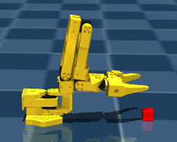
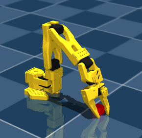
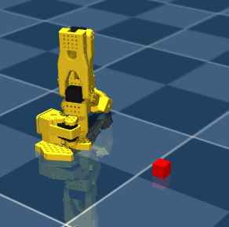

# ACT Training for SO-101

This repo now treats ACT training as a diagnostics-first pipeline:

1. `imitation-learning/diagnose_act_setup.py` audits the dataset, checkpoint, and optional physical inference CSV logs.
2. `simulation_code/train_act_on_data.py` trains supervised ACT from the real physical-arm demonstrations.
3. `simulation_code/train_sim_baseline.py` proves the MuJoCo reward/action contract with a simple privileged-state PPO baseline.
4. `simulation_code/train_act_in_sim.py` is preserved as an explicit experimental ACT-chunk PPO path, not the default improvement path.

The default physical dataset is:

`/home/win10ubuntu/dev/robotic-arm/SO-ARM-101/imitation-learning/datasets/so101_pickplace_v1`

Confirmed dataset schema:

- 100 episodes
- 41,631 frames
- 30 FPS
- `robot_type = so101_follower`
- 6D `observation.state`
- 6D `action`
- wrist-camera video at `observation.images.wrist`, 256x256 RGB

The sim PPO script keeps the actor observation schema matched to that physical dataset. It maps the MuJoCo wrist camera from `SO101PickPlaceEnv`:

- sim `observation.images.camera2` -> ACT `observation.images.wrist`
- sim `observation.state` -> ACT `observation.state`

Only the critic receives privileged MuJoCo state such as gripper position, block position, distance, and block height. The policy does not receive top or side cameras in this v1 path.

## Environment

The simulation README uses a conda environment named `lerobot` with Python 3.10.
This machine has Miniforge installed at `/home/win10ubuntu/miniforge3` and the
environment created at:

`/home/win10ubuntu/miniforge3/envs/lerobot`

For a new shell:

```bash
source /home/win10ubuntu/miniforge3/etc/profile.d/conda.sh
conda activate lerobot
```

The environment was installed from the adjacent local LeRobot fork:

```bash
pip install -e "/home/win10ubuntu/dev/robotic-arm/lerobot-fork[smolvla]" --no-cache-dir
pip install -e "/home/win10ubuntu/dev/robotic-arm/lerobot-fork[feetech]" --no-cache-dir
pip install mujoco pygame --no-cache-dir
conda install -n lerobot "ffmpeg<8"
```

Expected verification:

```bash
python - <<'PY'
import torch, mujoco, lerobot, transformers, scservo_sdk
from lerobot.policies.smolvla.modeling_smolvla import VLAFlowMatching
from lerobot.policies.act.modeling_act import ACTPolicy
print("cuda_available", torch.cuda.is_available())
print("mujoco", mujoco.__version__)
print("lerobot", getattr(lerobot, "__version__", "unknown"))
print("reinflow_patch", "sample_actions_reinflow" in dir(VLAFlowMatching))
print("act_policy", ACTPolicy.__name__)
PY
```

Default workflow:

```bash
cd /home/win10ubuntu/dev/robotic-arm/SO-ARM-101/imitation-learning
python3 diagnose_act_setup.py

cd /home/win10ubuntu/dev/robotic-arm/SO-ARM-101/simulation_code
python3 train_act_on_data.py --dry-run --profile corrected-act
python3 train_act_on_data.py --profile corrected-act --num-workers 0

python3 train_sim_baseline.py --no-render --headless
```

`--num-workers 0` is the default for `train_act_on_data.py`; it avoids
multiprocessing tensor-sharing failures observed on this WSL-mounted workspace.

For corrected ACT retraining, use `--profile corrected-act`. It runs the
parquet action/state preflight, enables AMP, computes a 20-epoch step budget,
and overrides ACT to a shorter `policy.chunk_size=30` and
`policy.n_action_steps=30` unless explicitly overridden. The old throughput-only
profile is still available as `--performance-profile fast`.

On this machine, the measured ACT offline benchmark winner was
`batch_size=128`, `num_workers=0`. Worker counts 1, 2, and 4 still failed under
WSL even with PyTorch `file_system` sharing enabled. `corrected-act` defaults to
`batch_size=64` for a more conservative retraining pass.

The physical dataset has an important contract detail: in the recorded parquet
files, same-frame `action` equals same-frame `observation.state`. LeRobot ACT
still builds future action chunks using `action_delta_indices`, so this is not
automatically invalid, but it must be audited before trusting a checkpoint.
`diagnose_act_setup.py` reports same-frame equality, future chunk deltas,
gripper range, checkpoint config, and offline policy replay error.

Offline training run history is recorded in
`notes/train-act-on-data-history.md`.

`train_act_in_sim.py` still defaults to the original offline checkpoint at:

`outputs/train/act_so101_physical/checkpoints/last/pretrained_model`

Pass `--init-checkpoint` to use a corrected ACT artifact. This script now
requires `--experimental-act-ppo` before it will launch, because the previous
long ACT PPO run completed mechanically but produced 0% success. Use
`train_sim_baseline.py` first to verify the MuJoCo reward and action units.

Experimental ACT PPO command:

```bash
python3 train_act_in_sim.py --experimental-act-ppo --no-render --headless
```

## Diagnostics

Run the full ACT setup diagnostic with:

```bash
cd /home/win10ubuntu/dev/robotic-arm/SO-ARM-101/imitation-learning
python3 diagnose_act_setup.py
```

To include a physical inference CSV log:

```bash
python3 diagnose_act_setup.py --physical-log outputs/act_physical_actions_YYYYMMDD_HHMMSS.csv
```

The diagnostic checks dataset counts/schema, whether same-frame `action`
equals `observation.state`, future action deltas, gripper range, checkpoint
configuration, offline replay error on recorded frames, and blank-image
sensitivity.

## MuJoCo Baseline

Before trying ACT fine-tuning in sim, run the simple privileged-state PPO
baseline:

```bash
cd /home/win10ubuntu/dev/robotic-arm/SO-ARM-101/simulation_code
python3 train_sim_baseline.py --no-render --headless
```

This baseline is not a deployment policy. It uses low-dimensional privileged
state and direct 6D joint deltas to verify that the environment, reward,
contact/grasp/lift metrics, and action units are learnable.

## MuJoCo Inference

After offline ACT training, run deterministic MuJoCo evaluation with:

```bash
cd /home/win10ubuntu/dev/robotic-arm/SO-ARM-101/simulation_code
python3 run_act_sim_inference.py --episodes 10 --headless
```

For a live MuJoCo viewer:

```bash
python3 run_act_sim_inference.py --episodes 1 --render
```

To save rollout videos:

```bash
python3 run_act_sim_inference.py --episodes 1 --headless --save-video outputs/eval/act_videos
```

The inference path uses the same observation adapter as the sim PPO plan:
MuJoCo `observation.images.camera2` is treated as the physical dataset's
`observation.images.wrist`, and only that wrist image plus
`observation.state` are passed to ACT.
`run_act_sim_inference.py` loads the same checkpoint pre/postprocessors used by
physical inference. By default it now uses the corrected `30/30` checkpoint at:

`outputs/train/act_so101_corrected_30_b32_20260621_160923/checkpoints/026020/pretrained_model`

For before/after ACT PPO behavior comparisons, use these two commands.
`run_act_sim_inference.py` loads LeRobot `pretrained_model` directories, while
`run_act_ppo_sim_inference.py` loads `.pt` checkpoints produced by
`train_act_in_sim.py`.

Before in-sim PPO:

```bash
python3 run_act_sim_inference.py \
  --checkpoint outputs/train/act_so101_corrected_30_b32_20260621_160923/checkpoints/026020/pretrained_model \
  --episodes 5 \
  --max-steps-per-episode 300 \
  --steps-per-action 1 \
  --render \
  --curriculum-fixed-block
```

After in-sim PPO:

```bash
python3 run_act_ppo_sim_inference.py \
  --resume act_sim_ppo_checkpoint.pt \
  --episodes 5 \
  --max-steps-per-episode 300 \
  --steps-per-action 1 \
  --render \
  --curriculum-fixed-block
```

Latest live comparison from the 2026-06-23 ACT PPO run:

- Base policy: corrected ACT checkpoint from `train_act_on_data.py`.
- Post-PPO policy: `act_sim_ppo_checkpoint.pt`, trained from that base policy.
- Observed behavior change: the post-PPO policy is more confident about moving
  toward the block and appears to angle the gripper more deliberately.
- Current failure mode: the post-PPO policy crashes into the block and stays
  there instead of transitioning from contact/grasp into lift.
- Interpretation: the in-sim PPO reward improved approach/contact behavior, but
  did not solve the staged manipulation objective. Treat this checkpoint as a
  diagnostic artifact, not a deployment policy.

Contact-stall reward rebalance:

- The next ACT-in-sim pass reduces repeated contact reward so crashing into the
  block and staying there is no longer a high-return local optimum.
- One-time contact remains useful, but sustained contact only pays when it is
  paired with grip or lift progress.
- Grasp, grasp persistence, lift progress, and lift success now carry more of
  the reward mass.
- `train_act_in_sim.py` logs reward components under
  `rollout/reward_components/*` so future runs can show whether return is coming
  from contact camping or from grasp/lift progress.

Result from the `act_sim_ppo_contact_stall_v2` ablation:

- W&B run: [`1db3iq53`](https://wandb.ai/7adamyasingh-rutgers-university/act-so101-sim-ppo/runs/1db3iq53).
- Checkpoint:
  `outputs/train/act_sim_ppo_contact_stall_v2/act_sim_ppo_checkpoint.pt`.
- Numeric result: return improved from about `-4.7` early to about `-0.3` late,
  with final `contact_steps=0`, `grasp_steps=0`, `lift_steps=0`, and
  `success=0`.
- Live sim result: policy was poor; it retracted the arm into a sitting posture
  and stayed there, with occasional slight gripper spinning.
- Interpretation: the contact-stall exploit was removed, but the new reward
  created a different avoidance/local optimum. Reward alone is not enough in
  this form; the next attempt should add behavioral constraints, curriculum, or
  action/pose regularization so “do nothing/retract” cannot score as the best
  low-risk strategy.

Follow-up workspace-engagement v3 change:

- Increase distance pressure and add explicit far-from-block and moving-away
  penalties so retracting into a sitting posture is no longer the best
  low-risk behavior.
- Gate near-contact reward on active horizontal or vertical progress so the
  policy cannot earn that term by freezing near the block.
- Keep the contact-stall v2 grasp/lift/contact reward balance unchanged; the
  next ablation should first prove the policy stays engaged with the block
  workspace before increasing grasp or lift bonuses again.

Result from the `act_sim_ppo_workspace_engagement_v3` ablation:

- W&B run: [`g1jtc81c`](https://wandb.ai/7adamyasingh-rutgers-university/act-so101-sim-ppo/runs/g1jtc81c).
- Checkpoint:
  `outputs/train/act_sim_ppo_workspace_engagement_v3/act_sim_ppo_checkpoint.pt`.
- Numeric result: completed `300` PPO updates / `180000` env steps with final
  `success=0`, `lift_steps=0`, `grasp_steps=0`, and `contact_steps=190`.
  Avoidance penalties mostly disappeared late in training, and the best rollout
  reached `grasp_steps=68` around update `220`, but no lift emerged.
- Live sim result: better than the contact-stall v2 run. The arm now moves
  immediately toward the block and hovers a little away from it, but it does not
  try to close into a grasp.
- Interpretation: workspace engagement improved and the retraction/sitting
  local optimum was reduced, but the learned policy is now stuck at an
  approach/hover pre-grasp local optimum. The next change should target the
  transition from hover/near-contact into active grasp, likely through
  curriculum/reset shaping or a staged grasp-attempt incentive rather than
  simply running this reward longer.

Follow-up grasp-transition v4 change:

- Add narrow randomized block resets with `--randomize-block-reset`,
  `--block-dist-range 0.22 0.26`, and `--block-angle-range -10 10`. This starts
  randomization near the fixed curriculum pose instead of jumping to the full
  environment default range.
- Add reward shaping for the hover-to-grasp transition: when the gripper is in a
  pre-grasp corridor or near-contact pose, reward active gripper closing and
  penalize repeated hovering without contact or closing.
- Keep the v3 workspace-engagement and contact-stall terms unchanged. The next
  ablation should test whether the policy begins closing into contact/grasp
  instead of stopping just short of the block.

Canonical v4 training command:

```bash
cd /home/win10ubuntu/dev/robotic-arm/SO-ARM-101/simulation_code

MUJOCO_GL=egl /home/win10ubuntu/miniforge3/envs/lerobot/bin/python train_act_in_sim.py \
  --experimental-act-ppo \
  --init-checkpoint /home/win10ubuntu/dev/robotic-arm/SO-ARM-101/simulation_code/outputs/train/act_so101_corrected_30_b32_20260621_160923/checkpoints/026020/pretrained_model \
  --parallel-envs 12 \
  --rollout-chunks-per-env 2 \
  --minibatch-size 64 \
  --ppo-epochs 1 \
  --chunk-size 30 \
  --max-steps-per-episode 100 \
  --steps-per-action 1 \
  --episodes 300 \
  --checkpoint-path /home/win10ubuntu/dev/robotic-arm/SO-ARM-101/simulation_code/outputs/train/act_sim_ppo_grasp_transition_v4/act_sim_ppo_checkpoint.pt \
  --randomize-block-reset \
  --block-dist-range 0.22 0.26 \
  --block-angle-range -10 10 \
  --headless \
  --no-render
```

Canonical v4 live inference command:

```bash
cd /home/win10ubuntu/dev/robotic-arm/SO-ARM-101/simulation_code

/home/win10ubuntu/miniforge3/envs/lerobot/bin/python run_act_ppo_sim_inference.py \
  --resume outputs/train/act_sim_ppo_grasp_transition_v4/act_sim_ppo_checkpoint.pt \
  --episodes 5 \
  --max-steps-per-episode 300 \
  --steps-per-action 1 \
  --render \
  --randomize-block-reset \
  --block-dist-range 0.22 0.26 \
  --block-angle-range -10 10
```

Result from the `act_sim_ppo_grasp_transition_v4` ablation:

- W&B runs:
  [`0ufccyej`](https://wandb.ai/7adamyasingh-rutgers-university/act-so101-sim-ppo/runs/0ufccyej)
  for the initial segment through update `219`, then
  [`kqky26x8`](https://wandb.ai/7adamyasingh-rutgers-university/act-so101-sim-ppo/runs/kqky26x8)
  for the resumed segment through update `299`.
- Checkpoint:
  `outputs/train/act_sim_ppo_grasp_transition_v4/act_sim_ppo_checkpoint.pt`.
- Numeric result: completed `300` PPO updates / `180000` env steps with final
  `success=0`, `contact_steps=0`, `grasp_steps=0`, and `lift_steps=0`. The
  policy learned to collect gripper-closing reward (`19.9` final, max `34.8`),
  but this did not produce contact, grasp, or lift.
- Live sim result: degraded. The policy found the earlier retraction/sitting
  local minimum again; the arm fully retracts to its sitting position and stays
  there.
- Interpretation: the v4 grasp-transition shaping was not sufficiently tied to
  physical contact. It rewarded closing behavior that could be exploited without
  actually entering the block. The next attempt should not increase
  gripper-closing reward alone; it should either return to fixed-block training
  while solving hover-to-contact, or only pay closing when it immediately
  produces contact / reduces final pre-contact distance.

Follow-up contact-commitment v5 change:

- Return to fixed-block training for one ablation. Randomized resets remain
  available, but v5 should first recover fixed-pose contact before adding reset
  variance again.
- Remove standalone gripper-closing reward. Gripper closing now only sets a
  short memory window, and reward is paid when first contact occurs soon after
  closing.
- Increase pre-grasp hover pressure and add a disengaged-stall penalty to make
  sitting/retraction less attractive without changing grasp/lift bonuses.

Canonical v5 training command:

```bash
cd /home/win10ubuntu/dev/robotic-arm/SO-ARM-101/simulation_code

MUJOCO_GL=egl /home/win10ubuntu/miniforge3/envs/lerobot/bin/python train_act_in_sim.py \
  --experimental-act-ppo \
  --init-checkpoint /home/win10ubuntu/dev/robotic-arm/SO-ARM-101/simulation_code/outputs/train/act_so101_corrected_30_b32_20260621_160923/checkpoints/026020/pretrained_model \
  --parallel-envs 12 \
  --rollout-chunks-per-env 2 \
  --minibatch-size 64 \
  --ppo-epochs 1 \
  --chunk-size 30 \
  --max-steps-per-episode 100 \
  --steps-per-action 1 \
  --episodes 300 \
  --checkpoint-path /home/win10ubuntu/dev/robotic-arm/SO-ARM-101/simulation_code/outputs/train/act_sim_ppo_contact_commit_v5/act_sim_ppo_checkpoint.pt \
  --headless \
  --no-render
```

Canonical v5 live inference command:

```bash
cd /home/win10ubuntu/dev/robotic-arm/SO-ARM-101/simulation_code

/home/win10ubuntu/miniforge3/envs/lerobot/bin/python run_act_ppo_sim_inference.py \
  --resume outputs/train/act_sim_ppo_contact_commit_v5/act_sim_ppo_checkpoint.pt \
  --episodes 5 \
  --max-steps-per-episode 300 \
  --steps-per-action 1 \
  --render \
  --curriculum-fixed-block
```

Result from the `act_sim_ppo_contact_commit_v5` ablation:

- W&B run: [`skfhaguf`](https://wandb.ai/7adamyasingh-rutgers-university/act-so101-sim-ppo/runs/skfhaguf).
- Checkpoint:
  `outputs/train/act_sim_ppo_contact_commit_v5/act_sim_ppo_checkpoint.pt`.
- Numeric result: completed `300` PPO updates / `180000` env steps with final
  `success=0`, `grasp_steps=0`, `lift_steps=0`, and `contact_steps=21`.
  Direct `gripper_closing_reward` stayed at `0`, as intended, but
  `closing_contact_bonus=0` and final `block_displacement_penalty=-28.76`
  indicate contact was not becoming useful grasp/lift behavior.
- Live sim result: degraded into a new local minimum. The arm scrunches up with
  the forearm sticking straight up and the gripper facing outward at roughly a
  90-degree angle, then stays there.



Image file: [act-sim-ppo-contact-commit-v5-local-minimum.png](./images/act-sim-ppo-contact-commit-v5-local-minimum.png)

- Interpretation: removing standalone gripper-closing reward prevented the v4
  close-in-air exploit, but the fixed-block contact-commitment reward still did
  not create a reliable hover-to-contact transition. The high displacement
  penalty suggests the policy may be finding awkward contact or posture states
  that move the block without grasping. The next attempt should likely add
  stronger posture/workspace constraints or collect/imitate targeted
  hover-to-contact demonstrations rather than continuing reward-only tweaks.

Episode-90 snapshot from the 150-episode v5 retry:

- W&B run: [`7aw545ha`](https://wandb.ai/7adamyasingh-rutgers-university/act-so101-sim-ppo/runs/7aw545ha).
- Snapshot checkpoint:
  `outputs/train/act_sim_ppo_contact_commit_v5_ep150/act_sim_ppo_checkpoint_snapshot_20260625_130447.pt`.
- Snapshot metadata: `episode=90`, `total_env_steps=54720`.
- Live sim result: promising but unstable. From the standard fixed start, the
  policy makes a good approach and appears to try gripping the block. It does
  not lift yet. A few seconds after the grip attempt, it scrunches up, turns far
  left, and stays away from the block. When started from positions other than
  the single training start pose, it also tends to scrunch into that far-left
  posture.
- Interpretation: this snapshot is more useful than the final v5 policy for
  diagnosing the next change. It suggests the reward can produce approach and
  early grip attempts before the policy escapes into a posture local minimum.
  The next run should preserve the approach/contact signal but constrain the
  post-grip posture or add recovery pressure so failed grip attempts return to
  the block instead of folding left.

Good approach / early grip attempt:



Image file: [act-sim-ppo-contact-commit-v5-ep90-approach.png](./images/act-sim-ppo-contact-commit-v5-ep90-approach.png)

Scrunched left posture a few seconds later:



Image file: [act-sim-ppo-contact-commit-v5-ep90-scrunch-left.png](./images/act-sim-ppo-contact-commit-v5-ep90-scrunch-left.png)

Follow-up preserve-grip v6 change:

- Continue PPO from the promising v5 episode-90 snapshot instead of restarting
  from the supervised ACT base. The supervised base checkpoint is still passed
  as `--init-checkpoint` because the training script constructs the ACT wrapper
  first, then loads PPO weights from `--resume`.
- Add a post-attempt commitment window. Contact, near-contact plus gripper
  closing, or positive lift-progress reward now starts a short window where the
  policy is rewarded for staying in the grasp corridor / near-contact zone and
  for moving back toward the block after a failed grip attempt.
- Add anti-escape shaping for the far-left scrunched posture. When the gripper
  is far from the block, not contacted/gripped/lifting, and moving away or
  staying disengaged, the reward applies an escape penalty. The penalty is
  stronger during the post-attempt commitment window.
- Keep fixed-block training, keep v5 grasp/lift amounts unchanged, and keep
  standalone `gripper_closing_reward=0.0`.
- Add `--snapshot-every` to save numbered checkpoint snapshots during resumed
  runs, since the best behavioral checkpoint may occur before the final update.

Canonical v6 training command:

```bash
cd /home/win10ubuntu/dev/robotic-arm/SO-ARM-101/simulation_code

MUJOCO_GL=egl /home/win10ubuntu/miniforge3/envs/lerobot/bin/python train_act_in_sim.py \
  --experimental-act-ppo \
  --init-checkpoint /home/win10ubuntu/dev/robotic-arm/SO-ARM-101/simulation_code/outputs/train/act_so101_corrected_30_b32_20260621_160923/checkpoints/026020/pretrained_model \
  --resume /home/win10ubuntu/dev/robotic-arm/SO-ARM-101/simulation_code/outputs/train/act_sim_ppo_contact_commit_v5_ep150/act_sim_ppo_checkpoint_snapshot_20260625_130447.pt \
  --parallel-envs 12 \
  --rollout-chunks-per-env 2 \
  --minibatch-size 64 \
  --ppo-epochs 1 \
  --chunk-size 30 \
  --max-steps-per-episode 100 \
  --steps-per-action 1 \
  --episodes 165 \
  --checkpoint-path /home/win10ubuntu/dev/robotic-arm/SO-ARM-101/simulation_code/outputs/train/act_sim_ppo_preserve_grip_v6/act_sim_ppo_checkpoint.pt \
  --snapshot-every 25 \
  --headless \
  --no-render
```

Canonical v6 live inference command:

```bash
cd /home/win10ubuntu/dev/robotic-arm/SO-ARM-101/simulation_code

/home/win10ubuntu/miniforge3/envs/lerobot/bin/python run_act_ppo_sim_inference.py \
  --resume outputs/train/act_sim_ppo_preserve_grip_v6/act_sim_ppo_checkpoint.pt \
  --episodes 5 \
  --max-steps-per-episode 300 \
  --steps-per-action 1 \
  --render \
  --curriculum-fixed-block
```

For v6, compare numbered snapshots as well as the final checkpoint. With
`--snapshot-every 25` and resume from episode `90`, expected important
snapshots include `act_sim_ppo_checkpoint_ep0115.pt` and
`act_sim_ppo_checkpoint_ep0140.pt`.

Result from the `act_sim_ppo_preserve_grip_v6` ablation:

- W&B run: [`ulu2z9qq`](https://wandb.ai/7adamyasingh-rutgers-university/act-so101-sim-ppo/runs/ulu2z9qq).
- Checkpoints:
  `outputs/train/act_sim_ppo_preserve_grip_v6/act_sim_ppo_checkpoint.pt`,
  plus snapshots `act_sim_ppo_checkpoint_ep0115.pt` and
  `act_sim_ppo_checkpoint_ep0140.pt`.
- Numeric result: resumed from v5 episode `90` and completed through episode
  `164`, with final checkpoint metadata `total_env_steps=99120` and
  `total_chunks=3960`. The final W&B summary still shows `success=0`, but
  contact behavior remained active with final `rollout/contact_steps=188`.
- Live sim result: promising. The policy still looks like the useful v5
  episode-90 checkpoint: it approaches the block and attempts a grasp. The v6
  shaping appears to slow the post-attempt retreat left, which is the desired
  direction.
- New failure mode: the policy closes the gripper immediately at episode start
  and keeps it closed. This prevents a real grasp because the gripper reaches
  the block already closed instead of closing around it.
- Interpretation: preserving the promising grip-attempt behavior worked better
  than restarting from the supervised base. The next reward change should
  explicitly keep the gripper open until the pre-grasp corridor / near-contact
  zone, then reward timed closure. Do not add broad grasp/lift bonuses yet; the
  immediate-closure behavior needs to be removed first.

Follow-up timed-gripper v7 change:

- Continue PPO from the v6 final checkpoint, which is the latest policy that
  preserves useful approach and grip-attempt behavior.
- Keep fixed-block training. Randomized block resets remain deferred until
  fixed-block timed closure is stable.
- Add timed gripper shaping:
  - penalize several consecutive pre-corridor steps with a too-closed gripper
  - reward keeping the gripper open enough during approach
  - reward gripper closing only inside the pre-grasp corridor / near-contact
    zone
  - allow the existing contact-after-closing bonus to trigger from this timed
    close window
- Keep v6 post-attempt commitment and anti-escape shaping intact.
- Use `--snapshot-every 100` for the overnight run to preserve checkpoint
  choices without filling disk too quickly.

Canonical v7 overnight training command:

```bash
cd /home/win10ubuntu/dev/robotic-arm/SO-ARM-101/simulation_code

MUJOCO_GL=egl /home/win10ubuntu/miniforge3/envs/lerobot/bin/python train_act_in_sim.py \
  --experimental-act-ppo \
  --init-checkpoint /home/win10ubuntu/dev/robotic-arm/SO-ARM-101/simulation_code/outputs/train/act_so101_corrected_30_b32_20260621_160923/checkpoints/026020/pretrained_model \
  --resume /home/win10ubuntu/dev/robotic-arm/SO-ARM-101/simulation_code/outputs/train/act_sim_ppo_preserve_grip_v6/act_sim_ppo_checkpoint.pt \
  --parallel-envs 12 \
  --rollout-chunks-per-env 2 \
  --minibatch-size 64 \
  --ppo-epochs 1 \
  --chunk-size 30 \
  --max-steps-per-episode 100 \
  --steps-per-action 1 \
  --episodes 1200 \
  --checkpoint-path /home/win10ubuntu/dev/robotic-arm/SO-ARM-101/simulation_code/outputs/train/act_sim_ppo_timed_gripper_v7/act_sim_ppo_checkpoint.pt \
  --snapshot-every 100 \
  --headless \
  --no-render
```

Canonical v7 live inference command:

```bash
cd /home/win10ubuntu/dev/robotic-arm/SO-ARM-101/simulation_code

/home/win10ubuntu/miniforge3/envs/lerobot/bin/python run_act_ppo_sim_inference.py \
  --resume outputs/train/act_sim_ppo_timed_gripper_v7/act_sim_ppo_checkpoint.pt \
  --episodes 5 \
  --max-steps-per-episode 300 \
  --steps-per-action 1 \
  --render \
  --curriculum-fixed-block
```

Acceptance notes for v7:

- Bad: gripper still closes immediately at episode start and stays closed.
- Bad: policy avoids closure entirely and only hovers.
- Better: gripper remains open enough during approach, then closes near the
  block.
- Good: W&B shows nonzero `approach_open_gripper_reward`, nonzero
  `timed_close_reward`, reduced `early_close_penalty`, and stable or rising
  `contact_steps` / `grasp_steps`.

Paused-result note for the `act_sim_ppo_timed_gripper_v7` overnight run:

- W&B run: [`ipxywbv8`](https://wandb.ai/7adamyasingh-rutgers-university/act-so101-sim-ppo/runs/ipxywbv8).
- Paused checkpoint:
  `outputs/train/act_sim_ppo_timed_gripper_v7/act_sim_ppo_checkpoint.pt`.
- Checkpoint metadata at pause: `episode=673`, `total_env_steps=404640`,
  `total_chunks=16176`.
- Saved snapshots available before pause: `act_sim_ppo_checkpoint_ep0264.pt`,
  `ep0364.pt`, `ep0464.pt`, `ep0564.pt`, and `ep0664.pt`.
- Live sim result: the timed-gripper v7 reward did not fix immediate closure.
  The policy still closes the gripper at episode start, approaches the block,
  stops just before it with the gripper pointed downward, and stays there.
- Improvement: the policy no longer scrunches up and retreats to the left/corner
  as quickly as prior failures.
- New dominant failure mode: it appears to avoid meaningful interaction with the
  block. It barely touches the block and does not make a real grasp attempt.
- Interpretation: the anti-retreat / stay-engaged shaping is helping posture
  stability, but the gripper timing reward is too weak or too easy to ignore.
  A follow-up pre-grasp action guard was tried and rejected; do not revive that
  branch without a separate design review.

Rejected v8 pre-grasp guard result:

- The `act_sim_ppo_pregrasp_guard_v8_overnight` checkpoint was manually stopped
  after a checkpoint was written around `2026-06-26 01:04`, with the log near
  update `256`.
- Live MuJoCo inference showed severe policy degradation: the arm waves around
  in the air instead of making a meaningful approach, contact, or grasp attempt.
- Do not continue from `act_sim_ppo_pregrasp_guard_v8_overnight`, and do not
  treat it as an improvement over v6 or v7.

Next ACT sim PPO baseline:

- Restart future experiments from the v5 episode-90 snapshot, not from v6, v7,
  or v8:
  `outputs/train/act_sim_ppo_contact_commit_v5_ep150/act_sim_ppo_checkpoint_snapshot_20260625_130447.pt`.
- The v5 episode-90 snapshot preserved the best observed approach and visible
  grip-attempt behavior before later continuations overfit into local minima.

## Physical ACT Inference

Physical inference uses the real SO-101 follower arm and the wrist camera:

```bash
cd /home/win10ubuntu/dev/robotic-arm/SO-ARM-101/imitation-learning

python3 run_act_physical_inference.py --list-devices
python3 run_act_physical_inference.py --wsl-attach-help

python3 run_act_physical_inference.py \
  --robot-port /dev/ttyUSB0 \
  --camera-index 0 \
  --preflight-only

python3 run_act_physical_inference.py \
  --robot-port /dev/ttyUSB0 \
  --camera-index 0 \
  --dry-run

python3 run_act_physical_inference.py \
  --robot-port /dev/ttyUSB0 \
  --camera-index 0 \
  --enable-motion
```

`run_act_physical_inference.py` is dry-run by default. It loads the ACT
checkpoint and predicts actions, but it only calls `robot.send_action` when
`--enable-motion` is passed and the runtime Enter confirmation is accepted.
Every physical run logs a CSV by default under `imitation-learning/outputs`
unless `--log-actions` is provided. The CSV includes the checkpoint path,
`chunk_size`, `n_action_steps`, control Hz, smoothing, and relative target cap.

The physical script uses the same state/action convention as
`record_single_arm.py`: the first five motors map normalized motor units to
radians with `motor / 100 * pi`, and the gripper maps with
`motor / 100 * 1.7`. It loads ACT pre/postprocessors from the checkpoint, so
the runtime path is physical observation -> checkpoint preprocessor ->
`ACTPolicy.select_action()` -> checkpoint postprocessor -> motor command.
By default it now uses the corrected `30/30` checkpoint, runs at 30 Hz, uses
`smooth_alpha=1.0`, and sets `max_relative_target=20`.
Before motion starts, the script prints a start-pose diagnostic comparing the
current 6D state to the recorded demo start-pose distribution. If the current
pose is far outside the demo distribution, treat the checkpoint behavior as
unreliable until you correct the reset pose or retrain with broader starts.

On this Windows/WSL machine, the current `imitation-learning/config.json`
contains stale macOS paths and should not be used as a source of truth for
physical ACT inference. Override the WSL device paths explicitly. The hardware
must be visible inside WSL before the script can run:

```bash
ls /dev/ttyUSB* /dev/ttyACM* /dev/video*
```

At the time this note was written, Windows could see the SO-101 USB serial
adapter as `USB-Enhanced-SERIAL CH343 (COM3)` and a USB camera-like device as
`USB\VID_0C45&PID_6366\SN0001`, but WSL did not expose `/dev/ttyUSB*`,
`/dev/ttyACM*`, or `/dev/video*`. Attach those devices into WSL first, then
rerun `--list-devices` and `--preflight-only`.

For WSL USB passthrough, install `usbipd-win` on Windows, run `usbipd list`,
bind/share the SO-101 serial adapter and wrist camera BUSIDs, then attach them
to WSL:

```powershell
winget install --interactive --exact dorssel.usbipd-win
usbipd list
usbipd bind --busid <SERIAL_BUSID>
usbipd bind --busid <CAMERA_BUSID>
usbipd attach --wsl --busid <SERIAL_BUSID>
usbipd attach --wsl --busid <CAMERA_BUSID>
```

While attached, Windows cannot use those USB devices. Detach with:

```powershell
usbipd detach --busid <BUSID>
```
