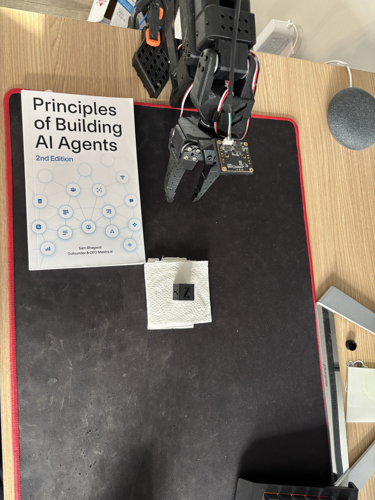
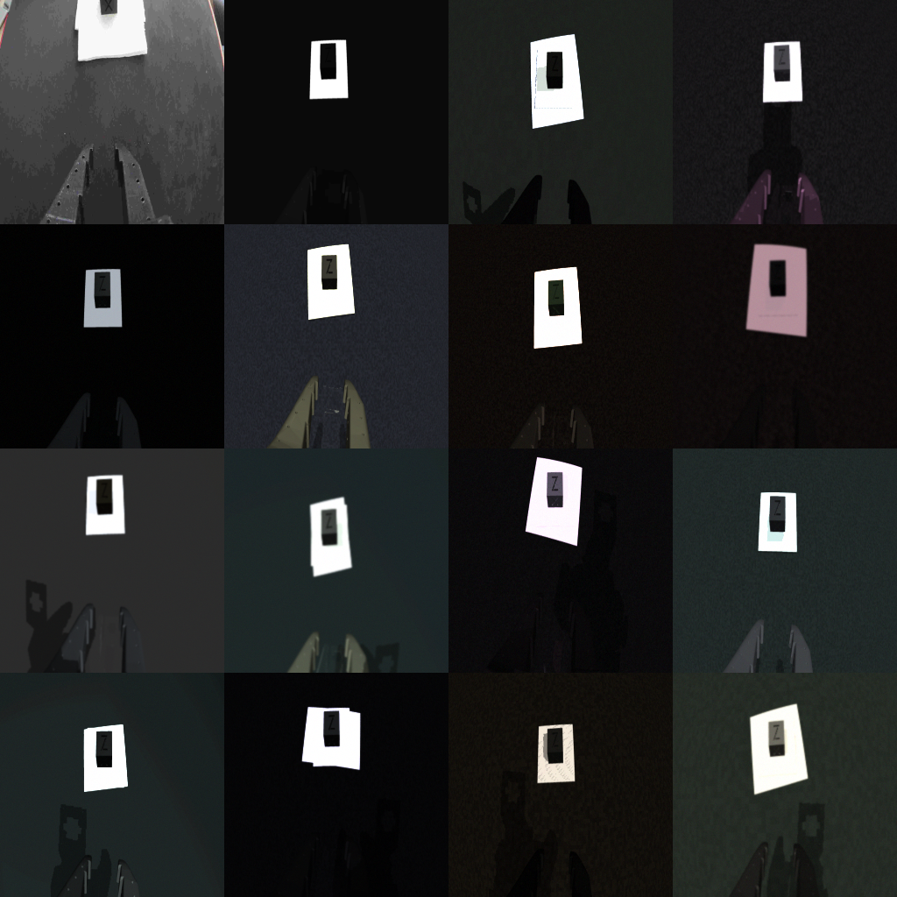
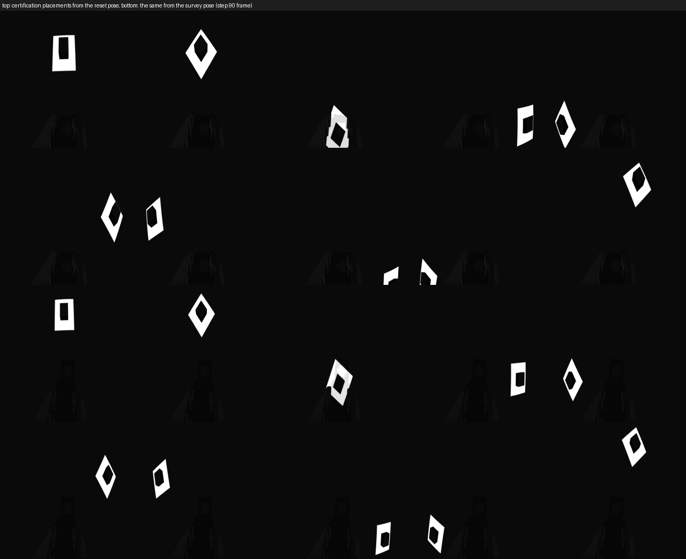
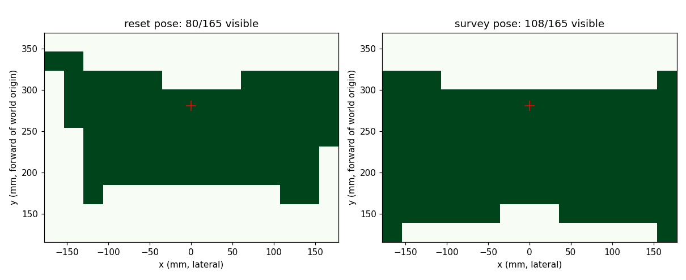
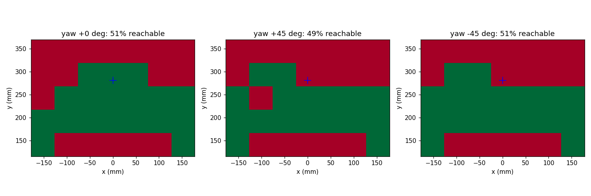

# Bench lift-and-replace, September 2026

This is the governing record for the active `bench_pick_replace_v1`
experiment: physical setup, recorded hardware state, active scene and
teacher, evidence inventory, gates, open work, and resume commands. It
absorbed the 2026-09-06 assistant handoff note, which has been deleted.

## Status (2026-09-10)

**Scaling ladder DONE 2026-09-11 15:18 (`experiments/scaling_ladder_20260910`,
W&B xygyhacp): 2400 placements x encoders v1/v2/v3 x 60k-480k steps, scored
on 10 unseen placements. Held-out loss at the first descent chunk stays at
2.3e-3 to 7.5e-3 for every encoder and every data size (train 1e-7 to 5e-6);
data exponent 0.4 with a 5e-5 floor, no parameter dependence, more steps
flat; best closed loop 9/30 (v2, 1200 placements, 480k steps). Per pose, the
network is 5x worse than a nearest-training-placement lookup and 300x worse
at its worst pose although a placement 2 mm away is in the training set:
the bottleneck is reading the square's position from the survey frame, not
data, capacity or steps. Next lever: random-shift augmentation, then a
separate square localiser conditioning the policy (notebook entry
"Scaling ladder (2026-09-11)"). No live trial candidate from the ladder.**

**Random-shift augmentation DONE 2026-09-12 10:41 (`experiments/augmentation_20260912`,
W&B 8okj7i9y): the ladder's 1200-placement / v2 / 120k point retrained with
per-sample random shifts of 4 and 12 px. Held-out start-90 loss 4.2e-3 ->
1.3e-3 -> 6.2e-4, held-out/train ratio 5250x -> 168x -> 15x, per-pose
median 1.1e-3 -> 2.4e-4 with 5/10 poses under 2.5e-4 (0 before); closed
loop 0/30 -> 9/30 -> 9/30, safety frames 525 -> 193. The baseline's
collisions and misses became "lifted but no strict grasp" near-misses (cube
caught by an edge, carried 20-30 mm, dropped at release): the network now
reads the survey frame, and the remaining error is millimetre precision at
closure. Next: shift 12 at 240k-480k steps and at 2400 placements (both
axes should pay now that memorisation is blocked), then the square
localiser (notebook entry "Random-shift augmentation (2026-09-12)"). Not a
live-trial candidate.**

**Fifth run (1200 placements, 240k steps, `pfavtk49`) DONE 2026-09-10 19:11,
247 min wall: nominal 0/3, held-out 3/30 (one pose 3/3, the far-centre
placement), held-out appearance 3/30, prefix 63/63, real-frame gate PASS on
episodes 02 and 10 with 16/16 photometric perturbations; 846 safety frames on
the held-out suite (18 safety invalidations, 9 incomplete pickups). Train vs
held-out at the first descent chunk (start 90): 7.0e-6 vs 2.9e-3, a 417x gap,
worse than run 4's 136x (1.4e-5 vs 1.9e-3). Tripling the placements did not
move the held-out loss at all: the network memorises whatever it is given and
does not learn to read the square's position from the survey frame. NOT a
live-trial candidate; the fixed-square policy `ytn3eygr` remains the only
one that has succeeded on the arm. The scaling ladder (2026-09-11, see the
status paragraph above) then tested the remaining levers directly: no encoder
generalised at any data size or step count, so the next lever is input
augmentation (random shifts) and a separate square localiser, not more data.**

**Placement randomization tranche implemented (2026-09-10, later): square +
cube anywhere in the 14 × 10 in rectangle with yaw; survey viewing pose;
yaw-aware teacher certified 30/30 on the regenerated scene `92f07142…`;
pipeline recipe `--appearance --placement` rehearsed. Fourth run pending gate 1
re-sign. Details under "Placement randomization" below.**

**FIRST SUCCESSFUL LIVE EPISODE (2026-09-10, `physical/episode_10_20260910`):
the appearance-randomized policy (run `ytn3eygr`) ran all 480 actions on the
physical arm at 30 Hz with zero holds and zero overruns, closed on the cube
(gripper stopped at 6 units), lifted it 18.6 mm (jaw-tip forward kinematics),
released it back onto the towel within 3 mm of its start and retreated. Video
and traces in `physical/episode_10_20260910/analysis/`. Getting there took
attempts 3 to 9 (details in `notes/vision-rung-notebook.md`): the live
real-frame gate, a cube-placement gate, and the runner's gate changed to
rate-limit-and-continue on the relative limit (`bench_clip_decision`), because
a hold that freezes the arm while a chunk's targets keep advancing can never
recover on a lagging servo. Single episode, exploratory.** Episode 13 (same setup, brighter daylight)
closed beside the cube: the three real descents land within ~10 mm of the
simulated grasp point while the cube sits ~20 mm beyond the task pose, so
success is marginal. Conclusion (user, 2026-09-10): the policy has no
tolerance for placement error (trained on ±10 mm). **Next tranche: randomize
placement in the capture** (wider cube offsets, teacher re-screened at that
range, appearance regime kept, retrain). Also to measure in that tranche: the
real jaws close ~15 mm higher than the simulator's, and the camera placement
reading differs by ~25 mm between the reset and end poses (joint-map bias).

**Third run (appearance recipe) DONE 2026-09-10, 263 min wall (training ran
at ~10.6 steps/s, see the note under "Tracking and monitoring"):
nominal 3/3, held-out (fixed look) 30/30 with zero safety frames, held-out
under appearance 29/30 (one rollout with 50 safety frames), prefix success
63/63, black-image ablation 3/3 nominal, 12/30 held-out and 12/30 held-out
appearance (each with 672 safety frames: pixels are used, but a blind policy
now completes some ±10 mm poses, unlike the earlier runs' 0/33).
The offline real-frame gate PASSES on the recorded real reset frame:
shoulder 0.70 units, elbow 0.61, zero holds, min shoulder −91.03, and 16/16
photometric perturbations pass (`real_frame_check.json`,
`real_frame_check_offline.json`); the simulated reference chunk moves 0.22 /
0.25. Checkpoint
`experiments/seed202_120k_appearance_20260910/models/vision_h90/96bc418efb97e58c/model.pt`
(W&B `ytn3eygr`). This is the first checkpoint eligible for a live trial
under gate 6.**

**Live attempts 3 and 4 (2026-09-10, auto-confirmed under the user's
standing authorization): the plan executes on the arm end to end (427
actions, zero overruns, prefix check passed) but the grasp misses because
the cube sits ~40 mm farther from the base and ~11 mm to the side of the
task pose: the towel's near edge, not its centre, is at the 8.5 in mark
(back-projection through the calibrated lens; the same method reproduces
the simulated square to 0.2 mm). Fix on the bench: centre the towel on the
8.5 in mark and the cube on the towel. Details in `notes/vision-rung-notebook.md`;
evidence in `physical/episode_04_20260910/analysis/`.**

**Appearance randomization tranche implemented and rehearsed (2026-09-10);
the third pre-registered run is ready to queue once gate 1 is re-signed on
the regenerated scene `fcead5c7…`.** Two physical attempts on 2026-09-09
(`physical/episode_01`, `episode_02`) showed the runner, timing, gate and
safety stack working and the lens policy failing for one reason: it is
brittle to appearance (on the real reset frame its first chunk retracts the
shoulder to −94.5 units; in simulation the same chunk is a hold). The
response, all recorded under "Appearance randomization" below: a versioned
appearance regime in `bench_config.json` (lighting, materials with a drawn
tint, ground speckle texture, a visual-only towel under the square, skybox,
camera nuisance, photometric ops on the observation), applied per scenario
from a seed that is hashed into every suite id and capture identity; the
scene gained two render-only slots (pristine renders byte-identical to the
2026-09-09 review images; teacher re-certified 15/15 on the new hash); an
**offline real-frame gate** (`tools/check_policy_on_real_frames.py`) that
the current policy fails (shoulder 25 units, elbow 21, 23 holds) and its
simulated reset chunk passes (0.47 / 0.45); the physical runner now records the
servo supply voltage (refusing only a brown-out below 4.8 V: the stock 5 V
adapter reads 5.3–5.4 V and is what this arm runs on) and refuses the
episode if the gate fails on a fresh frame at the reset pose. Recipe registered as gate 6. Full suite
318 passed; pipeline rehearsed end to end with the recipe
(`rehearsal/appearance_20260910/`). Pending: the bench owner's confirmation
of `inspection/camera_review_20260910.json` (signed 2026-09-10, images identical);
third run queued 2026-09-10 (see "Tracking and monitoring").

**Physical inference runner built (2026-09-09, evening): `tools/run_physical_episode.py`
with `so_arm101_v2.physical` (shared gate `bench_hold_decision`, runner loop,
simulator backend proven row-identical to the scored evaluation, real-arm
backend, gated approach from gravity rest to the reset, read-only pan-sign
preflight, evidence layout). Simulation rehearsal through the tool succeeded
(`rehearsal/physical_runner_20260909/`). No physical episode has been run;
the on-site procedure and preconditions are in
`notes/physical-smoke-runbook.md`. Full suite 298 passed.**

**Result (2026-09-09, finished 15:44 local, 94 min wall of which 29.5 min
training at ~68 steps/s): nominal 3/3, held-out 30/30, zero safety frames
in all 33 vision rollouts, prefix success 33/33, black-image ablation 0/33
with heavy safety invalidation (pixels used).** First perfect held-out
score on the bench task; the first run's single failing pose (`pose_006`,
same held-out suite seed 8) now succeeds in all three repeats. Single seed,
exploratory; the observation change is the only difference from run
`tinmahze` (27/30). Summary in
`experiments/seed202_120k_lens_20260909/evaluation_summary.json`.

**Second pre-registered run ran 2026-09-09 on the lens-matched scene
`7c765d4b…`** (same recipe: seed 202, 120k steps, 400/10 poses, w256,
batch 64), experiment directory
`artifacts/so_arm101_v2/bench_pick_replace_v1/experiments/seed202_120k_lens_20260909/`
(W&B run `iziftplw`, project `so-arm101-v2-scaling`:
https://wandb.ai/7adamyasingh-rutgers-university/so-arm101-v2-scaling/runs/iziftplw; `tsp -l` shows the queue job). What changed since the first run, all recorded below
under "Lens model and observation": the wrist lens was recalibrated with
edge/corner coverage (rational 8-coefficient model, fovy 44.85°, principal
point (867.5, 531.9)); the simulator now renders a 90.34° pinhole at
1600×900 and resamples it through that lens into the 256×256 observation,
which is the **full 1920×1080 frame squashed to a square**; the real camera
path is the same area filter on the raw frame, so **no undistortion is
needed at deployment any more**. Gate 1 re-signed 2026-09-09
(`inspection/camera_review_20260909.json`, images in `readme-assets/
bench-lens-review-*-20260909.png`); teacher re-certified 15/15 on the new
scene (`teacher_certification/7c765d4b5b1ff969-pad_normals_v2/`); pipeline
rehearsed end to end. Capture is process-parallel and training uses an
in-RAM lossless frame cache (57.8 steps/s vs 10.1), so the whole pipeline
should take about an hour instead of 5.5.

**First run (2026-09-08, pinhole scene `6477c4bd…`) finished 08:35 local:
nominal 3/3, held-out 27/30, zero safety frames, black-image ablation
0/33.**
Summary in `experiments/seed202_120k_20260908/evaluation_summary.json`;
the three failures are one held-out pose (`pose_006`) with an incomplete
pickup, deterministic across repeats. Single seed, exploratory. Details in
`notes/vision-rung-notebook.md`. Launched
2026-09-08 03:03 local on the persistent queue (`tsp` job 0) as W&B run
`bench-pick-replace-v1-s202-120k`, id `tinmahze`, project
`so-arm101-v2-scaling`:
https://wandb.ai/7adamyasingh-rutgers-university/so-arm101-v2-scaling/runs/tinmahze.
Experiment directory
`artifacts/so_arm101_v2/bench_pick_replace_v1/experiments/seed202_120k_20260908/`
(`progress.json` is the monitoring source of truth; `experiment.json` is the
immutable identity; `provenance.json` records suite ids, preflights and the
capture digest). Scene `6477c4bd…`, joint map `measured_20260908b`, detector
`pad_normals_v2`, calibrated camera (fovy 44.0°).

- Gate 1 (reset + camera review): **closed 2026-09-08**, user sign-off in
  `inspection/camera_review_20260908.json`.
- Gate 2 (teacher certification): **15/15, deterministic, zero safety
  invalidation** on the corrected arm (scene `6477c4bd…`):
  `artifacts/so_arm101_v2/bench_pick_replace_v1/teacher_certification/6477c4bda5b92eaa-pad_normals_v2/preflight/bench_pick_replace_v1_certification_5ef75fc85458/evaluation.json`.
  Earlier certifications (`512f897d…`, `f198fce2…`, `c2053419…`) used
  superseded joint maps or the old detector and are historical only.
- Full test suite: **259 passed** at launch.
- Monitoring: a detached watcher writes `health_20min.txt` twenty minutes
  after the first optimizer step; the assistant session checks the run
  twice an hour (`tools/bench_health_check.py`), reporting only on stall,
  failure or completion. No automatic recipe changes.
- The August results elsewhere in this repository concern the legacy fixed
  25 mm cube task and establish nothing about bench readiness; the run above
  is the first bench evidence and is **exploratory** (single seed).

**Deployment reminder (updated 2026-09-09).** Policies trained on the lens
scene (`7c765d4b…` and later) expect the raw 1920×1080 camera frame passed
through `LensModel.real_operator()` (an exact area filter to 256×256):
no undistortion, no crop. Policies from the pinhole scene (`6477c4bd…`,
run `tinmahze`) would need undistortion plus a centre crop and are
superseded. No physical inference path exists yet either way.

## Physical setup



The book was used for spacing because no ruler was available. The user
measured **8.5 inches (215.9 mm)** from the front edge of the arm base to the square center, centered
forward. The model’s base mesh front edge is at world Y = 64.6353 mm
(compiled mesh/geom world transforms; base bounds min
[-0.0554625, -0.0312647, -0.0024], max [0.0554625, 0.0646353, 0.08109645]),
so the square center is at world Y = 280.5353 mm. This mesh-derived offset
is recorded separately from the user’s measured distance; the photo is not
used to estimate it. This supersedes the earlier 7.5 inch measurement and
the mistaken reading of 215.9 mm from the rotation origin. Verify the
mesh/base correspondence when completing camera alignment. The cube is a
black **20 mm PLA XYZ calibration cube** (letters X/Y/Z on three faces;
existing STL for visuals, separate 20 mm box collision), initially on a
**50.8 mm square** over a black mousepad. The same square is the
replacement target. Remove the book before task trials. Cube mass and
friction and the 1 mm square thickness remain simulation assumptions, not
physical measurements.

The README uses a separately annotated copy; do not use generative image
output to infer geometry. The unaltered photo above is the reference.
Annotation was made with the built-in imagegen tool with the prompt:
“Preserve the photograph, every object, pose, scale, camera perspective,
lighting and existing book text. Add only a high-contrast caption in unused
mousepad area: The book was used as a spacing guide because no ruler was
available. The square is 8.5 inches forward of the arm base (measured).”
Its generic “arm base” caption means the base **front edge**.

## Hardware, runtime, and last observed state

- Git root `/home/win10ubuntu/dev/robotic-arm/SO-ARM-101`; the outer
  `robotic-arm` directory is not a Git repository. Hardware driver source is
  in the sibling `../lerobot-fork`.
- Python `/home/win10ubuntu/miniforge3/envs/lerobot/bin/python` with
  `PYTHONNOUSERSITE=1`; `MUJOCO_GL=egl` for rendering. MuJoCo pinned to
  **3.9.0**. Preserve the numerics regime; do not upgrade dependencies.
- GPU RTX 3090 (24 GB); about 559 GB disk free on 2026-09-06. Recheck before
  capture.
- Serial: `/dev/ttyACM0`, CH343 `1a86:55d3`, serial `5A68009601`. Camera:
  `/dev/video0`, `0c45:6366`, USB bus `5-3` (`/dev/video1` is metadata).
  Device enumeration can change; inspect before connecting.
- Windows USB forwarding: `/mnt/c/Program Files/usbipd-win/usbipd.exe` (not
  on PATH); `attach --wsl --busid 5-3` / `detach --busid 5-3` for the
  camera. Detach for lens adjustment in Windows and reattach only when the
  user is done. Camera works as MJPEG 1920×1080 at 30 Hz; uncompressed
  1080p over forwarding produced corrupt green frames.
- Live calibration `~/.cache/huggingface/lerobot/calibration/robots/so_follower/None.json`,
  checked against the pinned
  `src/so_arm101_v2/data/resources/physical_inference_calibration_20260620.json`.
  Never recalibrate automatically.
- Read-only inspection uses bus connect/read/disconnect with
  `disable_torque=False`, bypassing `robot.connect()`, which configures
  motors and changes torque.

**Last observed arm state (2026-09-08): torque off, arm at gravity rest**
(shoulder −92.08, elbow 100.0, wrist flex ≈ 38–44, roll ≈ −2 normalized;
the user turned the roll by hand during calibration and returned it). The
side photo `readme-assets/bench-rest-side-20260908.jpg` shows this pose:
upper arm horizontal backward, forearm horizontal forward stacked on it,
gripper folded down. Under the corrected joint map this rest pose is inside
the model (elbow at its calibrated maximum = model 173.5°), so the elbow no
longer needs staging for range; the shoulder at rest sits 0.08 below the −92
floor and must be lifted a few units before any physical episode. Never
assume the current pose from any file; measure read-only first
(`tools/read_joint_reference.py`). Joint order: shoulder_pan, shoulder_lift,
elbow_flex, wrist_flex, wrist_roll, gripper.

## Rest pose and elbow preparation

**Superseded for range on 2026-09-08.** The paragraphs below describe the
elbow staging performed under the June affine joint map, which placed the
gravity-rest elbow outside the model. Under `measured_20260908b` the same
rest reading (100.0 units) maps to the model's elbow maximum, inside range,
so staging is no longer required for range. What still binds is the
shoulder: gravity rest reads −92.08, below the −92 floor, so a small
reviewed shoulder lift (no tool exists yet) precedes any physical episode.
Kept for history and because the staging tool's safety pattern (read-only
default, per-step floor check, feedback stop) is the template for that
shoulder tool.

The observed gravity-rest elbow is about 99.73 calibrated units, which the
June affine map sent to 3.256 rad, beyond the Menagerie model's 3.14-rad
elbow maximum. This is not a
reason to silently clip a reset, recalibrate the arm, or widen model limits.
The user requested an explicit preparation step before every run instead.
The user confirmed being beside the arm with a clear workspace and approved
elbow-only preparation, which was performed successfully. **That approval
did not extend to a full-task physical test.**

`tools/prepare_physical_elbow.py` defaults to a read-only dry run. With
`--enable-motion --log <new.csv>` it requires an interactive confirmation,
then enables and commands **only the elbow**, moving inward in at most 0.1
calibrated-unit increments, stopping when measured elbow position is at most
92 units. A command floor of 85 and maximum command lead of 10 units
allow for observed gravity tracking error. The successful preparation
settled at 91.26 measured units, with shoulder lift at −90.84. Every observation checks the
−92 shoulder floor. The temporary elbow-only interval from observed gravity
rest into the validated range is confined to this preparation tool; learned control and replay
retain all model limits. A timeout or unexpected motion stops further
commands. Torque stays enabled afterward to prevent gravity collapse.
Earlier tiny-increment and goal-90 trials stalled on gravity tracking
error; their logs (`artifacts/so_arm101_v2/bench_pick_replace_v1/
elbow-preparation-20260906*.csv`) are evidence, not commands to repeat.

Capture the prepared pose using `tools/read_bench_pose.py --output-dir
artifacts/so_arm101_v2/bench_pick_replace_v1/reset_inspections`. It preserves
20 normalized/raw-tick samples, serial identity, timestamp and calibration
hash. Invalid or moving snapshots produce evidence but no usable config.
No task motion is implicit in recording a reset.

### Recorded reset

Stable 20-sample evidence:
`artifacts/so_arm101_v2/bench_pick_replace_v1/reset_inspections/9ed7de5997d0db89/reset_evidence.json`,
content digest `9ed7de5997d0db89014ff2af0e177cd3e0a1780fab247b0eac6c26342b28d8bc`
(the repository's canonical `content_sha256`, not the file byte hash;
re-verified 2026-09-06).

```
normalized physical reset (calibrated units):
[0.49315068493149283, -90.83629893238434, 91.26126126126127,
 43.64351245085189, -1.1965811965811923, 13.533834586466165]

MuJoCo reset (rad, gripper in model units):
[-0.009467720985412598, -3.156188726425171, 3.1131114959716797,
 0.7236365079879761, -0.03340867906808853, 0.08529800176620483]
```

The sibling `bench_config.json` inside that evidence directory is a
historical snapshot with the earlier distance interpretation. **Do not
overwrite historical evidence or copy that geometry into the active
scene.** The active configuration is
`simulation_code/model/bench_pick_replace_v1/bench_config.json`.

## Joint map: physical servo units to MuJoCo (corrected 2026-09-07)

The user compared the sim reset with the physical arm in the live viewer and
found the wrist roll a quarter turn off. Two read-only encoder recordings
then fixed the whole map (`tools/read_joint_reference.py`, torque off, arm
posed by hand):

- `artifacts/so_arm101_v2/bench_pick_replace_v1/joint_references/2026-09-07T133225_wrist_roll_jaws_horizontal_rest_396aa222.json`:
  gravity rest, jaws horizontal. Earlier the user turned the roll by hand
  from 2023 to 3089 ticks (+93.7°); the jaws then opened vertically with the
  moving finger on top, matching the old sim reset. That pins the roll offset
  and its direction.
- `artifacts/so_arm101_v2/bench_pick_replace_v1/joint_references/2026-09-07T133609_full_model_zero_reference_hand_held_25d117ec.json`:
  the model's all-zero configuration held by hand (arm straight out
  horizontally forward, jaws opening vertically). Ticks: pan 1957, lift 2003,
  elbow 2114, wrist flex 2031, roll 3113.

The legacy map (`act_coordinate_contract.json`, June 2026) assumed each
calibrated tick range spans the model joint range; the spans differ by up to
37 % and the shoulder-lift, elbow and wrist-roll zeros were each ~90° off.
The new map `measured_20260907` (`contracts/joint_map.py`,
`data/resources/physical_joint_map_20260907.json`) uses the exact 4096
ticks/turn scale and the reference ticks as zero offsets; the gripper keeps
the legacy affine endpoints because the model cannot represent touching jaws.
Signs: roll verified by the user's turn; shoulder, elbow and wrist flex
consistent with the rest pose; pan carried over from the legacy FK match and
not yet verified physically. The hand-held reference is good to roughly ±3°.

| Rest pose (model degrees) | pan | lift | elbow | wrist flex | roll |
| --- | ---: | ---: | ---: | ---: | ---: |
| legacy map | −0.5 | −180.8 | 178.4 | 41.5 | −1.9 |
| measured map | 0.1 | −85.3 | 92.5 | 41.6 | −99.5 |

Consequences: the sim rest pose now matches the setup photo (upper arm
vertical, forearm horizontal forward, gripper pitched 42° down over the
square, jaws horizontal). The physical joint ranges in model terms are pan
±80°, lift −85° (the −92 floor) to +10°, elbow −10° to 92.5° (the calibrated
maximum is the gravity rest), wrist flex ±95°, roll −160° to +86°. The
gravity-rest elbow is therefore inside the model and needs no staging; the
shoulder at rest reads −92.08, 0.08 below the floor, so a small shoulder lift
is still needed before any physical episode. **Every legacy sim trajectory
folded the shoulder to about −180°, a pose the physical arm cannot reach, so
the August results say nothing about physical feasibility.** The legacy lane
keeps `legacy_affine_v1` so its artifacts stay reproducible; the bench scene
binds to the measured map through `BenchConfig.joint_map`, which is hashed
into the scene dependencies and every capture identity.

## Camera calibration and joint-zero correction (2026-09-08)

The mount is the official SO-ARM101 small camera mount, i.e. the very part
the Menagerie model already places on the gripper, so the camera position was
known and only the lens and the arm's joint zeros were in question.

**Lens.** 29 hand-held views of a checkerboard shown 1:1 on an iPhone 15 Plus
(160 px squares = 8.835 mm at 460 ppi) plus 9 flat-on-table views:
`cv2.calibrateCamera`, principal point fixed at the image centre, five
distortion coefficients: **fovy 44.0°, fovx 71.5°, 1.9 px RMS**, strong barrel
distortion (k1 −0.57). The 103° figure found online for this module family is
wrong for this lens; the sim had been using 72°. Record:
`artifacts/so_arm101_v2/bench_pick_replace_v1/camera_calibration/camera_intrinsics.json`.
MuJoCo renders a pinhole, so physical frames must be undistorted with these
coefficients before the policy sees them.

**Joint zeros.** With the phone flat on the mousepad and the arm posed by hand
(torque off), 9 frames were kept in which all 98 corners of an asymmetric
8×15-square board were detected together with a read-only joint reading
(`tools/capture_checkerboard.py`, `tools/checkerboard_assist.py`; the first
symmetric board flipped its corner order between frames and had to be
replaced). Per-frame PnP gives the camera pose to ~1 px. Relative rotation
angles from the encoders matched the camera's to 2.5°, so scales and signs were
right; the camera's height above the board disagreed with the arm model by up
to 10 cm, so the shape of the arm was wrong. Deriving the board's world pose
from each frame through the forward kinematics and the mount camera, the nine
poses agree to **21 mm** (tilt 3.5°) only when the shoulder-lift, elbow and
wrist-flex zeros are shifted by **−72.3°, +60.0°, +20.0°**; with the 2026-09-07
zeros they scatter by 61 mm. The user confirmed the cause: the hand-held
reference pose of 2026-09-07 had the forearm level but the upper arm raised
and the elbow bent, not the straight horizontal arm the model zero means
(`inspection/reference_pose_hypothesis.png`). A bounded pixel refinement
(camera within 10 mm of the mount, zeros within 6°) settles at **73 px RMS**
over 882 corners, about 1.6 cm at working distance, with the camera 1 cm from
the Menagerie position and pitched 5° from its orientation; the board lands
at (−0.010, 0.269, 0.017), where the phone lay. The "board rotated 180°"
conclusion of 2026-09-07 was an artifact of the wrong arm shape and is
withdrawn: the board is mounted as the model assumes.

**Photo anchor (same day).** The user then supplied a side photo of the arm
at rest: upper arm horizontal pointing backward, forearm horizontal pointing
forward stacked on it, gripper folded down. Under the board-only zeros the
sim's upper-arm bar was tilted 21°, and the board data is indifferent along
the shoulder/elbow trade-off (scatter 19 mm at −72/+60 vs 23 mm at −93/+81;
pixel RMS 72 vs 78). The photo breaks the tie: zeros **−93.25°, +81.0°,
+20.0°** vs the 2026-09-07 map make both printed bars flat (the bar-to-axis
offsets of 14° and 2° are accounted for from the mesh) and put the board at
table height where the board-only fit had it floating 27 mm up. Extra wrist
flex beyond +20° worsens the board fit, so the gripper keeps +20°.

Outputs: joint map `measured_20260908b` (`physical_joint_map_20260908b.json`,
same scale and signs as 20260907, three zeros corrected; `measured_20260908`
kept as the board-only intermediate; rest pose now lift −178.6°, elbow
173.5°, wrist flex 61.6°: upper arm flat backward over the base, forearm flat
forward on top of it, gripper pitched down), `BenchConfig.camera_*` written
into the scene's `wrist_camera` by `tools/prepare_bench_scene.py`, hand-eye
record `camera_calibration/zero_and_camera_refine.json`, and the comparison
`inspection/calibrated_rest_compare.png` (physical rest frame vs the calibrated
sim view at the same joints) and `inspection/calibrated_rest_side_views.png`
(sim arm at the rest joints, to hold against the user's side photo, to be
filed as `readme-assets/bench-rest-side-20260908.jpg`). Teacher re-certified
on the corrected arm: 15/15, deterministic, zero safety invalidation (scene
`6477c4bd…`).

Remaining residual (~1.6 cm) comes from the intrinsics' limited coverage, the
±1 unit joint readings of hand-held poses, and the real napkin being a folded
paper towel larger than the 50.8 mm square in the model.

## Camera and viewing pose

H90 inference sees a fresh image every 90 actions. The shared observation
prefix moves to a verified viewing pose for 60 actions, holds to action 90,
then starts cube-conditioned behavior. Preserve the total 480-action budget
and final hold tail; any resulting safety or success failure blocks capture.
Reset, viewing, approach and grasp frames must be inspected before the large
dataset is captured. A successful physics simulation does not validate the
real camera mount.

The viewing pose is only a **candidate**: the prepared reset with the elbow
changed to 2.8 rad (`viewing_qpos` in the active config). It has not been
verified as a safe, useful view, and moving the physical arm to it needs
its own reviewed motion scope and on-site confirmation.

### Corrected-distance renders and the measured camera mismatch (2026-09-06)

`tools/render_bench_views.py` renders the sim wrist camera (and the side
camera) at the recorded reset and the candidate viewing pose at 1920×1080,
writes side-by-side and 50 % blend composites against the physical frame,
and a `render_manifest_512f897d.json` with every SHA-256. Files carry the
scene-hash tag `512f897d`; the older `sim_prepared_wrist.png` and
`sim_viewing_wrist.png` are superseded.

**The reset-pose comparison does not match, and the gap is in the camera
model, not the bench geometry.** In `physical_prepared_wrist.png` the white
square (a folded paper napkin) spans 574 px wide with its top edge cropped at
the frame top, centred at pixel (952, 184), and the two jaw fingers fill the
bottom third of the frame. Projecting the sim square through the sim wrist
camera at the same reset pose (`compare_reset_sim_projection_over_physical_512f897d.png`,
green outline) gives a 139 px wide quad centred at (955, 482): **4.1× smaller
and about 300 px lower**, with a different in-plane rotation. Horizontal
centring agrees, so the base-to-square line is right; scale and pitch are not.

Two effects explain the size of the gap. The sim `wrist_camera` inherits the
Menagerie mount (`fovy=72`, 68 mm above the gripper body origin). A 1920×1080
webcam with a typical ~60° horizontal field of view has a *vertical* field of
about 36°, which alone halves the apparent size. The remaining ~2× means the
physical camera sits closer to the square, i.e. the 3D-printed mount
(`3d-printing/oak-d-lite-mount`) places the camera further forward and pitched
further down than the Menagerie mount; the large fingers in the physical
frame agree. Neither number is measured yet.

**The joint-map correction (see the Joint map section) changed the sim arm
pose; the comparison was redone on 2026-09-07** with
`tools/compare_bench_camera.py` (`camera_comparison_f198fce2.json`,
`compare_reset_sim_projection_over_physical_f198fce2.png`). At the corrected
reset the sim wrist camera sits 24 cm above the table, 6 cm beyond the
square centre, looking down steeply, and projects the square 218 px wide
centred at (1019, 1126), i.e. **below the bottom edge of the frame**, while
the physical frame shows it 574 px wide at the top (952, 184). Horizontal
centring still agrees; the size ratio fell from 4.1× to 2.6×; the pitch
disagreement is now the other way. So the arm pose is right and the
remaining gap is the camera model: field of view and mount pose.

Separately, the physical camera mount differs from the Menagerie mount: in
the setup photo the camera board sits beside the jaws along the jaw-opening
axis, whereas the model camera sits perpendicular to it (68 mm "above" the
gripper body). No roll value reconciles both the jaw orientation and the
camera side, so the camera pose fit (gate 1b) remains a separate step.

What gate 1 now requires: (a) the physical camera's field of view, from the
module datasheet or one photograph of a ruler at a measured distance;
(b) three to five physical wrist frames at read-only recorded arm poses with
the square and cube in view; (c) fit the sim camera pose in the gripper frame
plus `fovy` to the detected square corners and jaw-tip features, regenerate
the scene (a camera-only change, versioned through the scene hash), re-render,
and only then write the review record. Training on the current renders would
teach the policy a viewpoint the real camera never produces.

Inspection images under `artifacts/so_arm101_v2/bench_pick_replace_v1/inspection/`:

| File | Meaning |
| --- | --- |
| `physical_prepared_wrist.png` | Good focused physical frame after elbow preparation; cube near upper center, partly cropped |
| `sim_prepared_wrist.png`, `sim_viewing_wrist.png` | **Superseded** (256×256, pre-correction). Use the `*_512f897d.png` renders |
| `sim_{reset,viewing}_{wrist_camera,camera_side}_512f897d.png`, `compare_*_512f897d.png`, `render_manifest_512f897d.json` | Corrected-distance renders and comparison composites, 2026-09-06; the `*_BRIGHTENED_review_only.png` is a gamma-lifted copy for viewing, never for training |
| `compare_reset_sim_projection_over_physical_512f897d.png` | Red: detected physical square; green: sim square projected at the same pose; cyan: sim cube top. The 4.1× mismatch evidence |
| `physical_reset_wrist.png` | Corrupt raw frame, not evidence |
| `physical_reset_wrist_mjpg.png` | Hand occlusion, not evidence |
| `physical_reset_wrist_focused.png` | Not described in the handoff; treat as inspection only, not verification evidence |
| `diagnostic_unsettled_*` | Out-of-model natural-rest FK diagnostics, not accepted reset images |

## Lens model and observation (2026-09-09)

Decision (user, 2026-09-09): make the simulator reproduce the real lens
rather than undistorting real frames at inference, with the policy seeing
the **whole 1920×1080 frame squashed to 256×256** (7.5× horizontally,
4.22× vertically). Design: one `LensModel`
(`src/so_arm101_v2/contracts/lens.py`, numpy only) defines the observation
on both sides. Sim: MuJoCo renders a symmetric pinhole (`render_fovy_deg`
90.34°, 1600×900, written into the scene XML with a matching offscreen
framebuffer) and `sim_operator()` resamples it with one fixed sparse
operator: every observation pixel's box footprint in the raw frame is
supersampled 8×5, each sample mapped raw → undistorted (Newton inverse with
the analytic Jacobian, refused beyond the model's invertible radius) →
render pixel, bilinear taps accumulated (~21 taps/pixel, ~28 ms/frame). Real:
`real_operator()` is the exact separable area filter of the raw frame.
The lens block lives in `bench_config.json` (`BenchConfig.lens`, validated
against `camera_fovy_deg`), so it is inside the scene hash; the capture
identity carries it and the frames convention names the model.

Why the recalibration: the 2026-09-08 intrinsics (5-coefficient, 29 centre
views) had a distorted-radius peak at 929 px while the frame corners lie
1101 px out, so the outer ~11 % of the frame had no invertible model. A
guided session (`tools/capture_checkerboard.py --guided --live-dir`, live
tkinter preview highlighting the target cell; the assistant watched the
snapshot feed) added 17 edge/corner views; the bottom-centre cells are
permanently filled by the fixed jaw and are ignored. Refit on 46 views:
`pinhole_rational_8coef_free_principal_point`, RMS 1.651 px, fovy 44.85°,
fovx 72.5°, principal point (867.5, 531.9), valid radius 1873 px (evidence:
`camera_calibration/camera_intrinsics.json`; the centre-only file is kept
as `camera_intrinsics_20260908_centre.json`). The corrected principal point
moved the projected square ~100 px horizontally onto the real one.

Review (gate 1, re-signed 2026-09-09): `tools/render_bench_views.py`
produces the observation pair (real frame through the area filter vs sim
through the lens) and a synthetic full-resolution raw frame;
`tools/compare_bench_camera.py` projects through the lens. Accepted
residual: the simulated square sits ~140 px (≈6° of pitch) lower than the
real paper towel, which is larger than the 50.8 mm model square; a pitch
refit was offered and declined for now. Images:
`readme-assets/bench-lens-review-observation-pair-20260909.png`,
`readme-assets/bench-lens-review-projection-overlay-20260909.png`.

Known facts recorded with this work: EGL rendering jitters by one grey
level on a few pixels run to run (so frame digests are records, not
reproducibility claims; physics arrays are bit-identical); the training
loop was disk-bound on the 37.7 GB sidecar (raw random-read ceiling ~13
batches/s), which the lossless in-RAM frame cache removes
(`notes/environment-switches.md`).

## Appearance randomization (2026-09-10)

Why: `physical/episode_02_20260909` (see `notes/vision-rung-notebook.md`).
The lens policy trained on one exact rendered look (flat grey-10 background,
one light, a pure-white square) and the real frame differs in background
level and texture, towel size, cube shading and lighting; simple photometric
edits do not recover a hold. Plan approved by the user 2026-09-09 (evening),
implemented in five committed tranches on 2026-09-10.

Design. `src/so_arm101_v2/contracts/appearance.py` (numpy only) holds the
versioned `AppearanceRegime` (ranges; `identity()` is the block stored as
`BenchConfig.appearance` in `bench_config.json`, so it is inside the scene
hash), the resolver `resolve_appearance(regime, seed)` (one fixed-order
`default_rng([seed, version, salt])` draw: headlight and key-light
ambient/diffuse/specular, light direction in a 40° cone with 80 % cast
shadows; per-material albedo = grey level × per-channel tint whose
amplitude is itself drawn so near-neutral looks dominate; specular,
shininess, reflectance; napkin colour; a visual-only towel under the square
85 % of the time, 0.9–1.6× the square per axis, ±10° yaw; a two-octave
ground speckle texture 70 % of the time with drawn contrast and tile
repeat; skybox off 50 % or recoloured; wrist camera ±2 mm, pitch ±4°,
yaw/roll ±2°, fovy ±2 %; photometric gain 0.6–1.6, gamma 0.7–1.4, channel
balance ±10 %, Gaussian noise σ ≤ 2, blur σ ≤ 1 px), the seed streams
(`appearance_seeds(seed, count, stream)`: stream 0 for training suites,
stream 1 for the held-out appearance product, both separate from the pose
RNG so the accepted poses are unchanged), and the photometric operators
(applied to the 256×256 observation *after* the lens operator, keyed on
`(seed, control step)` so repeated renders at a step are idempotent and the
runner's simulator backend stays row-identical to the evaluation).
`simulation/appearance.py` is the MuJoCo side: `resolve_scene_ids`, an
exact `ModelAppearanceSnapshot` of every written field (materials, geom
rgba/size, towel body pose, lights, headlight, camera pos/quat/fovy,
texture data and binding) and `apply_appearance`. The adapter configures
the look at `reset` (pristine → pristine never touches the model; any
transition closes the renderers because texture binding is baked into a
render context, restores the snapshot and applies the draw), sets the
skybox render flag per render, and exposes `appearance_record` for
evidence. Physics is untouched: no colliding geom, pose or contact
parameter changes; the privileged teacher's commands are bit-identical
under a draw (`tests/test_appearance_scene.py`).

Scene: `tools/prepare_bench_scene.py` always emits the two slots (an unbound
flat 256×256 texture `ground_speckle` and a last-in-world visual-only body
`towel_visual`, contype/conaffinity/density 0, alpha 0, top 0.5 mm inside
the napkin slab), so the scene hash does not depend on whether a regime is
on; `--appearance default` writes the v1 regime block. Regenerated
2026-09-10: hash `fcead5c72426f2927db9daf57a77418da78d96ba1c8404c6e486dface2baf8f2`
(previous `7c765d4b…`); the pristine reset and viewing observations are
byte-identical to the 2026-09-09 review images
(`inspection/sim_reset_observation_fcead5c7.png` = `…_7c765d4b.png`);
teacher certified 15/15
(`teacher_certification/fcead5c72426f292-pad_normals_v2/`). Review sheet
of 14 draws next to the real reset observation and the pristine sim
(reviewed and accepted by the user 2026-09-10, recorded in
`inspection/camera_review_20260910.json`):



Suites and evidence: `SimulationScenario.appearance_seed` (None = pristine;
`fixed_appearance` must agree), hashed into suite ids, `suite.json`, the
capture identity (`appearance` block, frames convention
`…_lens_opencv_rational_8_full_frame_squash_appearance_bench_appearance_v1_…`),
per-episode records and rollout telemetry. `bench_suite(appearance_seeds=)`,
`generate_bench_suite(randomize_appearance=)` (poses screened exactly as
before, then one seed each), `appearance_product()` (every held-out pose ×
3 draws = 30 unique scenarios, repeats 1, not re-screened). Capture parity
(workers 1 vs 2): arrays byte-identical, frames within the LUT-amplified
raster jitter.

Offline real-frame gate (`src/so_arm101_v2/physical/dry_pass.py`,
`real_frame_gate_v1`): the policy's first chunk on a frame taken at the
reset pose must be hold-like: shoulder_lift and elbow_flex move ≤ 3 units,
zero gate holds, shoulder never below the floor. Calibration on the current
lens policy (`tools/check_policy_on_real_frames.py`, frame
`physical/episode_02_20260909/boundaries/step_000.obs.png`, anchor from
`steps.csv` step 0, hashes verified): **FAIL** (shoulder 25.15, elbow 21.07,
23 holds, min shoulder −94.49); simulated reset chunk **PASS** (0.47 /
0.45, 0 holds). The pipeline runs it after evaluation and records the
result (`real_frame_check.json`, `evaluation_summary["real_frames/reset"]`,
plus a 16-draw photometric sweep of the real frame); the physical runner
runs it on a fresh frame at the reset pose after the approach and refuses
the episode on failure (torque kept), and reads `Present_Voltage` after the
read-only connect (stock 5 V adapter: 5.3–5.4 V; refuses below 4.8 V).


## Placement randomization (2026-09-10)

User direction after episode 13: the cube and the white square move
**together**, placed at random inside a rectangle **14 in wide (x) × 10 in
deep (y)** whose near edge is **2 in forward of the base front edge**
(x ∈ [−0.1778, 0.1778], y ∈ [0.1154, 0.3694] m), yawed up to **±45°**, cube
keeping its ±10 mm jitter on the square; the square is not always visible
from the reset pose, so the arm looks for it.

Design (`contracts/placement.py`, `BenchConfig.placement`, hashed like the
lens and appearance blocks; `simulation/bench.py`; `simulation/adapter.py`;
`simulation/privileged.py`; `physical/placement.py`, `physical/dry_pass.py`):
- **Scenario**: `SimulationScenario.square_center_xy` and `square_yaw_rad`
  (omitted from payloads when nominal, so fixed suites hash as before). The
  adapter moves the napkin geom (its compiler "same rotation as body" flag is
  cleared so yaw takes effect), the visual towel body (yaw composed on the
  appearance draw's own yaw) and the cube together at every reset; the
  footprint metric reads the napkin pose live, so the task follows the square.
- **Survey pose**: the teacher's existing 0–60 "look-up" stage now moves to a
  raised viewing pose (`viewing_qpos` = reset + shoulder_lift 0.40, elbow −0.60,
  wrist_flex 0.40 rad; camera 235 mm above the bench), so the frame the policy
  consumes at step 90 sees the reachable rectangle (reset frame: 80/165 grid
  points of the full rectangle; survey frame: 108/165; the far strip beyond
  ~300 mm and the near-centre pocket stay out of view, `inspection/
  survey_pose_coverage_92f07142.png`). Zero extra actions: horizon 480 stays.
  Placements the survey pose cannot see are screened out
  (`not_visible_from_survey`).
- **Teacher**: pad-normal and depth targets rotate with the cube's yaw (folded
  into ±45° by the cube's symmetry), the depth lead rotates with it, and the
  plan is built for the equivalent grasp yaws (yaw, yaw ± 90°) in order of
  wrist roll, keeping the first the IK solves. Legacy (yaw 0) is bit-identical.
  Reach map (`tools/bench_reach_scan.py`, `inspection/reach_scan_92f07142_retry.png`):
  about half of the full 7×5×3 grid is reachable at every yaw; the far strip
  (y ≥ ~0.32) and the far-lateral corners fail IK, the near-centre pocket
  (y < 0.15, |x| < 0.09) cannot fold for the top-down grasp, and one
  near-left yawed spot invalidates on contact. Suite generation samples the
  full rectangle and records every rejection by reason.
- **Certification** (`CERTIFICATION_PLACEMENTS`, ten placements with yaws
  across the reachable region × 3 repeats): **30/30, deterministic, zero
  safety** on the regenerated scene
  (`teacher_certification/92f07142c449ca2f-pad_normals_v2/`).
- **Suites**: `generate_bench_suite(randomize_placement=True)` draws (x, y,
  yaw) from stream 2 and the ±10 mm cube offset as before; `--placement` in the
  pipeline randomizes the training (seed 12, 400) and held-out (seed 8, 10 × 3)
  suites over the rectangle, keeps `nominal` as the fixed-square regression and
  `heldout_appearance` as before, and reports `success_by_region` (near/mid/far
  × left/centre/right).
- **Physical**: `real_frame_gate_v3` when the survey pose is active: the chunk
  on the real reset frame must track the simulated reference chunk within 5
  units on shoulder/elbow/wrist_flex and end within 4 units of the survey pose
  (holds ≤ 3 and the floor margin still apply). The cube-placement reading is
  region-aware (inside/outside the rectangle, advisory; a cube not visible at
  the reset pose is expected) and the runner records a second reading from the
  survey frame at step 90.

Scene regenerated with `--placement default --survey-pose default`: hash
`92f07142c449ca2f9aad45a6c678154eee6b6797b4bef07ba65384574a494818`; the
pristine reset render is unchanged. Gate 1 needs a re-sign on the new hash
(same reset image, plus the survey-pose render); draft record
`inspection/camera_review_20260910b.json`. Review images copied to the repo:







## Active scene and teacher

Active model: `simulation_code/model/bench_pick_replace_v1/scene_bench_pick_replace_v1.xml`,
generated by `tools/prepare_bench_scene.py` from the active
`bench_config.json` (black XYZ visual mesh, separate box collision, white
square, black floor and arm). Teacher tuning lives in the bench config so it
is hashed into every capture identity: **grasp pad 1, approach pitch 5°
(near vertical), depth lead 0 mm, grasp height offset 3 mm, joint map
`measured_20260907`** (active since 2026-09-07). The `BenchConfig` code
defaults differ (50°, pad 1, +6 mm, +8.5 mm); the scene builder therefore
requires `--bench-config` and must never be run with bare defaults.

### Why the grasp moved from pad 4 to pad 1, and the detector fix (2026-09-06)

The 25 mm legacy grasp closed the pad-4 pocket from a 25.2 mm gap at joint
angle 0. Measured on the bench scene, the jaw pads pinch a 20 mm cube at these
joint angles (gripper qpos, rad): pad 4 at −0.152, pad 3 at −0.063, pad 2 at
−0.003, pad 1 at +0.055. The strict detector's jaw-axis reference used to be
the line between the `fixed_jaw_tip` and `moving_jaw_tip` sites, which
carries an 18.6 mm vertical offset, so that line sat 25.4° off the pad normal
at joint angle 0 and rotated further as the jaw closed (27.3° at −0.06, 30.7°
at −0.15) against a cos 25° = 0.906 threshold. A parallel face pinch at pads 2
to 4 was therefore rejected regardless of contact quality, and the pad-4
teacher stalled at qpos −0.067 when moving pad 3 reached the cube first,
lifting it by edge contacts (the "jaw-axis alignment 0.888" symptom). The
legacy 25 mm grasp had passed that reference by 0.002.

**Detector fix (user-approved, `GRASP_DETECTOR_VERSION = pad_normals_v2`).**
`jaw_closing_axis` now returns the bisector of the fixed and moving pad-4
inward normals, the direction the jaws actually close along: exactly the pad
normal for parallel pads and half the moving-jaw tilt otherwise (at most 4.9°
at the closed limit). The legacy `tip_sites` mode is kept only to reproduce
historical measurements. Legacy check on `fixed_pick_place_v3` (25 mm, five
scenarios): strict-frame counts identical under both references (48/63/48/
50/47), all rollout fields identical, gate still proven and deterministic; the
tip-site reference's minimum cosine there was 0.908, the new reference's 1.0.
The comparison report is under
`artifacts/so_arm101_v2/simulation/detector_pad_axis_check/`. The version tag
is folded into bench capture identity and the certification directory key so
evidence from the old detector cannot be mistaken for current certification;
the earlier `512f897da336467a/` tree is that superseded evidence.

The teacher stays at pad 1 on its own merits: the cube pinches at +0.055 with
0.23 rad of closing travel to spare and a 3° moving-pad tilt, whereas pad 4
would pinch at −0.152, only 0.02 rad from the mechanical limit.

### Teacher scan and certification

Scan over pad ∈ {1}, pitch ∈ {78, 65, 50}, height offset ∈ {−4…+4 mm},
depth lead ∈ {−3, 0, +3 mm}, run on the nominal pose and then on all five
certification poses (`tools/bench_grasp_scan.py` records the older
pad-4 depth scan; the pad-station scans ran from scratch scripts and are
summarised here):

| Config (pad 1, 78°) | 5-pose passes | Min strict frames | Safety | Corner rejections |
| --- | ---: | ---: | ---: | ---: |
| offset 0, lead 0 (**chosen**) | 5/5 | 151 | 0 | 0 |
| offset −4…+2 mm, lead 0 | 5/5 each | 151 | 0 | 0 |
| offset +4 mm, lead 0 | 5/5 | 99 | 0 | 151 to 331 |
| lead −3 mm | 5/5 | 81 to 99 | 0 | 63 to 154 |
| lead +3 mm | 0 to 4/5 | 0 | 0 | IK failure or edge contacts |

Pitch 65° also passed 5/5 at lead 0 but with pad-edge rejections; 78° was
kept. Certification (`tools/certify_bench_teacher.py`): nominal plus four
±10 mm axis offsets, three repeats each, through the unchanged preflight
machinery → **15/15 successes, deterministic, `environment_proven: true`**,
scene dependencies `512f897da336467ac2b83de5e4b5adc641db350627c776511bfdff6caffa5375`,
detector `pad_normals_v2` (first passed under the tip-site detector the same
day with the same 15/15; re-certified after the fix).
A nominal regression pin lives in `tests/test_bench_contract.py`.

### Retune under the physical joint ranges (2026-09-07)

With the measured joint map the 78° near-horizontal approach became
infeasible: the pre-grasp point is reachable in position (4 mm) but the wrist
cannot bring the gripper back to horizontal at that reach within ±95°, and
the shoulder cannot lean past +10°. The legacy approach only worked because
the wrong map let the sim fold the shoulder to −180°. `tools/bench_teacher_scan.py`
over pitch {0, 5, 8, 10, 12, 15}° × height offset {0…8 mm} on the five
certification poses:

| pitch | offset 0 | 2 mm | 4 mm | 6 mm | 8 mm |
| ---: | --- | --- | --- | --- | --- |
| 0° | 5/5, 755 corner rej. | **5/5 clean** | **5/5 clean** | 4/5 | 0/5 |
| 5° | 4/5 | **5/5 clean** | **5/5 clean** | 5/5, corner rej. | 0/5 |
| 8° to 15° | IK failures on the y−10 mm pose or all poses | | | | |

Chosen: pitch 5°, offset 3 mm (centre of the clean window). Certification:
15/15, deterministic, zero safety invalidation, 151 strict frames per
episode, scene dependencies
`f198fce23f1920008910f92e80f2bd1f9bd06d2b680a491fbe7f651c763c59e8`.

Stage boundaries (actions) are unchanged:
`(0,60,90,135,160,185,205,225,260,280,299,334,369,374,399,419,424,450)`.
The full task completes at about action 431.

The earlier pad-4 preflight report at
`artifacts/so_arm101_v2/bench_pick_replace_v1/teacher_diagnostics/9c4cff24f78b/preflight/bench_pick_replace_v1_diagnostic_59b6ba96b593/evaluation.json`
used the OLD incorrect distance and older code. It is superseded.

## Software inventory (reviewed 2026-09-06; lens additions 2026-09-09; appearance 2026-09-10)

2026-09-10 additions: `contracts/appearance.py` (regime, resolver, seed
streams, photometric ops, procedural textures), `simulation/appearance.py`
(scene ids, exact snapshot, applier), adapter `_configure_appearance` /
`appearance_record`, `SimulationScenario.appearance_seed`,
`BenchConfig.appearance`, `bench_suite(appearance_seeds=)`,
`generate_bench_suite(randomize_appearance=)`, `appearance_product`,
oracle/rollout appearance evidence, `physical/dry_pass.py` (dry pass,
real-frame gate, hash-verified boundary loader),
`lerobot_backend.check_servo_voltage`, `tools/check_policy_on_real_frames.py`,
`tools/prepare_bench_scene.py --appearance`, `tools/render_bench_views.py
--appearance-samples`, `tools/run_bench_pipeline.py --appearance
--real-frame-episode`; tests `test_appearance.py`,
`test_appearance_scene.py`, `test_appearance_suites.py`,
`test_real_frame_gate.py` and extensions of the runner-tool tests. Full
suite 318 passed.

2026-09-09 additions (evening): `contracts/physical.py::bench_hold_decision` (the
shared gate; the adapter delegates to it), `so_arm101_v2.physical` (runner,
sim backend, lerobot backend, camera, evidence) and
`tools/run_physical_episode.py`; tests `test_hold_decision.py`,
`test_physical_runner*.py`, `test_lerobot_backend.py`,
`test_run_physical_episode.py`.

2026-09-09 additions: `contracts/lens.py` (LensModel, operators);
`BenchConfig.lens`; `MujocoTaskAdapter.render_wrist_observation()`;
`tools/prepare_bench_scene.py --intrinsics`; `tools/camera_preview.py`
(FrameGrabber + tkinter PreviewWindow with the save-flash dot, used by every
capture tool); `tools/capture_checkerboard.py --assist/--guided/--live-dir`;
`tools/calibrate_camera_intrinsics.py` (five models, valid radius, coverage
evidence, `--ignore-cells`); process-parallel `capture_oracle_demonstrations`
(`workers`) and `run_bench_pipeline.py --workers`; training switches
`SO_ARM101_V2_FRAME_CACHE`, `SO_ARM101_V2_IMAGE_UPLOAD`; tests
`test_lens_model.py`, `test_oracle_capture_parallel.py`, vision-lane parity
tests. Full suite 278 passed at the second launch.

- `src/so_arm101_v2/contracts/bench.py`: versioned bench reset and
  geometry, shoulder-floor intersection, strict reset rejection, dependency
  hashing; geometry measured from the base front edge.
- `contracts/physical.py`: shoulder floor and post-integer-tick conversion
  checks without renormalization.
- `contracts/physical_io.py`: read-only bus connect/disconnect, finite and
  fresh measured observations (100 ms read deadline).
- `contracts/task.py`, `contracts/pick_place.py`: bench pickup and
  full-task contracts; starting on the destination cannot succeed without
  grasp, lift and hold first.
- `simulation/adapter.py`, `simulation/contact.py`: derived 20 mm cube
  geometry, bench safety intersection and refusal; legacy scene behavior
  preserved conditionally. `contact.py` jaw axis = pad-normal bisector
  (`pad_normals_v2`); `tip_sites` legacy mode retained for reproduction.
- `simulation/bench.py`: seeded suite construction and teacher screening
  with rejection accounting.
- `simulation/oracle.py`, `simulation/rollout.py`: new task support and
  bench/dependency provenance.
- `learning/vision.py`: optional atomic scratch checkpoints holding model,
  optimizer, RNG, step, and pending minibatch indices; interrupted versus
  uninterrupted training is bitwise equivalent with prefetch on and off;
  final artifacts stay immutable. Review fix: resume loads weights into the
  unwrapped module, so it also works under the default torch.compile
  regime (the equivalence test runs eager only).
- `tools/read_bench_pose.py`, `tools/prepare_physical_elbow.py`,
  `tools/prepare_bench_scene.py`, `tools/bench_grasp_scan.py`,
  `tools/certify_bench_teacher.py`: described above.
- `tools/replay_physical_trajectory.py`: bench config required on hardware
  paths, first-target check, fresh feedback before each command, configured
  relative limit, measured/requested/sent logging, abort on refusal instead
  of skipping, read-only preflight. Review fixes: the exclusive log is
  claimed and the live calibration checked against the pinned contract
  before the bus opens; a failed connection removes the unused log; default
  port is now `/dev/ttyACM0`. Ordering is pinned by
  `tests/test_physical_replay.py`.
- `tools/run_bench_pipeline.py`: draft gate chain, local progress and
  telemetry, online W&B initialization, single vision recipe, evaluations.
  Arguments `--model`, `--verification`, `--output-dir`, optional
  `--stop-after preflight|screen|capture|train`, and `--rehearsal`. The
  verification file must be an artifact-backed camera review record (see
  Run gates). W&B is initialised first (120 s init timeout) so a tracking
  problem fails before hours of screening; every phase, throughput, elapsed
  time, checkpoint age and tracking state go to W&B and `progress.json`;
  `provenance.json` records suite ids, preflight reports and the capture
  manifest digest; the evaluation summary reports success, safety frames
  and observation-prefix success (arm within 0.05 rad of the viewing pose
  at the first image refresh; the certified teacher scores 15/15).
  **Rehearsed end to end 2026-09-06** in `--rehearsal` mode (camera gate
  skipped and labelled, 3+2 screened poses, 30 training steps, W&B
  offline, output forced under `rehearsal/`): certification → screening →
  preflights → capture with frames → training with scratch checkpoints →
  nominal and held-out evaluation with black-image ablation all ran;
  `artifacts/so_arm101_v2/bench_pick_replace_v1/rehearsal/20260906_200755/`.
  Rehearsal numbers are meaningless by construction. The real run still
  refuses to start without the review record.
- `simulation_code/queue_bench_pipeline.sh`: enqueues the pipeline (or a
  rehearsal) on the persistent `tsp` queue with a label and a queue log;
  the pipeline's internal gate order is the dependency chain.
- `tools/bench_health_check.py`: read-only health report from an experiment
  directory (process alive, phase, step advance, finite loss and trend,
  throughput vs the run's post-warmup median, GPU memory, checkpoint age,
  W&B state, ETA); exit 0 healthy, 1 warning, 2 failed/complete/action.
- `tools/render_bench_views.py`: the camera-review renders above.
- `contracts/joint_map.py` + `data/resources/physical_joint_map_20260907.json`:
  versioned physical-to-MuJoCo joint maps; `tools/read_joint_reference.py`
  records read-only encoder references; `tools/bench_teacher_scan.py`
  is the durable teacher scan; `tools/compare_bench_camera.py` the
  pixel-space camera comparison.
- `tests/test_bench_contract.py`: shoulder and tick boundaries, stale and
  nonfinite observations, read-only I/O, reset rejection, geometry and
  provenance, already-on-square prevention, elbow staging, exact resume,
  front-edge distance, pinned-calibration drift, verification record.
- `tools/prepare_bench_scene.py` now requires `--bench-config`, so the
  active scene can no longer be regenerated from bare defaults by accident.
  `contracts/physical_io.py` gained the shared `assert_pinned_calibration`
  used by the replay and elbow tools.

## Run gates

1. Verified prepared reset and matched physical/simulated wrist view,
   recorded as a verification JSON next to the images: the active
   `scene_dependencies_sha256` and `reset_evidence_sha256`, plus a
   `camera_review` object naming `physical_wrist_image` and
   `simulated_wrist_image` (paths relative to the record), their SHA-256
   digests, `reviewer`, ISO `reviewed_at`, and `notes`. The pipeline
   refuses anything less; there is no boolean to set.
2. Oracle certification: nominal plus four ±10 mm axis offsets, three
   repeats each, 15/15 complete episodes with zero safety invalidation. If
   the full task cannot fit safely within 480 actions, stop before data
   generation and report the failed gate.
3. Teacher-screen 400 training poses (seed 12) and 10 held-out poses (seed 8,
   three repeats each), independent uniform XY offsets within ±10 mm of the
   square center, fixed square and initial cube orientation. Record
   rejections and stop if coverage cannot be filled. Capture fresh frames
   and labels; no reuse of old data. Provenance hashes cover task, scene
   with dependencies, reset, safety config, teacher config and datasets.
4. Exactly one vision run: seed 202, H90, hidden width 256, batch 64, Adam
   1e−3, cosine_floor_v1, 120,000 steps, existing gripper clamp, pinned
   numerics, deterministic prefetch. No extra seeds or architecture search.
   Atomic scratch checkpoints every 5,000 optimizer steps must resume
   exactly, including prefetched minibatch order.
5. Nominal and held-out closed-loop evaluation with videos and black-image
   ablation; report task success, safety, and observation-prefix success.
   A single run is exploratory, not a promotion claim.
6. **Appearance recipe (registered 2026-09-10, `--appearance`):** the scene
   carries the `bench_appearance` v1 regime (gate 1 re-signed on the
   regenerated scene, gate 2 re-certified); the 400 training poses (seed 12,
   screened as in gate 3) each get one appearance seed from stream 0; the
   held-out suite stays fixed-appearance for comparability with runs
   `tinmahze`/`iziftplw`; an additional `heldout_appearance` evaluation
   renders the same 10 poses under 3 draws each (stream 1, seed 8; vision and
   black-image); the same single training run as gate 4; then the offline
   real-frame gate on `physical/episode_02_20260909` (recorded, not raised).
   Success for the tranche: the real-frame gate passes and held-out
   appearance is not far below the fixed held-out score, with nominal and
   fixed held-out comparable to `iziftplw`. Only then is a physical trial
   authorized (the runner records the servo voltage, refusing only a
   brown-out below 4.8 V, and refuses the episode if the gate fails live).
7. **Placement recipe (registered 2026-09-10, `--placement`, with `--appearance`):**
   the scene carries the `bench_placement` v1 regime and the survey viewing
   pose (gate 1 re-signed on the regenerated scene, gate 2 re-certified
   30/30 over the placement set); training (seed 12, 400) and held-out
   (seed 8, 10 × 3) squares are drawn anywhere in the rectangle with yaw and
   screened by the teacher and the survey-visibility check; `nominal` stays
   the fixed-square regression; the same single training run; evaluation
   reports success by region; the offline real-frame gate v3 on the recorded
   reset frames. Training for this run: `--frame-store gpu --frame-stride 3`
   (every third row of each episode held as one uint8 tensor on the 24 GB
   GPU; the appearance frames are incompressible and the RAM cache no longer
   fits, which made the third run disk-bound at 10.6 steps/s). The stride is
   part of the training identity; the store is bitwise-neutral (pinned by
   test). Success for the tranche: held-out success over the
   rectangle well above chance across regions, nominal comparable to
   `ytn3eygr`, and a live episode with the square placed away from the
   old task pose.

Full physical testing, additional seeds, and arbitrary workspace placement
are later work.

## Implementation and review items (all pre-launch items closed 2026-09-08)

1. *Done 2026-09-08.* Camera review record: the user confirmed
   `inspection/calibrated_rest_compare.png` ("basically matches"; the real
   frame crops the top of the cube and napkin that the sim shows), recorded in
   `inspection/camera_review_20260908.json`, which `load_bench_verification`
   accepts. Physical frames must be undistorted at inference with the
   calibrated coefficients. The rest-pose side photo is to be filed as
   `readme-assets/bench-rest-side-20260908.jpg` by the user.
2. *Done 2026-09-06.* Teacher retuned to the pad-1 tip station; the common
   prefix is unchanged and no privileged cube coordinates reach the
   learned policy.
3. *Done 2026-09-06.* Gate 2 certified 15/15 with zero safety invalidation
   (`tools/certify_bench_teacher.py`).
4. *Done 2026-09-06.* Replay code review: log claimed and calibration
   checked before hardware contact, unused log removed on failed
   connection, measured/requested/sent distinction and the actual relative
   limit preserved, finite and stale feedback refused. LeRobot's integer
   tick truncation was confirmed against the driver source, so the
   shoulder-floor tick check matches what goes on the wire.
5. *Done 2026-09-06.* Artifact-backed review record required;
   `provenance.json` and prefix-success reporting added; rehearsed.
6. *Done 2026-09-06.* `simulation_code/queue_bench_pipeline.sh` enqueues on
   `tsp`; gate order is enforced inside the pipeline, so a failed gate
   raises before capture, training or evaluation.
7. *Done 2026-09-06 at rehearsal scale.* Elapsed time, throughput,
   checkpoint age and tracking state logged locally and to W&B; W&B is
   probed first with a 120 s timeout. Still unexercised: online W&B on this
   machine, and resume at the real 38 GB frame scale (the equivalence test
   covers the mechanism, not the scale).
8. Re-run tests after code changes and proceed only through passing gates.
9. **Physical preparation before any episode (tooling done 2026-09-09,
   execution open):** `tools/run_physical_episode.py` performs the gated
   approach from gravity rest to the recorded reset (the shoulder lift above
   the −92 floor included) and the read-only pan-sign check at preflight;
   the user still has to run them on site. Do not rewrite legacy results or
   decisions to imply they apply to this task.
10. **Deployment path (done 2026-09-09):** no undistortion; the lens-scene
    policy expects the raw frame (BGR→RGB) through the exact area filter,
    implemented in `physical/lerobot_backend.py` and proven bit-identical to
    `LensModel.real_operator()` at preflight. See the smoke runbook.
11. **After the run (done 2026-09-08, result above):** nominal 3/3,
    held-out 27/30, zero safety frames, ablation 0/33; a single seed is
    exploratory. If a promotion claim is wanted, pre-register a gate first. Next levers if it under-performs:
    more data (the engine is proven) or more compute per seed; the
    calibration residual (~1.6 cm at working distance) is a known
    sim-to-real gap.

## Tracking and monitoring

**W&B chart order (user request 2026-09-10, runs after run 5).** W&B groups
panels by the prefix before the slash and sorts the sections alphabetically,
so the pipeline and the scaling ladder log under numbered prefixes that put
the decisive charts first: `01_outcome/` (closed-loop success rate and
safety frames per suite, real-frame gate), `02_generalisation/` (train vs
held-out loss at chunk start 90 and the ratio, from the new `heldout_fit`
phase), `03_training/` (batch loss), `04_throughput/` (steps/s, elapsed,
checkpoint age, tracking), `05_phases/` (gate flags). The `heldout_fit`
phase runs between training and evaluation: it captures the held-out suite
with frames once per (scene hash, suite id) into
`artifacts/.../heldout_fit_captures/` (reused by every later run, or pass
`--heldout-fit-manifest`), scores the checkpoint with `tools/heldout_fit.py`
and writes `heldout_fit.json` into the experiment directory and the
evaluation summary. Runs 1-5 keep their old metric names (`train/*`,
`phase/*`); their generalisation numbers live in `heldout_fit.json` files
produced by hand. The convention is recorded in `AGENTS.md`.

Fourth run (placement + appearance recipes, gate 7) queued 2026-09-10 13:19 local
as `tsp` job 2, experiment directory
`artifacts/so_arm101_v2/bench_pick_replace_v1/experiments/seed202_120k_placement_20260910/`,
W&B run `bench-pick-replace-v1-s202-120k-appearance-placement` id `8qj8795i`:
https://wandb.ai/7adamyasingh-rutgers-university/so-arm101-v2-scaling/runs/8qj8795i.
Verification `inspection/camera_review_20260910b.json` (scene `92f07142…`).
Training uses the GPU frame store with stride 3 (`--frame-store gpu
--frame-stride 3`). **Result (98 min wall, training 14 min at 144 steps/s):
nominal 0/3, held-out 3/30 (one pose 3/3), held-out appearance 0/30, prefix
30/30 (the survey move is learned), 293/435 safety frames; failures are
imprecise grasps (cube nudged and tilted, unsafe contacts) after a correct
approach; full-data fit 7.7e-6 vs 1.3e-6 for the fixed-square run: an
underfit of the far larger input distribution on the same 400 episodes.
Next run: 1200 placements, stride 9 (chunk starts 0.3 s apart; 12.7 GB on
the GPU), 240k steps; nothing else changes.**

**Scaling ladder queued 2026-09-10 17:45 local as `tsp` job 4** (runs after run 5),
`tools/scaling_ladder.py --output-dir experiments/scaling_ladder_20260910 --workers 8`:
one screened capture of 2400 placements, data sizes 300/600/1200/2400 (prefixes)
x encoders v1/v2/v3 at 120k steps, plus a steps sweep 60k/240k/480k at (1200, v2);
every point scored train-vs-held-out at chunk start 90, closed-loop rollouts on
the frontier only; W&B run `scaling-ladder-92f07142` (group scaling-ladder,
numbered sections). Resumable: completed points in `progress.json` are kept.
Rehearsed three times at toy scale (`rehearsal/scaling_ladder_20260910`,
including the resume path). Estimated cost: ~4.7 h CPU capture, ~6-8 h GPU
training. When it finishes, apply the experiment-analyze-explain skill to
`ladder.json` and report.
**Outcome:** first attempt (tsp 4, stride 9) captured 2400 episodes in 3.5 h
and died copying the 226 GB frames sidecar (ENOSPC; fixed in commit 796e352:
move-publish, in-place truncation, disk preflight); re-queued 03:37 as tsp 5
at stride 18 (the stride-9 store would not fit the GPU at 2400 episodes),
done 15:18: 15 points, ~6.5 h GPU. Results and analysis in the notebook
(`analysis_summary.png`, `analysis_per_pose.txt`, `analysis_lookup_baseline.txt`
next to `ladder.json`/`ladder.png`).

Fifth run queued 2026-09-10 15:04 local as `tsp` job 3, experiment directory
`experiments/seed202_120k_placement_20260910b/`, W&B id `pfavtk49`:
https://wandb.ai/7adamyasingh-rutgers-university/so-arm101-v2-scaling/runs/pfavtk49
(`--train-count 1200 --frame-stride 9 --max-steps 240000`, same verification).
**Result (247 min wall; capture ~150 min for 1200 placements at 1841
attempts, training ~31 min at ~134 steps/s median, final batch loss 3.8e-6):
nominal 0/3, held-out 3/30 (far/centre 3/3, every other region 0), held-out
appearance 3/30, prefix 63/63, real-frame gate PASS (`real_frame_check_offline.json`,
episodes 02 and 10, 16/16 perturbations each). `heldout_fit.json` (scored by
hand against `rehearsal/analysis_run4_heldout_capture`, the run predates the
pipeline's heldout_fit phase): start 0 6.5e-7 / 1.4e-6, start 90 7.0e-6 /
2.9e-3 (417x), later boundaries 3.2e-6 / 1.6e-5. Held-out start-90 loss did
not improve from run 4 (1.9e-3) despite 3x the placements: memorisation, and
the data axis alone is exhausted at this encoder. The outcome and
generalisation sections were back-filled onto the W&B run at step 240001.**

Third run (appearance recipe, gate 6) queued 2026-09-10 00:34 local as `tsp`
job 1, experiment directory
`artifacts/so_arm101_v2/bench_pick_replace_v1/experiments/seed202_120k_appearance_20260910/`,
W&B run `bench-pick-replace-v1-s202-120k-appearance` id `ytn3eygr`:
https://wandb.ai/7adamyasingh-rutgers-university/so-arm101-v2-scaling/runs/ytn3eygr.
Verification `inspection/camera_review_20260910.json` (scene `fcead5c7…`).
Finished after 263 min: training ran at ~10.6 steps/s instead of the ~68 of
run `iziftplw`. The photometric noise makes the frames incompressible, so the
zlib frame cache no longer fits its budget and training fell back to the
disk-bound path; a raw (uncompressed) in-RAM cache or a GPU-resident frame
store is the fix for the next run. Results are in the status section above.

**Live run (2026-09-08):** W&B project `so-arm101-v2-scaling`, run
`bench-pick-replace-v1-s202-120k` id `tinmahze`,
https://wandb.ai/7adamyasingh-rutgers-university/so-arm101-v2-scaling/runs/tinmahze;
queue `tsp` job 0 (`tsp -l`; stdout in the file `tsp -l` names); output
`artifacts/so_arm101_v2/bench_pick_replace_v1/experiments/seed202_120k_20260908/`.
Monitoring in place: `watch_first_step.sh` (detached, pid in
`watch_first_step.log`) writes `health_20min.txt` twenty minutes after
`training_clock.json` appears; the assistant session's scheduled check runs
`tools/bench_health_check.py` at :23 and :53 and reports once after the
20-minute check, then only stall/failure/completion. Delete the schedule
when the run finishes.

The pipeline writes `training_clock.json`, `training.jsonl`,
`progress.json` and `wandb.json` to its experiment output directory.

The first health check is due **20 minutes after the first optimizer
step**, not after preparation begins: process alive, steps advancing,
finite loss and trend, throughput against the same run's post-warmup
baseline, GPU memory, checkpoint freshness, W&B sync, estimated remaining
time. Send one early report with the run link, then notify only on stall,
failure, completion, or required action, and disable the watcher after the
final report. No automatic recipe changes and no competence inference from
loss. The check is implemented as `tools/bench_health_check.py`; schedule it (or
run it by hand) once `training_clock.json` appears. The user asked for an
assistant-thread heartbeat; if the assistant cannot create that automation
natively, say so and arrange monitoring explicitly rather than claiming a
watcher exists.

## Resume commands

From the Git root; none of these actuates hardware.

```bash
cd /home/win10ubuntu/dev/robotic-arm/SO-ARM-101
git status --short

# Regenerate only after deliberately reviewing/editing the active config.
PYTHONNOUSERSITE=1 /home/win10ubuntu/miniforge3/envs/lerobot/bin/python \
  tools/prepare_bench_scene.py \
  --bench-config simulation_code/model/bench_pick_replace_v1/bench_config.json

# Reproduce the bounded simulation-only depth-lead diagnostic.
PYTHONNOUSERSITE=1 MUJOCO_GL=egl \
  /home/win10ubuntu/miniforge3/envs/lerobot/bin/python tools/bench_grasp_scan.py

# Full test suite (259 passed on 2026-09-08 at launch).
PYTHONNOUSERSITE=1 /home/win10ubuntu/miniforge3/envs/lerobot/bin/python -m pytest -q tests

# Third run (appearance recipe): after the bench owner confirms
# inspection/camera_review_20260910.json (fill reviewer/notes/reviewed_at), queue it:
simulation_code/queue_bench_pipeline.sh \
  artifacts/so_arm101_v2/bench_pick_replace_v1/inspection/camera_review_20260910.json \
  artifacts/so_arm101_v2/bench_pick_replace_v1/experiments/seed202_120k_appearance_20260910 \
  --appearance --workers 8

# Offline real-frame gate on any checkpoint (exit 2 = fails; the current lens policy fails).
PYTHONNOUSERSITE=1 MUJOCO_GL=egl /home/win10ubuntu/miniforge3/envs/lerobot/bin/python \
  tools/check_policy_on_real_frames.py --checkpoint <model.pt> --perturb 16

# Run status (read-only).
tsp -l
PYTHONNOUSERSITE=1 /home/win10ubuntu/miniforge3/envs/lerobot/bin/python tools/bench_health_check.py \
  --experiment-dir artifacts/so_arm101_v2/bench_pick_replace_v1/experiments/seed202_120k_20260908

# Sim/real comparison at the rest pose (needs the camera on /dev/video0).
PYTHONNOUSERSITE=1 MUJOCO_GL=egl /home/win10ubuntu/miniforge3/envs/lerobot/bin/python \
  tools/compare_bench_camera.py --reference artifacts/so_arm101_v2/bench_pick_replace_v1/camera_references/<latest>.json
```
