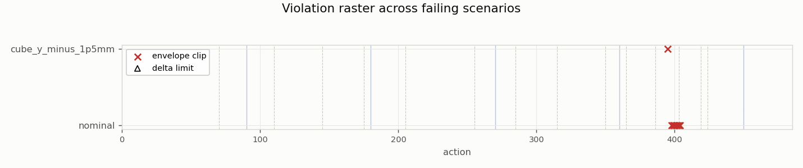
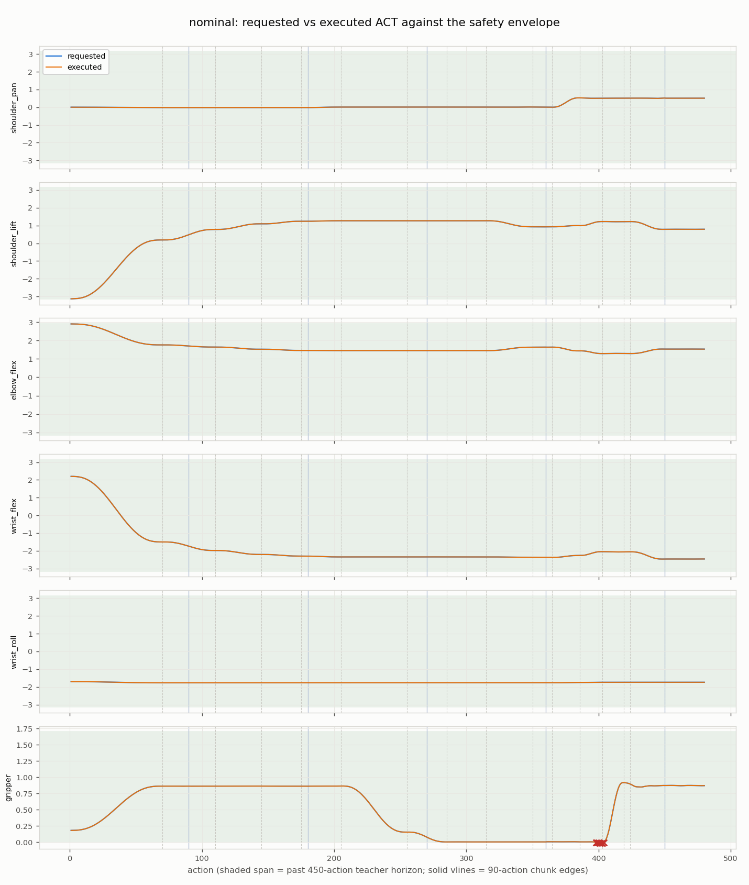
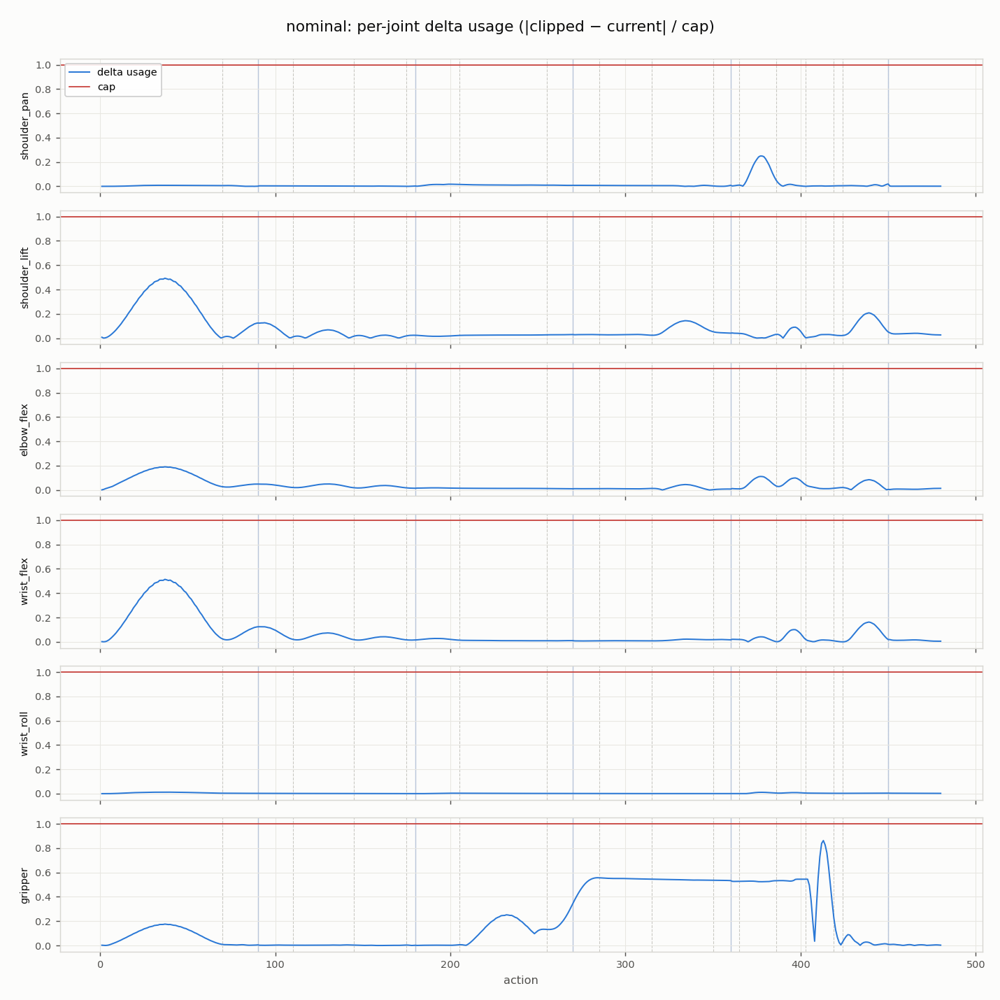
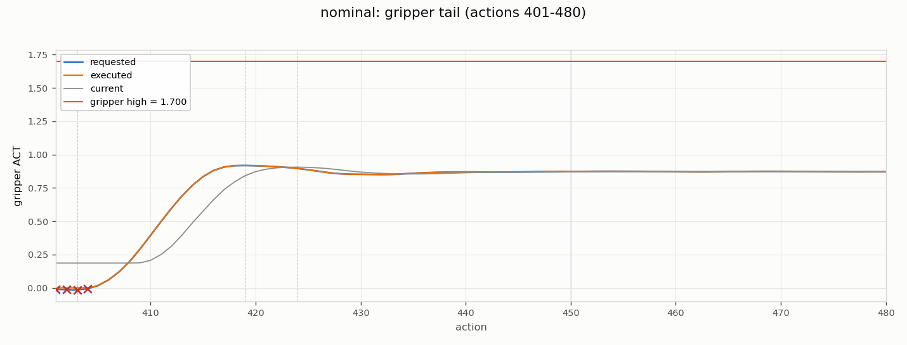
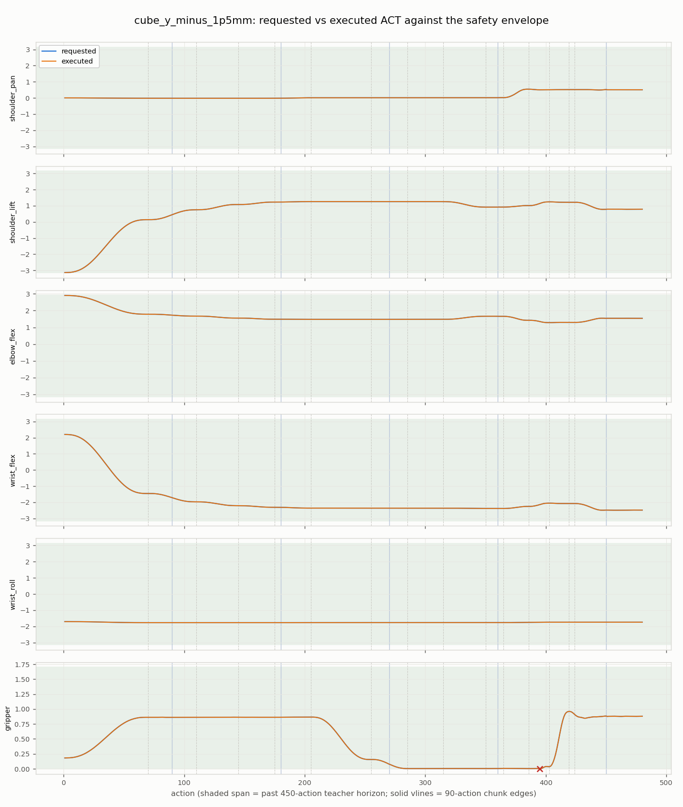
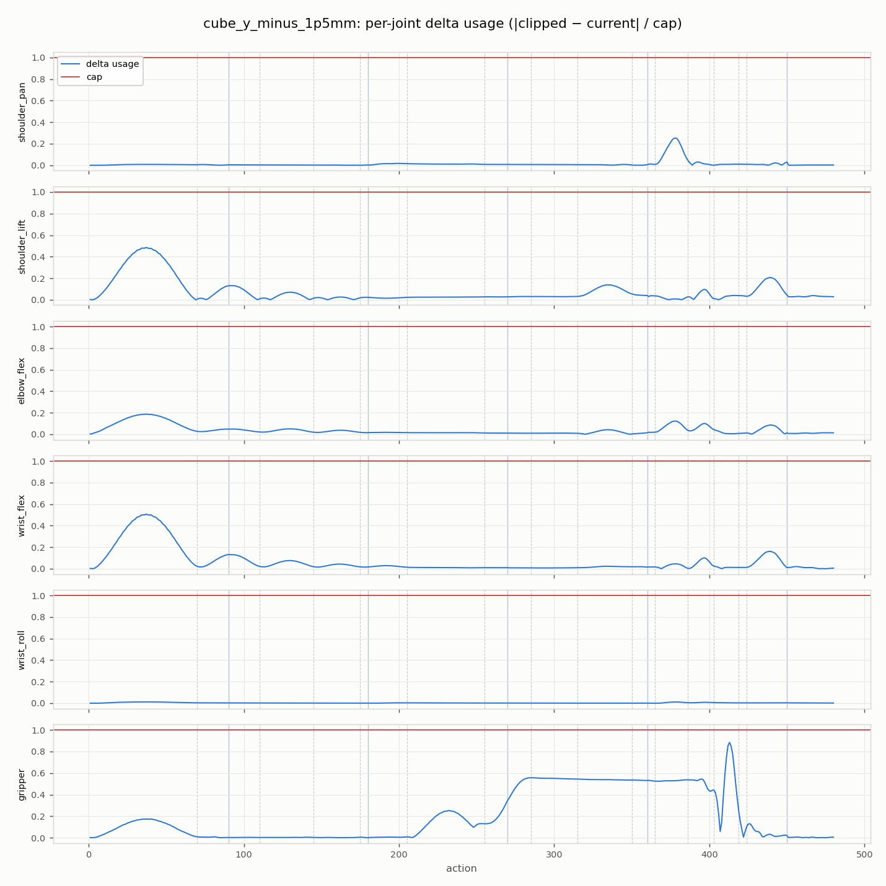
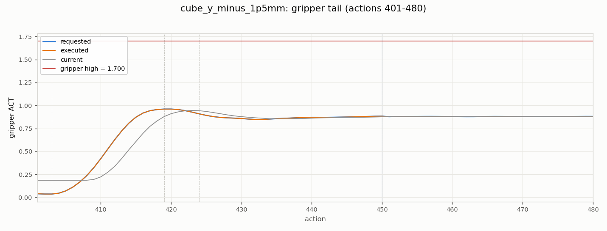

# Scaling-gate failure-frame analysis

Generated by `tools/analyze_safety_frames.py` (matplotlib 3.10.9).
Input: `/home/win10ubuntu/dev/robotic-arm/SO-ARM-101/artifacts/so_arm101_v2/oracle_distillation/horizon_stage_a_evaluations/872c6484287b6fe2/policies/fixed_pick_place_v3.horizon_seed101/evaluation.json` (`content_sha256 336bf00fb88eb54e…`).

## Method

Per frame and joint, recomputed from telemetry `requested_act`/`current_act`:
envelope test = requested outside `effective_safe_act_bounds()`; delta test =
`|clip(requested, low, high) − current| > maximum_act_delta_per_step`.
**Cross-check: recomputed per-rollout clip/limit frame counts equal the
evaluation report's recorded `clipping_frames`/`limiting_frames` exactly**
(the tool errors otherwise), so this analysis is pinned to the live safety path.
Phase labels come from the privileged teacher's stage boundaries; chunk index
= (action−1)//90; actions > 480 are past the teacher horizon.
Repeats with byte-identical physics rows are deduplicated (hash of the
`rows` array; the payload-level `content_sha256` differs per repeat because
it embeds the repeat index).

## Overview

## nominal — repeat 0 (repeats 1, 2 byte-identical)

Telemetry `16a8cc68c493c61e…`, policy `chunked_h90.seed101.noise_penalty_v1`.

| action | joint | kind | excess | stage | chunk | offset | past horizon |
| ---: | --- | --- | ---: | --- | ---: | ---: | --- |
| 398 | gripper | envelope_clip | +0.002903 | set_down | 4 | 37 |  |
| 399 | gripper | envelope_clip | +0.005480 | set_down | 4 | 38 |  |
| 400 | gripper | envelope_clip | +0.007611 | set_down | 4 | 39 |  |
| 401 | gripper | envelope_clip | +0.010598 | set_down | 4 | 40 |  |
| 402 | gripper | envelope_clip | +0.014353 | set_down | 4 | 41 |  |
| 403 | gripper | envelope_clip | +0.015336 | set_down | 4 | 42 |  |
| 404 | gripper | envelope_clip | +0.007442 | released | 4 | 43 |  |

## cube_y_minus_1p5mm — repeat 0 (repeats 1, 2 byte-identical)

Telemetry `674b23305fa21b67…`, policy `chunked_h90.seed101.noise_penalty_v1`.

| action | joint | kind | excess | stage | chunk | offset | past horizon |
| ---: | --- | --- | ---: | --- | ---: | ---: | --- |
| 395 | gripper | envelope_clip | +0.001228 | set_down | 4 | 34 |  |

## Findings

- Violating joints: **gripper** — no other joint violates anywhere.
- 0/8 violating (frame, joint) findings lie **past the 480-action teacher horizon** (actions 481-480), i.e. in the chunk predicted entirely beyond the teacher's demonstration, where the progress feature is clamped at `min(action, 479)/479`.
- 1/8 findings fall in the release/retreat stages, where the privileged teacher itself needs ≥16 actions to open the gripper without tripping the delta limiter (servo lag).

## Implication for the precision tranche

The failures are not behavioral (all milestone chains complete) but concentrated
envelope-grazing in the past-horizon/release regime. LR decay and budget scaling
(`notes/precision-tranche-proposal.md`) are therefore measured against whether they
move this grazing margin; if violations remain confined to past-horizon/release
frames across all cells, the pre-registered next action is a teacher-horizon /
contract alignment proposal (450-action teacher vs 480-action contract).
