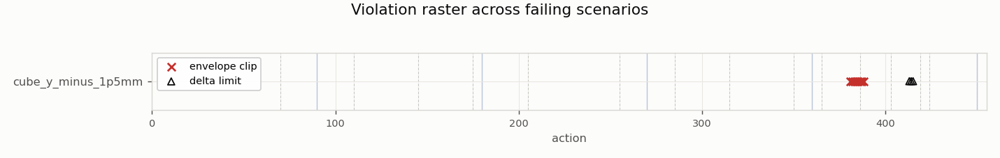
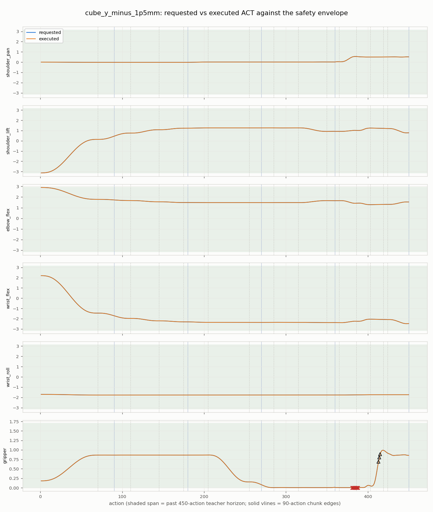
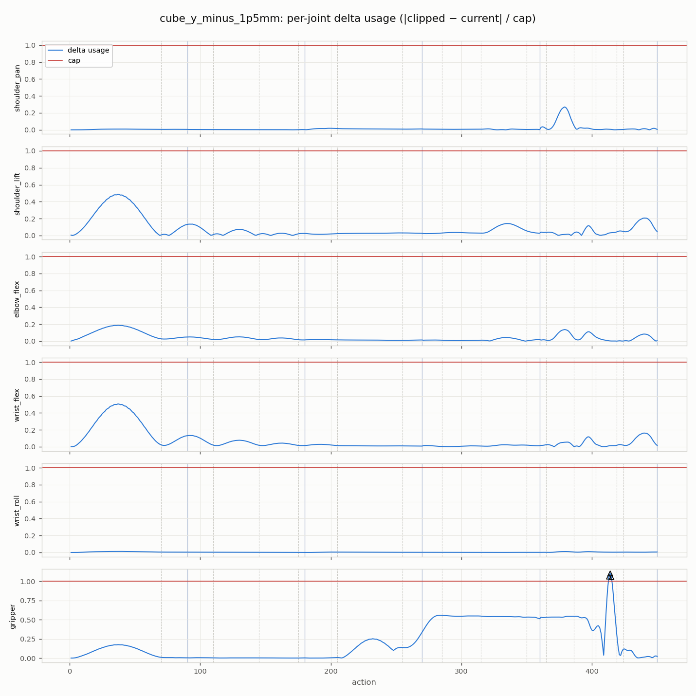
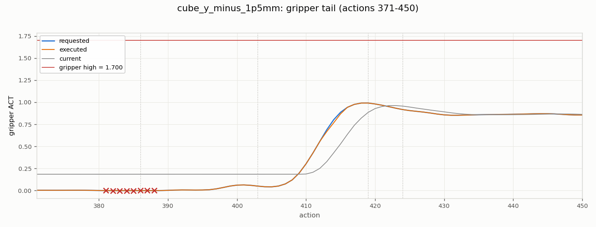

# Scaling-gate failure-frame analysis

Generated by `tools/analyze_safety_frames.py` (matplotlib 3.10.9).
Input: `/home/win10ubuntu/dev/robotic-arm/SO-ARM-101/artifacts/so_arm101_v2/oracle_distillation/horizon_stage_a_evaluations/98241384e86b69a7/policies/fixed_pick_place_v3.horizon_seed303/evaluation.json` (`content_sha256 829cb69382042198…`).

## Method

Per frame and joint, recomputed from telemetry `requested_act`/`current_act`:
envelope test = requested outside `effective_safe_act_bounds()`; delta test =
`|clip(requested, low, high) − current| > maximum_act_delta_per_step`.
**Cross-check: recomputed per-rollout clip/limit frame counts equal the
evaluation report's recorded `clipping_frames`/`limiting_frames` exactly**
(the tool errors otherwise), so this analysis is pinned to the live safety path.
Phase labels come from the privileged teacher's stage boundaries; chunk index
= (action−1)//90; actions > 480 are past the teacher horizon.
Repeats with byte-identical physics rows are deduplicated (hash of the
`rows` array; the payload-level `content_sha256` differs per repeat because
it embeds the repeat index).

## Overview

## cube_y_minus_1p5mm — repeat 0 (repeats 1, 2 byte-identical)

Telemetry `5a013d00ec2b58a1…`, policy `chunked_h90.seed303.noise_penalty_v1`.

| action | joint | kind | excess | stage | chunk | offset | past horizon |
| ---: | --- | --- | ---: | --- | ---: | ---: | --- |
| 381 | gripper | envelope_clip | +0.000222 | traverse | 4 | 20 |  |
| 382 | gripper | envelope_clip | +0.000928 | traverse | 4 | 21 |  |
| 383 | gripper | envelope_clip | +0.001264 | traverse | 4 | 22 |  |
| 384 | gripper | envelope_clip | +0.001230 | traverse | 4 | 23 |  |
| 385 | gripper | envelope_clip | +0.000776 | traverse | 4 | 24 |  |
| 386 | gripper | envelope_clip | +0.000289 | traverse | 4 | 25 |  |
| 387 | gripper | envelope_clip | +0.000128 | set_down | 4 | 26 |  |
| 388 | gripper | envelope_clip | +0.000421 | set_down | 4 | 27 |  |
| 413 | gripper | delta_limit | +0.020644 | released | 4 | 52 |  |
| 414 | gripper | delta_limit | +0.034808 | released | 4 | 53 |  |
| 415 | gripper | delta_limit | +0.018062 | released | 4 | 54 |  |

## Findings

- Violating joints: **gripper** — no other joint violates anywhere.
- 0/11 violating (frame, joint) findings lie **past the 480-action teacher horizon** (actions 481-480), i.e. in the chunk predicted entirely beyond the teacher's demonstration, where the progress feature is clamped at `min(action, 479)/479`.
- 3/11 findings fall in the release/retreat stages, where the privileged teacher itself needs ≥16 actions to open the gripper without tripping the delta limiter (servo lag).

## Implication for the precision tranche

The failures are not behavioral (all milestone chains complete) but concentrated
envelope-grazing in the past-horizon/release regime. LR decay and budget scaling
(`notes/precision-tranche-proposal.md`) are therefore measured against whether they
move this grazing margin; if violations remain confined to past-horizon/release
frames across all cells, the pre-registered next action is a teacher-horizon /
contract alignment proposal (450-action teacher vs 480-action contract).
