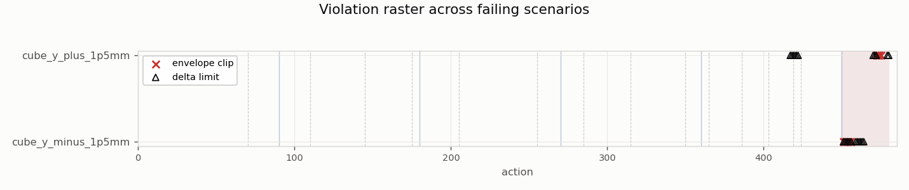
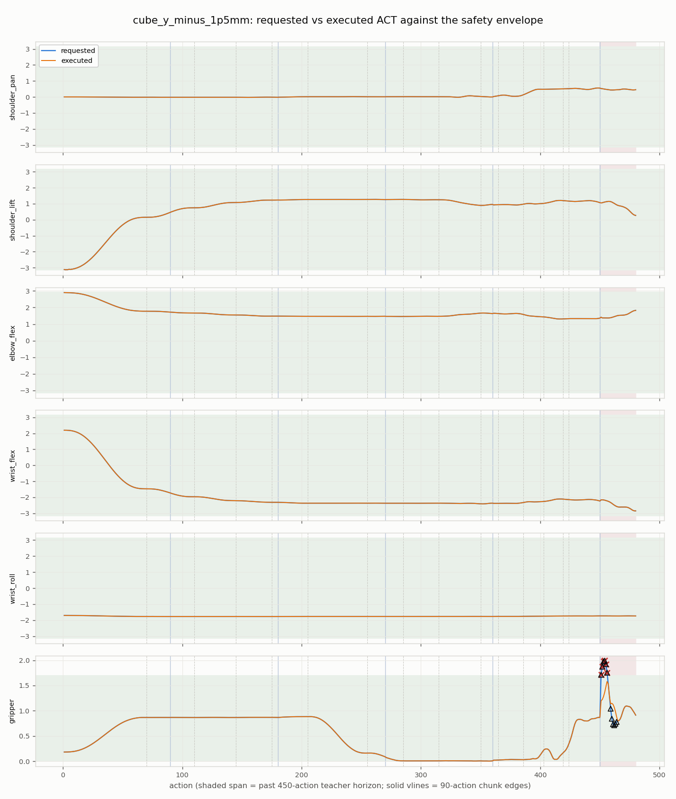
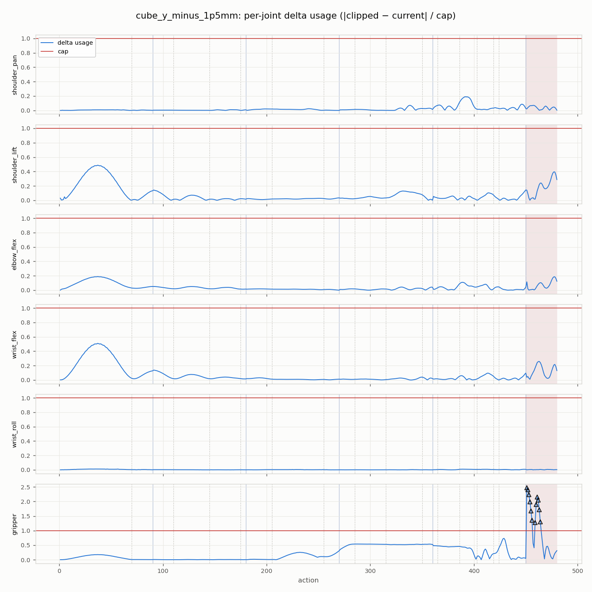
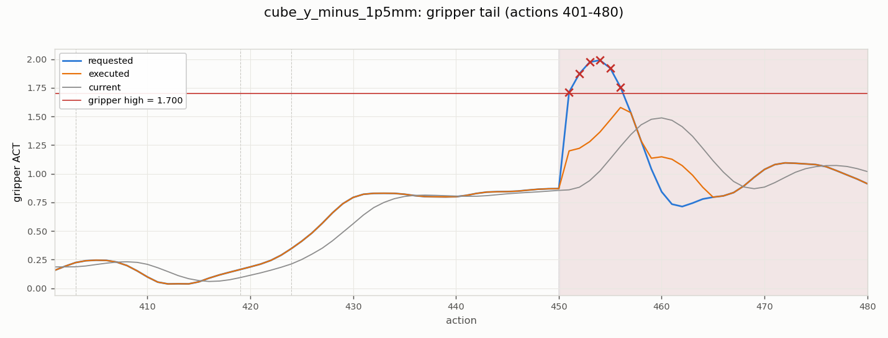
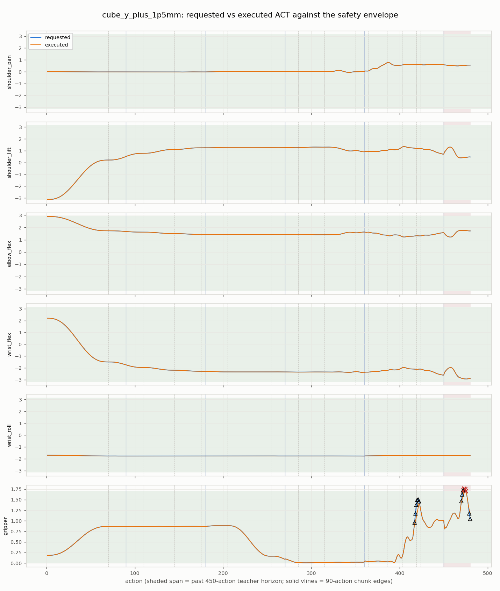
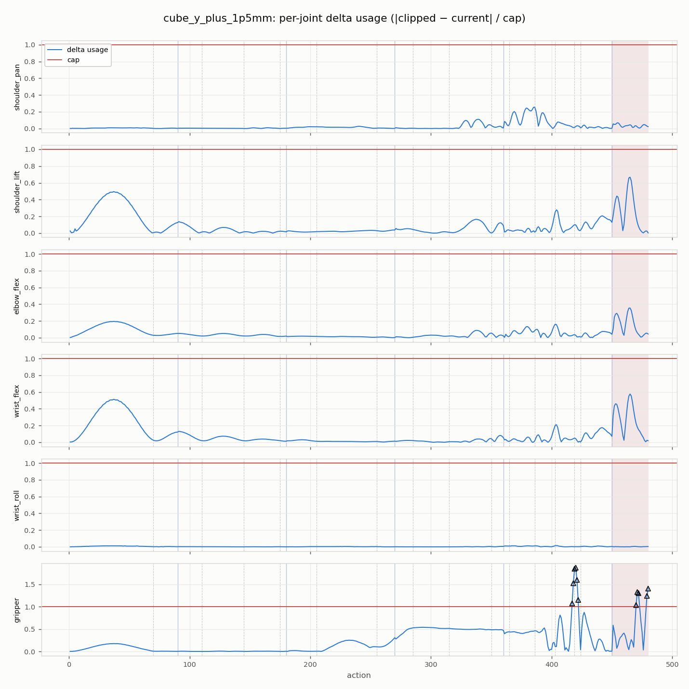
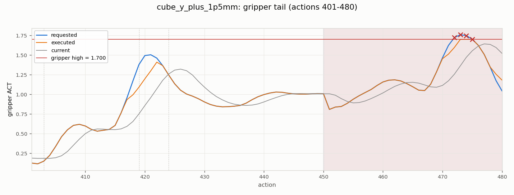

# Scaling-gate failure-frame analysis

Generated by `tools/analyze_safety_frames.py` (matplotlib 3.10.9).
Input: `artifacts/so_arm101_v2/oracle_distillation/scaling_stage_a_evaluations/59286035eef0f008/policies/fixed_pick_place_v3.scaling_width512_steps90k/evaluation.json` (`content_sha256 c0dbf693ee27961b…`).

## Method

Per frame and joint, recomputed from telemetry `requested_act`/`current_act`:
envelope test = requested outside `effective_safe_act_bounds()`; delta test =
`|clip(requested, low, high) − current| > maximum_act_delta_per_step`.
**Cross-check: recomputed per-rollout clip/limit frame counts equal the
evaluation report's recorded `clipping_frames`/`limiting_frames` exactly**
(the tool errors otherwise), so this analysis is pinned to the live safety path.
Phase labels come from the privileged teacher's stage boundaries; chunk index
= (action−1)//90; actions > 450 are past the teacher horizon.
Repeats with byte-identical physics rows are deduplicated (hash of the
`rows` array; the payload-level `content_sha256` differs per repeat because
it embeds the repeat index).

## Overview

## cube_y_minus_1p5mm — repeat 0 (repeats 1, 2 byte-identical)

Telemetry `d5cdbcabb1a20527…`, policy `chunked_h90.seed101.noise_penalty_v1`.

| action | joint | kind | excess | stage | chunk | offset | past horizon |
| ---: | --- | --- | ---: | --- | ---: | ---: | --- |
| 451 | gripper | envelope_clip | +0.013117 | past_teacher_horizon | 5 | 0 | yes |
| 451 | gripper | delta_limit | +0.501008 | past_teacher_horizon | 5 | 0 | yes |
| 452 | gripper | envelope_clip | +0.173530 | past_teacher_horizon | 5 | 1 | yes |
| 452 | gripper | delta_limit | +0.478195 | past_teacher_horizon | 5 | 1 | yes |
| 453 | gripper | envelope_clip | +0.274549 | past_teacher_horizon | 5 | 2 | yes |
| 453 | gripper | delta_limit | +0.420593 | past_teacher_horizon | 5 | 2 | yes |
| 454 | gripper | envelope_clip | +0.291638 | past_teacher_horizon | 5 | 3 | yes |
| 454 | gripper | delta_limit | +0.336159 | past_teacher_horizon | 5 | 3 | yes |
| 455 | gripper | envelope_clip | +0.221634 | past_teacher_horizon | 5 | 4 | yes |
| 455 | gripper | delta_limit | +0.230040 | past_teacher_horizon | 5 | 4 | yes |
| 456 | gripper | envelope_clip | +0.055090 | past_teacher_horizon | 5 | 5 | yes |
| 456 | gripper | delta_limit | +0.121508 | past_teacher_horizon | 5 | 5 | yes |
| 459 | gripper | delta_limit | +0.094059 | past_teacher_horizon | 5 | 8 | yes |
| 460 | gripper | delta_limit | +0.305544 | past_teacher_horizon | 5 | 9 | yes |
| 461 | gripper | delta_limit | +0.392498 | past_teacher_horizon | 5 | 10 | yes |
| 462 | gripper | delta_limit | +0.357458 | past_teacher_horizon | 5 | 11 | yes |
| 463 | gripper | delta_limit | +0.244329 | past_teacher_horizon | 5 | 12 | yes |
| 464 | gripper | delta_limit | +0.102899 | past_teacher_horizon | 5 | 13 | yes |

## cube_y_plus_1p5mm — repeat 0 (repeats 1, 2 byte-identical)

Telemetry `693d7b3b698a33f8…`, policy `chunked_h90.seed101.noise_penalty_v1`.

| action | joint | kind | excess | stage | chunk | offset | past horizon |
| ---: | --- | --- | ---: | --- | ---: | ---: | --- |
| 417 | gripper | delta_limit | +0.024636 | released | 4 | 56 |  |
| 418 | gripper | delta_limit | +0.177831 | released | 4 | 57 |  |
| 419 | gripper | delta_limit | +0.287660 | released | 4 | 58 |  |
| 420 | gripper | delta_limit | +0.296024 | released_hold | 4 | 59 |  |
| 421 | gripper | delta_limit | +0.203103 | released_hold | 4 | 60 |  |
| 422 | gripper | delta_limit | +0.051316 | released_hold | 4 | 61 |  |
| 470 | gripper | delta_limit | +0.012082 | past_teacher_horizon | 5 | 19 | yes |
| 471 | gripper | delta_limit | +0.110777 | past_teacher_horizon | 5 | 20 | yes |
| 472 | gripper | envelope_clip | +0.023276 | past_teacher_horizon | 5 | 21 | yes |
| 472 | gripper | delta_limit | +0.102788 | past_teacher_horizon | 5 | 21 | yes |
| 473 | gripper | envelope_clip | +0.059048 | past_teacher_horizon | 5 | 22 | yes |
| 474 | gripper | envelope_clip | +0.047872 | past_teacher_horizon | 5 | 23 | yes |
| 475 | gripper | envelope_clip | +0.001666 | past_teacher_horizon | 5 | 24 | yes |
| 479 | gripper | delta_limit | +0.081746 | past_teacher_horizon | 5 | 28 | yes |
| 480 | gripper | delta_limit | +0.137262 | past_teacher_horizon | 5 | 29 | yes |

## Findings

- Violating joints: **gripper** — no other joint violates anywhere.
- 27/33 violating (frame, joint) findings lie **past the 450-action teacher horizon** (actions 451-480), i.e. in the chunk predicted entirely beyond the teacher's demonstration, where the progress feature is clamped at `min(action, 449)/449`.
- 6/33 findings fall in the release/retreat stages, where the privileged teacher itself needs ≥16 actions to open the gripper without tripping the delta limiter (servo lag).

## Implication for the precision tranche

The failures are not behavioral (all milestone chains complete) but concentrated
envelope-grazing in the past-horizon/release regime. LR decay and budget scaling
(`notes/precision-tranche-proposal.md`) are therefore measured against whether they
move this grazing margin; if violations remain confined to past-horizon/release
frames across all cells, the pre-registered next action is a teacher-horizon /
contract alignment proposal (450-action teacher vs 480-action contract).
